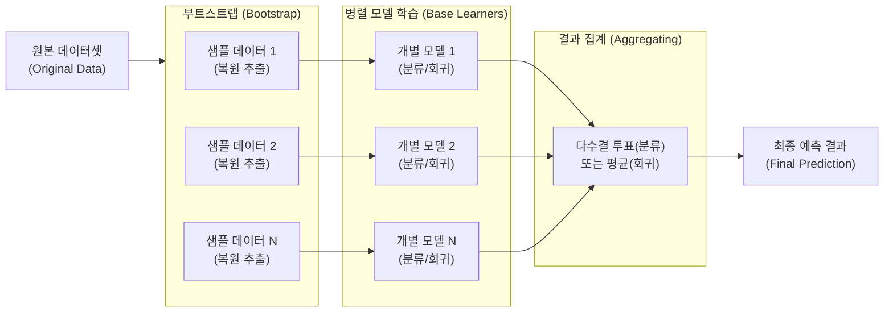

# 배깅 (Bagging, Bootstrap Aggregating)

---

## I. 과적합 방지와 분산 감소를 위한 앙상블 기법, 배깅의 개요

### 가. 배깅(Bagging)의 정의

* 원본 데이터에서 복원 추출(Bootstrap) 방식으로 여러 개의 서브 데이터셋을 생성하고, 독립적인 개별 모델을 학습시킨 후 결과를 집계(Aggregating)하여 최종 예측하는 앙상블 머신러닝 기법임.
* 단일 모델의 불안정성을 극복하고 분산(Variance)을 줄여 모델의 [[일반화]] 성능을 향상시키기 위해 활용됨.

### 나. 배깅의 등장배경 및 특징

* **등장배경**: [[의사결정나무]](Decision Tree) 등 단일 모델이 훈련 데이터에 과적합(Overfitting)되기 쉬운 문제를 해결하기 위해 등장함.
* **특징**: 독립적인 병렬 학습 구조, 분산(Variance) 감소 효과, OOB(Out-of-Bag) 기반 자체 검증, 대표 알고리즘으로 [[랜덤 포레스트]](Random Forest) 보유.

---

## II. 배깅의 개념도 및 핵심 기술 요소

### 가. 배깅의 개념도 및 동작 원리

* 원본 데이터에서 중복을 허용한 무작위 복원 추출(Bootstrap)을 통해 서브 데이터셋을 생성함.
* 생성된 데이터셋으로 개별 모델을 병렬 학습(Training)한 후, 다수결 투표나 평균 연산을 통해 최종 결과를 도출(Aggregating)함.

### 나. 배깅의 핵심 기술 요소

| 구분 | 요소기술(키워드) | 세부 설명 |
| --- | --- | --- |
| **데이터 샘플링** | 부트스트랩 (Bootstrap) | 원본 데이터에서 중복을 허용하여 무작위로 데이터를 추출해 동일한 크기의 샘플셋 여러 개를 생성 |
| **데이터 샘플링** | 복원 추출 (Replacement) | 한 번 추출된 데이터를 다시 모집단에 포함하여 다음 추출 시 중복 선택이 가능하도록 하는 기법 |
| **모델 학습** | 약한 학습기 (Weak Learner) | 배깅의 기반이 되는 개별 예측 모델 (주로 분산이 높고 편향이 낮은 의사결정나무 활용) |
| **모델 학습** | 병렬 학습 (Parallel Training) | 개별 서브 데이터셋에 대해 모델 간 의존성 없이 독립적이고 동시 다발적으로 모델을 학습하는 구조 |
| **결과 집계** | 하드 보팅 (Hard Voting) | 분류(Classification) 문제에서 개별 모델의 예측 결과 중 가장 많은 득표를 얻은 클래스를 최종 선정 |
| **결과 집계** | 평균화 (Averaging) | 회귀(Regression) 문제에서 개별 모델이 예측한 연속형 수치 결과들의 평균값을 최종 결과로 산출 |
| **성능 검증** | OOB (Out-of-Bag) Error | 부트스트랩 샘플링 과정에서 한 번도 선택되지 않은 약 36.8%의 데이터를 활용하여 별도의 검증셋 없이 모델 성능 평가 |
| **확장 기법** | 특성 배깅 (Feature Bagging) | 데이터 샘플링뿐만 아니라 변수(Feature)까지 무작위로 일부만 선택하여 트리를 구성하는 방식 (랜덤 포레스트의 핵심) |

---

## III. 앙상블 기법 비교 및 배깅의 최신 동향

### 가. 배깅(Bagging)과 부스팅(Boosting)의 핵심 비교

| 비교 항목 | 배깅 (Bagging) | [[부스팅|부스팅 (Boosting)]] |
| --- | --- | --- |
| **주요 목적** | 모델의 **분산(Variance)** 감소 | 모델의 **[[편향]](Bias)** 감소 |
| **학습 방식** | 독립적인 **병렬(Parallel)** 학습 | 이전 모델의 오차를 보완하는 **순차(Sequential)** 학습 |
| **데이터 추출** | 중복을 허용한 균등 확률 복원 추출 | 이전 학습에서 오답을 낸 데이터에 가중치를 부여하여 추출 |
| **적합한 모델** | 과적합 우려가 큰 복잡한 모델 (분산이 높은 트리 등) | 과소적합 우려가 큰 단순한 모델 (편향이 높은 트리 등) |
| **대표 [[알고리즘]]** | Random Forest, Bagging Classifier | AdaBoost, Gradient Boosting(XGBoost, LightGBM) |

### 나. 배깅 기술의 최신 동향 및 향후 전망

* **딥 앙상블(Deep Ensembles) 진화**: 배깅 기법이 딥러닝과 결합하여, 다양한 초기화 상태와 데이터 서브셋으로 신경망 앙상블을 구축해 불확실성(Uncertainty)을 정량화하고 강건성을 확보하는 연구가 활발함.
* **대규모 시계열 및 이상 탐지 응용**: 금융 사기 탐지나 네트워크 침입 탐지 등 소수 [[클래스]] 분류(Imbalanced Data) 문제에서 배깅 기반의 앙상블이 안정적 성능을 제공하는 핵심 기법으로 각광받고 있음.

---

---

### 🔗 연관 토픽

- **소속 도메인**: [[00_데이터베이스_MOC|🗄️ 데이터베이스]]
- **세부 분류**: `5. 분산 데이터베이스 & NoSQL & 대용량`
- **핵심 연관 토픽**:
  - [[의사결정나무]]
  - [[부스팅|부스팅 (Boosting)]]
  - [[랜덤 포레스트|랜덤 포레스트 (Random Forest)]]
  - [[일반화]]
  - [[분류화]]
