# 배열 (Array)

---

## I. 데이터의 연속적 메모리 할당 구조, 배열의 개요

### 가. 배열(Array)의 정의

* 동일한 데이터 타입을 가지는 원소들을 메모리 상의 연속적인(Contiguous) 공간에 순차적으로 할당하여 인덱스([[RDBMS 인덱스(index)|Index]])로 접근하는 선형 자료구조
* 논리적 순서와 물리적 저장 순서가 일치하며, 대용량 데이터의 고속 탐색 및 순차적 병렬 연산에 최적화된 컴퓨터 과학의 기본 데이터 구조임

### 나. 배열의 필요성 및 특징

* **$O(1)$ 접근 (Random Access)**: 기준 주소(Base Address)와 인덱스를 활용한 오프셋(Offset) 수학적 연산으로 즉각적 요소 접근 가능
* **공간 [[지역성]] (Spatial Locality) 극대화**: 연속된 메모리 블록 할당으로 [[CPU]] 캐시(L1/L2) 적중률(Cache Hit)을 극대화하여 연산 지연 최소화
* **SIMD 병렬화 친화성**: 데이터가 연속적으로 배치되어 현대 CPU의 SIMD(Single Instruction Multiple Data) / AVX 벡터화(Vectorization) 일괄 로드에 필수적임

---

## II. 배열의 메모리 구조 및 핵심 구성 요소

### 가. 배열의 구조 및 동작 원리

```mermaid
flowchart LR
    subgraph Memory ["Main Memory (RAM)"]
        direction LR
        Base["Base Address<br/>(0x100)"] --- A0["Index [0]<br/>Value: 10"]
        A0 --- A1["Index [1]<br/>Value: 20"]
        A1 --- A2["Index [2]<br/>Value: 30"]
        A2 --- A3["Index [3]<br/>Value: 40"]
        A3 --- A4["...<br/>..."]
    end

    subgraph CPU_Cache ["CPU Cache (L1/L2)"]
        direction TB
        CacheLine["Cache Line (e.g., 64 bytes)<br/>[10, 20, 30, 40] 동시 적재"]
    end

    subgraph CPU_SIMD ["CPU / SIMD Vector Register"]
        direction TB
        VectorOp["AVX-512 Register<br/>동시 병렬 덧셈 연산"]
    end

    A0 -. "Address = Base + (0 * size)" .-> Base
    Memory == "메모리 블록(Block) 단위 패치 (공간 지역성)" ==> CPU_Cache
    CPU_Cache == "Vectorized Load" ==> CPU_SIMD

```

* 메모리상 연속된 주소에 위치하여, 특정 요소에 접근 시 인접 요소들까지 캐시 라인(Cache Line)에 한 번에 적재(Fetch)됨
* CPU는 배열의 연속된 요소를 SIMD 벡터 레지스터로 일괄 로드하여 하나의 명령어로 병렬 처리함

### 나. 배열의 핵심 기술 요소

| 분류 | 요소기술(키워드) | 세부 설명 |
| --- | --- | --- |
| **메모리 할당** | 정적 배열 (Static Array) | 컴파일 타임에 크기가 고정되며, 런타임에 크기 변경이 불가능한 전통적 배열 구조 |
| **메모리 할당** | 동적 배열 (Dynamic Array) | 배열 공간 초과 시 기존 대비 2배(Growth Factor) 크기의 새로운 연속 메모리를 재할당하여 복사(ArrayList, Vector) |
| **주소 연산** | 오프셋 계산 (Offset 연산) | `목표 주소 = 시작 주소 + (인덱스 * 데이터 타입 크기)`를 통한 $O(1)$ 상수 시간 접근 지원 |
| **성능 최적화** | 공간 지역성 (Spatial Locality) | 접근한 데이터의 인접 메모리 주소 데이터가 곧 사용될 확률이 높다는 특성을 활용한 캐시 최적화 |
| **다차원 제어** | 스트라이드 ([[STRIDE|Stride]]) | 다차원 배열 평탄화 시, 다음 차원의 요소로 이동하기 위해 건너뛰어야 하는 메모리 바이트 수 |
| **다차원 제어** | Row/Column Major | 메모리 1차원 전개 시 행(C/C++) 기준 또는 열(Fortran, MATLAB) 기준으로 연속 할당하는 레이아웃 방식 |
| **연산 가속** | SIMD 기반 벡터화 | 배열 형태의 연속 데이터 블록을 256/512bit 레지스터에 적재하여 일괄 병렬 산술 연산 수행 |
| **활용 기법** | 원형 배열 (Circular Array) | 배열의 처음과 끝을 논리적으로 연결하여 큐([[Queue]])나 링 버퍼(Ring Buffer) 구현 시 오버헤드 최소화 |

---

## III. 배열과 연결 리스트 비교 및 향후 기술 동향

### 가. 배열(Array)과 연결 리스트(Linked List) 비교

| 비교 항목 | 배열 (Array) | 연결 리스트 (Linked List) |
| --- | --- | --- |
| **메모리 할당 구조** | **연속적** 할당 (Contiguous) | **비연속적** 분산 할당 (포인터 연결) |
| **접근 시간 (Access)** | $O(1)$ (인덱스를 통한 즉시 접근) | $O(N)$ (Head부터 순차 탐색 필수) |
| **삽입/삭제 시간** | $O(N)$ (데이터 시프트/이동 발생) | $O(1)$ (노드 탐색 완료 후 포인터만 변경 시) |
| **캐시 효율성** | **매우 높음** (공간 지역성 우수) | **낮음** (메모리 파편화 및 캐시 미스 발생) |
| **메모리 오버헤드** | 미리 할당한 빈 공간으로 인한 낭비 가능성 | 데이터 외에 다음 노드를 가리키는 포인터 공간 추가 필요 |
| **적합한 워크로드** | 데이터 탐색 빈도가 높고 정렬 및 병렬 연산 필요 시 | 데이터의 삽입/삭제가 빈번하게 발생하는 큐/스택 구현 시 |

### 나. 배열 아키텍처의 최신 활용 동향 및 전망

* **AI 텐서(Tensor) 연산의 근간**: [[딥러닝]] [[프레임워크]](PyTorch, TensorFlow)의 텐서는 다차원 배열 구조인 `ndarray`의 스트라이드(Strided) 메모리 레이아웃을 채택하여 [[GPU]] 및 [[NPU]] 내부의 대규모 행렬 곱(MatMul) 연산 시 연속적 메모리 읽기 성능을 극대화함.
* **DOD (Data-Oriented Design) 및 ECS 패턴 도입**: 기존 객체 지향(OOP)의 메모리 파편화(AoA) 한계를 극복하기 위해, 게임 엔진(Unity DOTS 등)을 중심으로 데이터(Component)를 거대한 구조체 배열(SoA)로 밀집 배치하여 CPU 캐시 히트율을 끌어올리는 구조로 진화 중임.

---

### 🔗 연관 토픽

- **소속 도메인**: [[00_인공지능_MOC|🤖 인공지능]]
- **세부 분류**: `6. 설명가능한 AI (XAI) & AI 윤리 · 거버넌스`
- **핵심 연관 토픽**:
  - [[딥러닝]]
  - [[CPU]]
  - [[GPU]]
  - [[지역성|지역성(Locality)]]
  - [[온디바이스 AI]]
