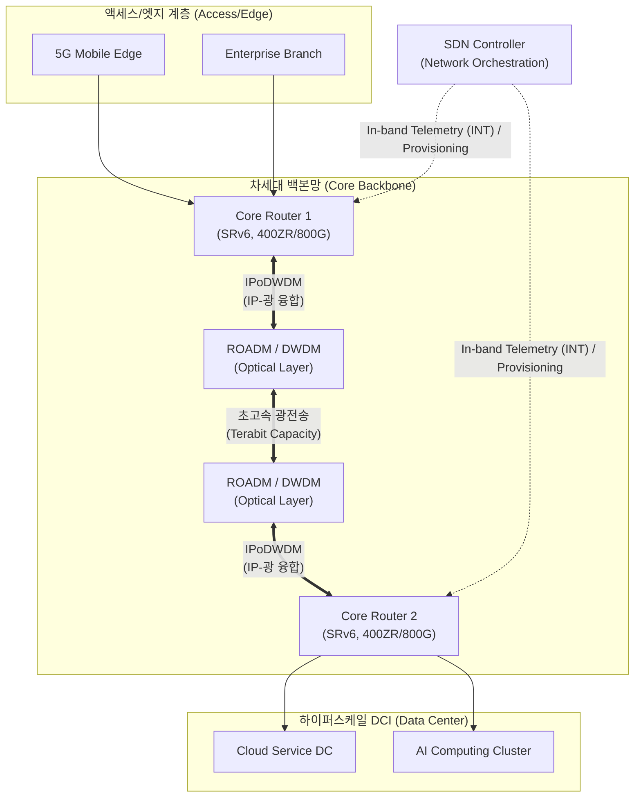

# 백본망

---

## I. 대규모 트래픽의 고속 라우팅 허브, 백본망(Backbone Network)의 개요

### 가. 백본망의 정의

* 엣지([[EDGE|Edge]]) 네트워크, 데이터센터 및 다양한 부분망 간의 트래픽을 상호 연결하여 글로벌 또는 국가 규모의 대규모 데이터를 고속으로 라우팅 및 전송하는 최상위 기간(Core) 네트워크망임.

### 나. 백본망의 특징 및 등장배경

* **AI/클라우드 트래픽 폭증**: 데이터센터 간(DCI) 연결 수요 증가에 따른 400G/800G 이상의 광대역 트래픽 전송 및 초저지연 아키텍처 요구 증대.
* **[[SDN(Software Defined Network)|SDN]] 기반 네트워크 프로그래밍**: SRv6 기반의 경로 제어와 슬라이싱을 통해 5G/6G 및 클라우드 서비스에 최적화된 유연성 확보.
* **계층 통합 구조**: IP 라우팅 계층과 광(Optical) 전송 계층을 일원화하는 IPoDWDM 아키텍처로 진화하여 인프라 비용 절감 및 효율성 극대화.

---

## II. 차세대 백본망의 개념도 및 핵심 기술 요소

### 가. 백본망의 개념도 및 동작 원리

* 집중형 SDN 컨트롤러의 제어하에 코어 라우터가 SRv6 기반 경로를 결정(Source Routing)하고, 코히어런트 광 모듈(IPoDWDM)을 통해 별도의 트랜스폰더 없이 ROADM 계층으로 데이터를 직결하여 초고속 전송을 수행함.

### 나. 차세대 백본망의 핵심 기술 요소

| 분류 | 요소기술(키워드) | 세부 설명 |
| --- | --- | --- |
| **네트워크 제어** | SRv6 (Segment Routing v6) | [[IPv6]] 확장 헤더(SRH)에 패킷 전달 명령(Segment)을 조합하여 상태 정보 유지 없이 네트워크 프로그래밍 지원 |
| **가시성/오케스트레이션** | SDN / INT | 중앙 집중형 제어(SDN) 및 데이터 플레인 패킷에 메타데이터를 직접 삽입(INT)하여 실시간 홉 단위 지연 분석 |
| **IP-광 융합** | IPoDWDM | 코어 라우터에 코히어런트 광 트랜시버를 장착하여 기존에 분리되었던 IP/광 전송 장비를 하나로 통합 |
| **광 [[전송 계층]]** | ROADM (CDC-F) | 광파장을 전기 신호로 변환 없이 유연하게 분기/결합(Add/Drop)하여 트래픽 전송 경로를 동적으로 재구성 |
| **초고속 인터페이스** | 400G / 800G Ethernet | PAM4 변조 및 실리콘 포토닉스를 적용하여 주파수 효율을 높이고 하이퍼스케일/AI 코어 계층 간 대역폭 확장 |
| **트랜시버 모듈** | 400ZR / 800ZR | OIF(Optical Internetworking Forum) 규격 기반, 코어 라우터와 [[스위치 (Layer 3 Switch)|스위치]] 포트에 플러그인(Plug-in) 가능한 광 모듈 |
| **품질 제어([[QoS]])** | FlexE (Flexible Ethernet) | 물리적 인터페이스 속도에 구속받지 않고 논리적 대역폭을 세밀하게 분할 할당하여 [[네트워크 슬라이싱]] 구현 |
| **[[신뢰성]] 보장** | 멀티호밍 / BFD | 다중 회선/장비 연결을 통한 단일 장애점(SPOF) 제거 및 양방향 전달 감지(BFD)를 활용한 밀리초 단위 장애 복구 |

---

## III. 기존 백본망과 차세대 백본망 비교 및 향후 전망

### 가. 기존 백본망(MPLS)과 차세대 백본망(SRv6) 핵심 비교

| 비교 항목 | 레거시 백본망 (MPLS 기반) | 차세대 백본망 (SRv6 기반) |
| --- | --- | --- |
| **라우팅 기반** | LDP, RSVP-TE 터널링 [[프로토콜]] | IPv6 주소 및 확장 헤더(SRH) 기반 소스 라우팅 |
| **장비 상태 정보** | 모든 라우터가 경로/[[세션]] 상태(State) 유지 | 시작 노드(Source)만 경로 지정, 중간 라우터는 상태 무유지 |
| **IP/광망 구조** | IP 라우터와 광 트랜스폰더(OTN) 독립적 운영 | IPoDWDM 기반 소형 플러그형 광 모듈 통합형 (400ZR 등) |
| **적용 시나리오** | 트래픽 엔지니어링, B2B 가상사설망([[VPN]]) | 대규모 5G 네트워크 슬라이싱, AI 기반 하이퍼스케일 DCI |

### 나. 향후 기술 동향 및 전망

* **1.6T 시대로의 도약 및 저전력화**: 트래픽의 기하급수적 증가와 탄소 중립 요구에 대응하여, 단일 포트 1.6Tbps 이더넷 표준화 및 칩셋 패키지 내부에 광 모듈을 직접 내장하는 CPO(Co-Packaged Optics) 기술이 백본망 라우터에 도입되고 있음.
* **3D 융합 네트워크 진화**: 지상망 백본을 넘어 저궤도 위성통신(LEO) 네트워크와 Seamless하게 연결되는 6G 기반의 3차원 입체 백본망으로 아키텍처 확장이 진행 중임.

---

### 🔗 연관 토픽

- **소속 도메인**: [[00_네트워크_MOC|🌐 네트워크]]
- **세부 분류**: `2. 네트워크 계층 & 라우팅 프로토콜 (L3)`
- **핵심 연관 토픽**:
  - [[QoS|QoS (Quality of Service)]]
  - [[SDN(Software Defined Network)]]
  - [[WFQ|WFQ (Weighted Fair Queuing)]]
  - [[프로토콜]]
  - [[스위치 (Layer 3 Switch)]]
