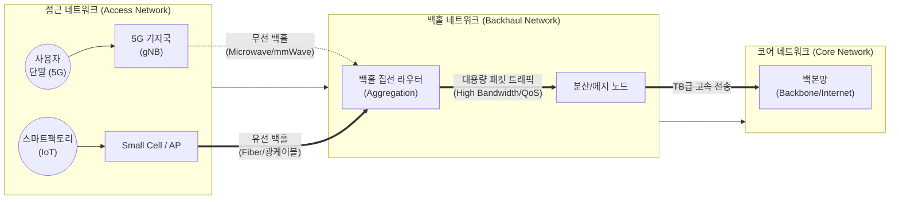

# 백홀 트래픽 (Backhaul Traffic)

---

## I. 모바일 트래픽 급증을 위한 연결통로, 백홀 트래픽의 개요

**가. 백홀 트래픽의 정의**

* 사용자 단말이 접속하는 엑세스망(기지국, AP 등)에서 수집된 데이터를 핵심 네트워크(Core Network)로 전달하거나 그 반대로 전송하기 위해 발생하는 집선된 네트워크 트래픽
* 5G/6G 환경에서 초고속, 초저지연 서비스 품질을 보장하기 위해 병목현상 해소가 필수적인 핵심 통신 인프라 데이터

**나. 백홀 트래픽의 주요 특징**

* **트래픽 집선(Aggregation)**: 다수의 기지국이나 Wi-Fi 단말 등 엣지 기기에서 발생한 소규모 데이터를 대용량 링크로 통합
* **이기종 전송 매체**: 광케이블 기반의 유선 백홀과 마이크로웨이브, 위성 등 무선 백홀 기술을 환경에 따라 하이브리드로 구성
* **엄격한 [[QoS]] 요구**: [[Smart Car(자율주행)|자율주행]], AR/VR 등 실시간 서비스 확대로 트래픽 지연시간 최소화(10ms 이하 등) 및 안정성 보장 필수

---

## II. 백홀 트래픽의 개념도 및 핵심 기술 요소

### 가. 백홀 트래픽의 개념도 및 동작 원리

* 엑세스망에서 발생한 다수의 트래픽을 유/무선 매체를 통해 백홀 라우터로 집선하여 코어망으로 전달
* 패킷 기반 전송, [[SDN(Software Defined Network)|SDN]] 기반 동적 자원 할당 및 네트워크 슬라이싱을 통해 트래픽 특성별 맞춤형 전송 품질(QoS) 보장

### 나. 백홀 트래픽의 핵심 기술 요소

| 구분 | 핵심 기술 | 세부 설명 |
| --- | --- | --- |
| **유선 전송** | 광케이블 (DWDM, PON) | 대용량 데이터 전송(수십 Gbps 이상), 최저 지연시간 보장, 도심 핵심 지역 인프라 |
| **무선 전송** | 마이크로웨이브 / 밀리미터파 | 광케이블 포설이 어려운 외곽지역이나 도심 스몰셀 간 연결, 가시선(LoS) 기반 고속 전송 |
| **무선 전송** | 저궤도(LEO) 위성 백홀 | 재난 지역, 해양, 지상 인프라 구축 불가 지역에 위성을 통한 데이터 백홀 라우팅 제공 |
| **트래픽 제어** | 패킷 기반 백홀 & SDN | 중앙 집중식 컨트롤러 기반 패킷 라우팅 제어, 트래픽 폭증 시 동적 대역폭 할당 수행 |
| **품질 보장** | [[네트워크 슬라이싱]] (Slicing) | eMBB, URLLC, mMTC 등 트래픽 특성에 따른 논리적 전용 맞춤형 백홀 네트워크 [[파티셔닝]] |
| **품질 보장** | QoS 및 트래픽 엔지니어링 | 지연 민감 트래픽(게임, 화상회의 등) 우선순위 부여 및 혼잡 구간 우회 라우팅 경로 제공 |
| **상호 운용성** | [[O-RAN]] 기반 오픈 백홀 | 개방형 인터페이스 적용(TIP 주도 등)으로 멀티벤더 환경 장비 간 상호운용성 확보 |
| **인프라 관리** | AI 기반 트래픽 최적화 | 머신러닝 기반 트래픽 패턴 예측 용량 계획, 장애 자동 감지 및 자가 치유(Self-healing) |

---

## III. 백홀 트래픽과 백본 트래픽의 비교 및 향후 전망

### 가. 백홀 트래픽과 백본 트래픽의 비교

| 비교 항목 | 백홀 트래픽 (Backhaul Traffic) | 백본 트래픽 (Backbone Traffic) |
| --- | --- | --- |
| **연결 구간** | 접속망(Access) $\leftrightarrow$ 코어망(Core) | 코어망 내부, 국가 간 / 대륙 간 글로벌 연결 |
| **핵심 역할** | 다수의 엔드포인트 데이터 집선(Aggregation) 및 전달 | 글로벌 데이터 라우팅 및 중심 경로 대규모 전송 |
| **전송 속도** | 수십 Mbps ~ 수십 Gbps 수준 (Gbps 급) | 수 Tbps 이상의 초고용량 |
| **적용 매체** | 유선(광케이블), 무선(마이크로웨이브, 위성) 혼합 | 초고속 광케이블, 해저 케이블 등 유선 중심 |
| **핵심 이슈** | 트래픽 병목 해소, 지연시간 최소화, 커버리지 유연성 | 이중화/대체 경로 즉시 제공, 높은 [[신뢰성]] 및 망 확장성 |

* **향후 전망**: 5G/6G 환경의 진화에 따라 트래픽 처리 한계를 극복하기 위해, 초고대역폭 테라헤르츠(THz) 무선 백홀 도입이 연구되고 있으며, 소프트웨어 정의 네트워킹(SDN)과 AI 기술이 융합된 자가 최적화(Self-Optimizing) 백홀망 구축이 핵심 트렌드로 부상 중임.

---

### 🔗 연관 토픽

- **소속 도메인**: [[00_네트워크_MOC|🌐 네트워크]]
- **세부 분류**: `3. 전송 계층 & 트래픽 / 혼잡 제어 (L4)`
- **핵심 연관 토픽**:
  - [[QoS|QoS (Quality of Service)]]
  - [[네트워크 슬라이싱]]
  - [[SDN(Software Defined Network)]]
  - [[O-RAN]]
  - [[망 중립성|망 중립성 (Network Neutrality)]]
