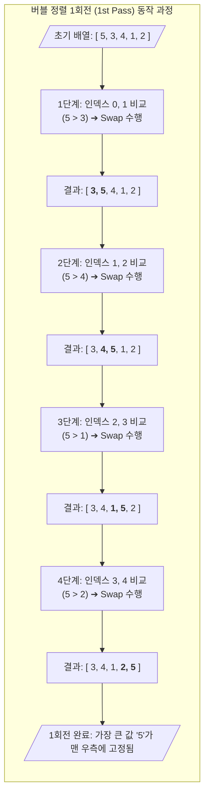

# 버블 정렬 (Bubble Sort)

---

## I. 인접 데이터 교환 기반 정렬 알고리즘, 버블 정렬의 개요

* **정의**: 서로 인접한 두 원소를 검사하여 크기 순서에 따라 교환(Swap)하는 과정을 반복하며 배열을 정렬하는 제자리(In-place) 정렬 [[알고리즘]]
* 거품이 수면으로 올라오는 듯한 모습에서 유래되었으며, 구현이 직관적이고 단순한 기초 정렬 기법
* **특징**: 제자리 정렬(In-place Sort), 안정 정렬(Stable Sort), $O(N^2)$ 시간 복잡도, 높은 교환(Swap) 오버헤드

---

## II. 버블 정렬의 동작 원리 및 핵심 구성 요소

### 가. 버블 정렬의 구성도 및 동작 원리

* 인접한 두 데이터를 비교하여 조건에 맞지 않으면 위치를 교환(Swap)하며 배열의 끝까지 이동함
* 1회전(Pass)이 끝날 때마다 가장 큰 값(오름차순 기준)이 배열의 맨 끝에 고정(정렬)되는 구조로, 회전이 거듭될수록 비교 횟수가 1씩 감소함

### 나. 버블 정렬의 핵심 기술 요소

| 구분 | 요소기술(키워드) | 세부 설명 |
| --- | --- | --- |
| **메모리 구조** | 제자리 정렬 (In-place) | 입력 배열 자체 공간만 사용하며 추가적인 메모리 공간이 거의 불필요($O(1)$)함 |
| **정렬 특성** | 안정 정렬 (Stable Sort) | 동일한 값을 가진 데이터들의 원래 순서가 정렬 후에도 그대로 유지됨 |
| **핵심 연산** | Swap 연산 | 임시 변수(Temp)를 활용하여 인접한 두 데이터의 메모리 위치 값을 상호 교환함 |
| **제어 구조** | 중첩 루프 (Nested Loop) | 외부 루프(회전 제어, $N-1$번 반복)와 내부 루프(인접 요소 비교 제어)로 구성됨 |
| **성능 최적화** | Flag 변수 (Early Exit) | 1회전 동안 교환이 한 번도 발생하지 않으면 정렬이 완료된 것으로 간주, 즉시 루프 종료 |
| **시간 복잡도** | $O(N^2)$ (평균/최악) | 데이터가 역순으로 정렬되어 있을 경우 모든 인접 요소 간 반복적인 교환 연산 발생 |
| **시간 복잡도** | $O(N)$ (최선) | Flag 최적화 적용 시, 이미 정렬된 배열에 대해서는 1회전 탐색 후 즉시 종료됨 |
| **알고리즘 진화** | 칵테일 셰이커 정렬 | 버블 정렬의 변형으로, 양방향으로 교대로 탐색과 교환을 수행하여 거북이(Turtle) 데이터 문제 해결 |

---

## III. 버블 정렬과 타 단순 정렬 알고리즘 비교 및 활용 전망

### 가. @@@PROT_6@@@ 단순 정렬 알고리즘 간 비교

| 비교 항목 | 버블 정렬 (Bubble Sort) | 선택 정렬 (Selection Sort) | [[삽입 정렬|삽입 정렬 (Insertion Sort)]] |
| --- | --- | --- | --- |
| **정렬 메커니즘** | 인접 데이터 간 비교 및 교환 | 전체 중 최솟값 탐색 후 맨 앞과 교환 | 타겟 데이터를 기 정렬된 영역의 올바른 위치에 삽입 |
| **안정성 (Stability)** | 안정 정렬 (Stable) | 불안정 정렬 (Unstable) | 안정 정렬 (Stable) |
| **시간 복잡도 (최선)** | $O(N)$ (Flag 사용 시) | $O(N^2)$ | $O(N)$ |
| **데이터 교환 횟수** | 매우 많음 (매번 조건 만족 시) | 적음 (1회전에 1번의 교환만 수행) | 보통 (이동을 통한 덮어쓰기 위주) |

### 나. 버블 정렬의 실무적 한계 및 활용 전망

* **실무적 한계**: 배열의 크기가 커질수록 성능이 급격히 저하되며, 특히 앞쪽의 큰 숫자는 빠르게 뒤로 가지만 뒷쪽의 작은 숫자(거북이, Turtle)는 앞으로 느리게 이동하는 치명적 구조적 단점 존재
* **해결 및 전망**: 실무의 대용량 데이터 처리에는 [[퀵 정렬]](Quick Sort)이나 팀 정렬(Tim Sort) 등이 주로 사용됨. 버블 정렬은 매우 작은 데이터 세트 정렬이나 정렬 알고리즘의 기초 동작(루프, 스왑)을 이해하기 위한 컴퓨터 공학 교육 목적으로 널리 활용됨.

---

### 🔗 연관 토픽

- **소속 도메인**: [[00_컴퓨터구조_MOC|💻 컴퓨터구조]]
- **세부 분류**: `4. 기본 자료구조 (Data Structures)`
- **핵심 연관 토픽**:
  - [[삽입 정렬|삽입 정렬 (Insertion Sort)]]
  - [[퀵 정렬|퀵 정렬 (Quick Sort)]]
  - [[알고리즘]]
  - [[병합 정렬|병합 정렬 (Merge Sort)]]
  - [[O-Notation (O-표기법)]]
