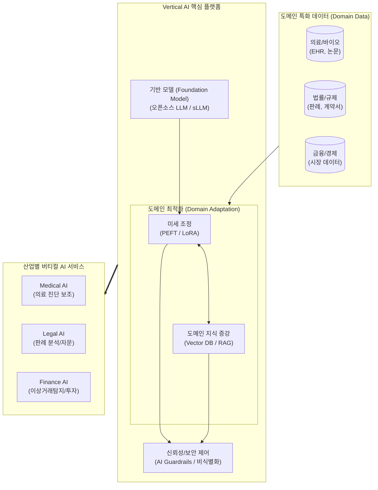

# 버티컬 AI (Vertical AI)

---

## I. 특정 산업 도메인 최적화, 버티컬 AI의 개요

**가. 버티컬 AI (Vertical AI)의 정의**

* 범용 데이터가 아닌 특정 산업(의료, 법률, 금융, 제조 등)의 고유한 도메인 지식과 데이터를 집중적으로 학습하여 해당 분야의 특화된 문제 해결 및 맞춤형 서비스를 제공하는 산업 특화 [[인공지능]]

**나. 버티컬 AI의 등장배경 및 특징**

* **등장배경**: 범용 AI(Horizontal AI)의 [[할루시네이션]](환각) 한계, 기업 내부 데이터 유출 등 보안 이슈 증가, 거대 언어 모델([[초거대 언어 모델|LLM]]) 운용에 따른 천문학적 컴퓨팅 비용 부담 발생
* **핵심특징**: **도메인 전문성**(높은 정확도), **비용 효율성**([[sLLM (Smaller Large Language Model)|sLLM]] 기반 경량화), **강력한 보안**(On-Premise 등 프라이빗 환경 구축)

---

## II. 버티컬 AI의 개념도 및 핵심 기술 요소

### 가. 버티컬 AI의 개념도 및 아키텍처

* 범용 파운데이션 모델에 산업별 특화 데이터를 파인튜닝([[PEFT]])과 RAG 기법으로 결합하고, 강력한 보안/가드레일을 거쳐 특화 서비스를 제공하는 구조임.

### 나. 버티컬 AI의 핵심 기술 요소

| 구분 | 요소기술(키워드) | 세부 설명 |
| --- | --- | --- |
| **모델 경량화** | sLLM (Small LLM) | 수십억~백억 개 수준의 파라미터로 구성되어 구축/운영 비용을 절감하는 경량 언어 모델 |
| **도메인 학습** | PEFT (Parameter-Efficient FT) | 모델의 전체 가중치 대신 일부 파라미터만 업데이트([[LoRA(Low-rank adaptation)|LoRA]] 등)하여 효율적으로 도메인 지식 주입 |
| **지식 증강** | 특화 RAG (Retrieval-Augmented Gen.) | 기업 내부 [[데이터베이스]] 및 전문 문헌을 벡터화하여 검색 후 생성, 할루시네이션(환각) 최소화 |
| **데이터 처리** | Domain Knowledge Graph | 산업별 복잡한 전문 용어 및 개체 간의 연관 관계를 구조화하여 AI의 맥락 이해도 향상 |
| **보안/[[신뢰성]]** | AI Guardrails | 법적 규제 준수, 민감 정보(PII 등) 필터링 및 편향성 제거를 위한 입출력 통제 시스템 |
| **인프라/환경** | On-Premise / Private Cloud | 기업 데이터의 외부 유출을 원천 차단하기 위해 폐쇄망 내부에서 자체적으로 AI 모델 구동 |
| **작업 자동화** | Domain [[AI Agent]] | 단순 질의응답을 넘어, 특정 도메인의 복잡한 워크플로우(예: 계약서 자동 작성)를 자율 수행 |
| **품질 검증** | Domain-specific Evaluation | 도메인 전문가(SME)가 참여하는 RLHF 및 MMLU 등 산업 맞춤형 벤치마크 기반 성능 평가 |

---

## III. 버티컬 AI와 범용 AI 비교 및 향후 전망

### 가. 버티컬 AI vs 범용 AI (Horizontal AI) 비교

| 비교 항목 | 버티컬 AI (Vertical AI) | 범용 AI (Horizontal AI) |
| --- | --- | --- |
| **설계 목적** | 특정 산업 분야의 심층적 문제 해결 | 광범위한 일반 지식 제공 및 범용적 태스크 처리 |
| **학습 데이터** | 도메인 특화 데이터 (법례, 의료기록 등 폐쇄 데이터) | 웹 크롤링 등 대규모 공개 데이터 (방대한 코퍼스) |
| **모델 규모** | 상대적으로 작음 (sLLM 중심, 수십억 파라미터) | 매우 큼 (거대 LLM, 수백억~수조 파라미터) |
| **정확도/신뢰성** | 해당 도메인 내 정확도 매우 높음 (할루시네이션 낮음) | 일반 상식은 높으나 전문 지식 오류 발생 가능성 존재 |
| **보안 수준** | 강력한 보안 (On-Premise 구축 용이) | 퍼블릭 클라우드 의존으로 민감 데이터 유출 리스크 존재 |
| **주요 사례** | Harvey(법률), BloombergGPT(금융), Lunit(의료) | ChatGPT(OpenAI), Gemini(Google), Claude(Anthropic) |

### 나. 향후 전망 및 기술 동향

* **[[에이전틱 AI]](Agentic AI)로의 진화**: 단순 정보 검색 및 텍스트 생성을 넘어, 기업의 ERP/[[CRM]] 등과 연동하여 특정 산업의 전문적인 업무 프로세스를 자율적으로 기획하고 실행하는 도메인 특화 에이전트로 발전 중임.
* **B2B 엔터프라이즈 AI 시장 주도**: 데이터 프라이버시 규제(GDPR, 망분리 등)가 강화됨에 따라, 보안이 보장된 sLLM 기반의 버티컬 AI가 기업의 실질적인 ROI(투자 대비 수익)를 창출하는 핵심 솔루션으로 자리 잡을 전망임.

---

### 🔗 연관 토픽

- **소속 도메인**: [[00_인공지능_MOC|🤖 인공지능]]
- **세부 분류**: `6. 설명가능한 AI (XAI) & AI 윤리 · 거버넌스`
- **핵심 연관 토픽**:
  - [[초거대 언어 모델|초거대 언어 모델(Large Language Model)]]
  - [[인공지능]]
  - [[sLLM (Smaller Large Language Model)]]
  - [[에이전틱 AI|에이전틱 AI(Agentic AI)]]
  - [[AI Agent]]
