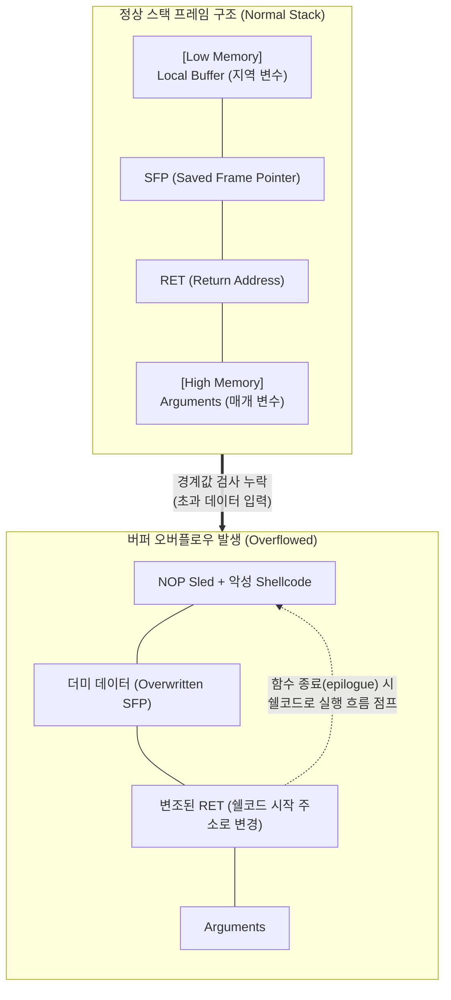

# 버퍼 오버플로우 (Buffer Overflow)

---

## I. 메모리 경계 침범을 통한 제어권 탈취, 버퍼 오버플로우의 개요

* **정의**: 프로그램이 할당된 메모리 공간(Buffer)의 한계를 넘어 데이터를 기록하여 인접한 메모리 영역(SFP, RET 등)을 덮어쓰는 소프트웨어 취약점 및 공격 기법
* **발생 원인**: C/C++ 등에서 메모리 경계값 검사(Bounds Checking)를 수행하지 않는 취약한 표준 함수(`strcpy`, `gets`, `sprintf` 등)의 사용
* **특징**: 제어 흐름 하이재킹(Control Flow Hijacking), 관리자 권한 획득, 임의 코드 실행, 시스템 서비스 거부([[DoS (Denial of Service)|DoS]]) 유발

---

## II. 버퍼 오버플로우의 개념도 및 핵심 기술 요소

### 가. 버퍼 오버플로우의 개념도 및 동작 원리

* 공격자가 버퍼 크기를 초과하는 악성 코드(쉘코드)와 조작된 복귀 주소(RET)를 주입하여, 함수 종료 시 정상 흐름을 가로채어 악성 코드를 실행함

### 나. 버퍼 오버플로우 공격 및 방어 핵심 기술 요소

| 구분 | 요소기술(키워드) | 세부 설명 |
| --- | --- | --- |
| **공격 기법** | [[Stack]] Smashing | 지역 변수 버퍼를 넘치게 하여 스택의 SFP와 RET를 덮어쓰는 전통적 공격 방식 |
| **공격 기법** | NOP Sled | 메모리 주소 오차를 극복하기 위해 No Operation(0x90) 명령을 연속 배치하여 쉘코드로 유도 |
| **공격 기법** | ROP (Return-Oriented) | 실행 권한 제한(DEP) 우회를 위해, 메모리 내 기존 공유 라이브러리의 기계어 조각(Gadget)들을 연결하여 공격 |
| **방어 기법 (컴파일)** | Stack Canary (SSP) | 버퍼와 제어 데이터(RET 등) 사이에 검증용 난수(Canary)를 삽입하여 오버플로우 발생 시 변조 탐지 |
| **방어 기법 (OS)** | ASLR | 실행 시마다 스택, 힙, 라이브러리 등 메모리 영역의 로드 주소를 난수화하여 주소 예측 차단 |
| **방어 기법 (OS)** | DEP / NX Bit | 스택, 힙 등 데이터 영역에 실행 권한(Executable)을 제거하여 주입된 쉘코드의 실행을 원천 차단 |
| **방어 기법 (HW)** | Shadow Stack (CET) | 인텔 CET 등 하드웨어 레벨에서 별도의 격리된 스택에 RET를 백업하고, 실제 스택의 RET와 비교/검증 |
| **방어 기법 (시큐어 코딩)** | Safe Function | `strcpy` 대신 `strncpy` 사용 등 메모리 경계값을 명시적으로 제한하는 안전한 함수 사용 및 코드 인스펙션 |

---

## III. 버퍼 오버플로우 발생 영역 비교 및 최신 동향

### 가. 스택 기반 vs 힙 기반 오버플로우 비교

| 비교 항목 | 스택(Stack) 오버플로우 | 힙(Heap) 오버플로우 |
| --- | --- | --- |
| **발생 위치** | 스택 메모리 영역 (지역 변수, 매개 변수) | 힙 메모리 영역 (동적 할당 변수) |
| **주요 원인 함수** | `strcpy()`, `gets()`, `sprintf()` | `malloc()`, `calloc()` 이후 포인터 검증 누락 |
| **주요 변조 대상** | RET (복귀 주소), SFP | 함수 포인터, 동적 메모리 할당 청크(Chunk) 메타데이터 |
| **공격 복잡도** | 비교적 단순함 (일정한 메모리 구조) | 높음 (메모리 파편화 및 할당자 알고리즘에 의존적) |

### 나. 최근 동향 및 산업 적용 방향

* **메모리 안전 언어(Memory-Safe Language) 전환 가속**: 미 CISA, NSA 등 주요 보안 기관은 C/C++ 사용을 지양하고, 컴파일 단계에서 메모리 소유권과 생명주기를 엄격히 관리하는 **Rust, Go** 등의 언어로 시스템 소프트웨어를 재작성할 것을 강력히 권고함
* **하드웨어 레벨의 보호 기술 기본 탑재**: ARM 아키텍처의 **MTE (Memory Tagging Extension)** 및 인텔의 CET (Control-flow Enforcement Technology)와 같이, OS 소프트웨어 레벨의 방어(ASLR/DEP)를 우회하는 우회 공격(Bypass)을 방어하기 위해 [[CPU]] 하드웨어 단의 메모리 포인터 검증 기술이 최신 칩셋에 기본 적용되는 추세임

---

### 🔗 연관 토픽

- **소속 도메인**: [[00_보안_MOC|🛡️ 보안]]
- **세부 분류**: `4. 웹 & 애플리케이션 보안 · 취약점 점검`
- **핵심 연관 토픽**:
  - [[DoS (Denial of Service)]]
  - [[Stack]]
  - [[CPU]]
  - [[위협 모델링|위협 모델링(Threat Modeling) - Secure SDLC]]
  - [[시큐어코딩]]
