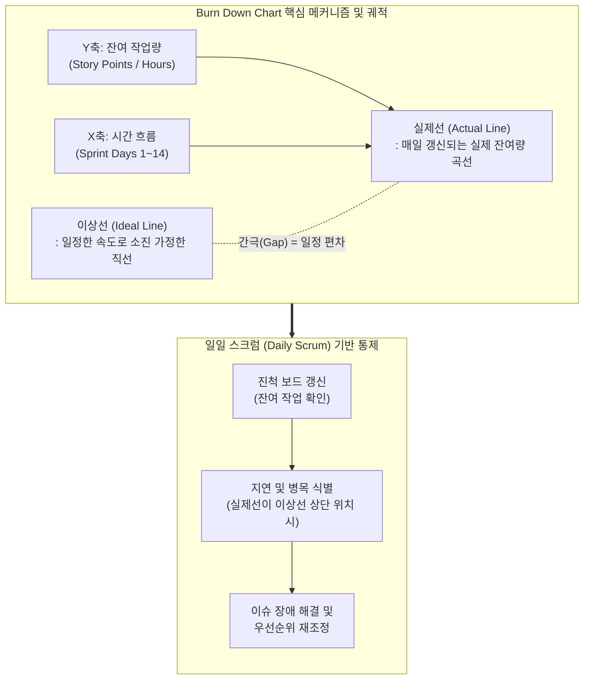

# 번다운차트 (Burn Down Chart)

---

## I. 애자일 진척 관리의 시각화 도구, 번다운차트의 개요

**가. 번다운차트의 정의**

* 애자일([[Agile]]) 프로젝트에서 시간의 경과에 따라 남아있는 잔여 작업량(Remaining Work)을 하향 곡선으로 나타내어, 스프린트의 진척 상태와 목표 달성 가능성을 직관적으로 파악하는 시각화 도구

**나. 번다운차트의 필요성 및 특징**

* **필요성**: 장기 계획 위주의 전통적 방식(Gantt Chart 등)으로는 짧은 반복 주기(Sprint) 내의 실질적인 진척율 파악 및 즉각적인 리스크(지연) 식별이 어려움
* **특징**: 직관적 진척 가시화(이상선과 실제선 비교), 데일리 [[스크럼]](Daily [[SCRUM|Scrum]]) 연계 피드백, 조기 위험 인지(병목 및 범위 변경)

---

## II. 번다운차트의 개념도 및 핵심 구성 요소

### 가. 번다운차트의 개념도 및 동작 원리

* **동작 흐름**: 계획된 이상선과 매일 갱신되는 실제선 간의 편차(Gap)를 분석하여, 데일리 스크럼 회의에서 즉각적으로 일정 지연 및 장애 요인을 식별하고 대응함.

### 나. 번다운차트의 핵심 기술 및 구성 요소

| 구분 | 요소기술(키워드) | 세부 설명 |
| --- | --- | --- |
| **기본 축** | X축 (Time) | 스프린트(1~4주) 또는 릴리즈의 전체 기간을 일(Day) 단위 흐름으로 표시 |
| **기본 축** | Y축 (Remaining Work) | 완료해야 할 잔여 작업의 총량을 지시 (스토리 포인트, 태스크 시간 등) |
| **기준 지표** | 이상선 (Ideal Line) | 프로젝트 시작부터 종료 시점(0)까지 작업이 균등하게 소진된다고 가정한 선 |
| **실적 지표** | 실제선 (Actual Line) | 팀의 실제 잔여 작업량을 매일 궤적으로 연결하여 현실적인 진척 상태를 표시 |
| **측정 단위** | 스토리 포인트 (Story Point) | 요구사항(백로그)의 상대적 복잡도, 난이도, 작업량을 반영한 애자일 추정 단위 |
| **분석 요소** | 편차 분석 (Variance) | 실제선이 이상선보다 위에 있으면 '지연', 아래에 있으면 '빠른 소진'을 의미함 |
| **변동 요인** | 범위 변경 (Scope Change) | 스프린트 도중 긴급 요구사항이 추가되어 잔여 작업량이 증가해 선이 위로 꺾이는 현상 |
| **관리 활동** | 데일리 스크럼 (Daily Scrum) | 매일 정해진 시간에 차트의 갱신 결과를 바탕으로 진척을 공유하고 장애 요인을 제거함 |

---

## III. 번다운차트의 비교 및 최신 활용 동향

### 가. 번다운차트(Burn Down)와 번업차트(Burn Up) 비교

| 비교 항목 | 번다운차트 (Burn Down Chart) | 번업차트 (Burn Up Chart) |
| --- | --- | --- |
| **핵심 목적** | **'얼마나 남았는가?'** (잔여 작업량 추적) | **'얼마나 완료했는가?'** (누적 달성량 추적) |
| **그래프 형태** | 전체 작업량에서 시작하여 **'0'을 향해 하강** | '0'에서 시작하여 전체 목표치(Scope)를 향해 **상승** |
| **범위 변경 가시화** | 총량 변동 파악이 어려움 (실제선만 위로 튀어오름) | 전체 목표선(Total Scope Line)의 변동으로 **직관적 확인 가능** |
| **주요 활용처** | 단기적 **스프린트(Sprint)** 진척 및 잔여 리스크 관리 | 장기적 **릴리즈(Release)** 진척 및 요구사항 변동 관리 |

### 나. 번다운차트의 한계점 극복 및 향후 전망

* **AI 기반 지능형 예측 (Predictive ALM)**: 최근 Jira 등 ALM(Application Lifecycle Management) 도구는 팀의 과거 릴리즈 속도(Velocity)를 기계학습하여, 스프린트 종료 시점의 예상 도착선을 자동으로 그려주는 AI 보조 기능을 제공함.
* **하이브리드 메트릭스 활용**: 잔여 작업만 보이는 번다운차트의 단점을 보완하기 위해, 누적 흐름도(CFD: Cumulative Flow Diagram) 및 번업차트를 통합 대시보드로 구성하여 프로젝트 병목과 범위 팽창(Scope Creep)을 입체적으로 모니터링하는 추세임.

---

### 🔗 연관 토픽

- **소속 도메인**: [[00_프로젝트관리_MOC|📋 프로젝트관리]]
- **세부 분류**: `5. 애자일 프로젝트 관리 & 개발 운영 (Agile PM)`
- **핵심 연관 토픽**:
  - [[스크럼|스크럼 (SCRUM)]]
  - [[SCRUM]]
  - [[린 방법론|린 (Lean) 방법론]]
  - [[터크만 팀 개발 5단계]]
  - [[Kanban (development) 프로세스]]
