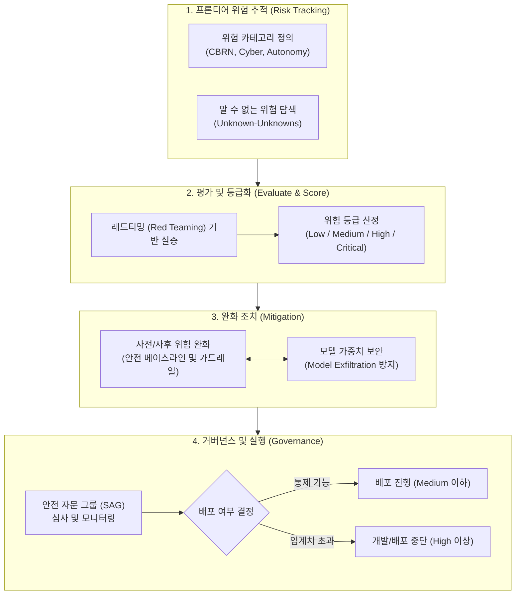

# 범용 인공지능 위험관리 프레임워크 (AGI Risk Management Framework)

---

## I. 파멸적 위험의 선제적 통제 체계, AGI 위험관리 프레임워크의 개요

**가. [[AGI]] 위험관리 프레임워크의 정의**

* [[범용 인공지능]](AGI) 및 프론티어(Frontier) AI 모델의 개발·배포 과정에서 발생 가능한 파멸적 위험(Catastrophic Risk)을 사전에 식별, 평가, 통제, 예측하기 위한 포괄적 안전 거버넌스 체계

**나. AGI 위험관리 프레임워크의 등장배경 및 특징**

* **등장배경**: AI의 능력 고도화 및 에이전트화(Agentic AI)로 인해 CBRN(생화학/핵), 사이버 테러, 통제력 상실 등 인류 생존을 위협하는 치명적 위험 대두
* **핵심특징**: 선제적 위험 평가(Red Teaming), 한계선 도달 시 개발/배포를 차단하는 임계치 기반 통제(Threshold), 알 수 없는 위험(Unknown-Unknowns)에 대한 지속적 예측 및 정렬(Alignment)

---

## II. AGI 위험관리 프레임워크의 개념도 및 핵심 기술 요소

### 가. AGI 위험관리 프레임워크의 개념도 및 동작 프로세스

* **핵심 동작**: 모델의 잠재적 위험을 카테고리화하여 추적하고, 레드팀 평가를 통해 위험 등급을 부여한 뒤, 안전 자문 그룹(SAG)의 통제하에 임계치 초과 시 배포 및 개발을 즉각 중단(Hold)하는 방어 [[프로세스]] 체계임.

### 나. AGI 위험관리 프레임워크의 핵심 기술/구성 요소

| 구분 | 요소기술(키워드) | 세부 설명 |
| --- | --- | --- |
| **위험 식별** | 파멸적 위험 지표 (Catastrophic Risk) | 생화학 및 핵무기(CBRN), 사이버 해킹, 대규모 설득(Persuasion), 모델 자율성(Autonomy) 등 범주화 관리 |
| **위험 식별** | 알 수 없는 위험 (Unknown-Unknowns) | 현재 예측 불가능한 신규 위험 카테고리를 지속해서 탐지하고 분석하기 위한 식별 프로세스 운영 |
| **평가 기술** | 레드티밍 (Red Teaming) | 외부 전문가 및 자동화 스크립트를 활용하여 의도적인 악의적 프롬프트 주입 및 한계 돌파 능력을 실증 평가 |
| **기준 통제** | 안전 등급제 (AI Safety Levels, ASL) | 모델의 파괴적 능력을 Low/Medium/High/Critical 4단계로 분류하여 단계별 엄격한 통제 수준 적용 |
| **위험 완화** | 시스템 가드레일 (Guardrails) | 위험 등급 완화(Pre/Post Mitigation)를 위해 입력 필터링, 거절(Refusal) 메커니즘, 출력 제어 기술 적용 |
| **위험 완화** | 안전 베이스라인 및 인프라 보안 | 모델 가중치(Weights) 탈취(Exfiltration)를 방지하기 위해 High/Critical 모델 대상 군사급 정보 보안 환경 구축 |
| **운영 통제** | AI 정렬 (AI Alignment) | 초인적 AI의 행동이 인류의 의도와 일치하도록 RLHF, RLAIF 등을 통한 가치 기반 미세 조정 (Superalignment) |
| **거버넌스** | 안전 자문 그룹 (Safety Advisory Group) | 위험 지표 심사, 비상 시나리오 대응, 임원진 및 이사회 보고를 통한 배포 중단(Kill Switch) 권한 행사 기구 |

---

## III. 기존 AI 위험관리 체계와 AGI 위험관리 체계 비교 및 향후 전망

### 가. 기존 일반 AI 위험관리 체계와의 핵심 비교

| 비교 항목 | 기존 AI RMF (예: NIST AI RMF 등) | 프론티어 AGI 위험관리 (예: OpenAI Preparedness) |
| --- | --- | --- |
| **관리 목적** | 사회적 윤리 확보 및 일상적 피해 예방 | **인류 생존 위협(Catastrophic) 방지** 및 파멸적 사고 차단 |
| **주요 대상** | 일반적 [[딥러닝]] 서비스, 분류/추천 시스템 등 | **초거대 [[초거대 언어 모델|LLM]], [[에이전틱 AI]]**, 자기 개선이 가능한 AI |
| **위험 평가 기준** | 데이터 편향성, 프라이버시 침해, 설명 가능성 | **사이버 테러 능력, CBRN 지원 능력, 통제 이탈** |
| **핵심 통제 방식** | 가이드라인 준수 및 프로세스 문서화 최적화 | **위험 임계치 도달 시 개발·배포 전면 강제 중지 (Hold)** |

### 나. 한계점 및 향후 기술 전망

* **실효성 한계 및 입법화 추세**: 현재 AGI 위험관리 프레임워크는 개별 기업(OpenAI, Anthropic 등)의 자율적 내부 정책(Self-regulation)에 머물러 경영진의 자의적 판단으로 우회될 위험성이 존재함. 이에 따라 EU AI Act 및 각국 [[AI 기본법]] 제정을 통한 법적 구속력 확보가 활발히 진행 중임.
* **제3자 독립 검증 및 평가 생태계 도래**: 기업 자체 평가의 한계를 극복하기 위해, 영국/미국 AI 안전 연구소(AISI) 및 독립적 제3자 감사 기관이 AGI 모델 출시 전 강제적 안전 검증(Audit)을 수행하는 체계로 발전할 전망임.

---

### 🔗 연관 토픽

- **소속 도메인**: [[00_인공지능_MOC|🤖 인공지능]]
- **세부 분류**: `6. 설명가능한 AI (XAI) & AI 윤리 · 거버넌스`
- **핵심 연관 토픽**:
  - [[AI 기본법]]
  - [[딥러닝]]
  - [[에이전틱 AI|에이전틱 AI(Agentic AI)]]
  - [[범용 인공지능]]
  - [[AGI|AGI (Artificial General Intelligence)]]
