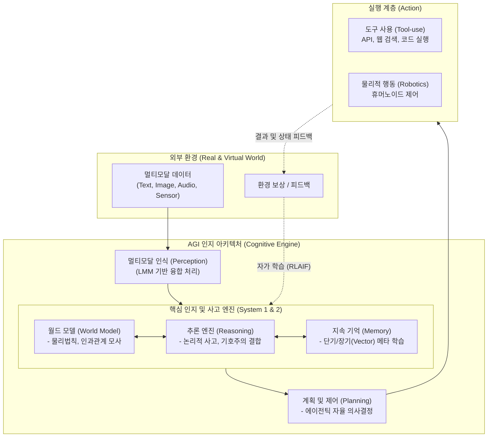

# 범용 인공지능 (AGI)

---

## I. 인간 수준의 사고와 자율적 문제 해결, 범용 인공지능(AGI)의 개요

**가. 범용 [[인공지능]](AGI, [[AGI|Artificial General Intelligence]])의 정의**

* 특정 도메인에 국한되지 않고, 모든 인지적 상황에서 인간과 유사하거나 그 이상의 학습, 추론, 문제 해결 능력을 자율적으로 발휘하는 인공지능 체계

**나. 범용 인공지능의 등장 배경 및 핵심 특징**

* **등장 배경**: 좁은 인공지능(ANI)의 과적합 및 유연성 한계, 초거대 언어모델([[초거대 언어 모델|LLM]])과 멀티모달 기술의 비약적 발전, 스케일링 법칙(Scaling Law)을 통한 지능의 창발(Emergence)
* **핵심 특징**: **범용성**(모든 영역의 태스크 수행), **자율성**(목표 설정 및 에이전트 기반 실행), **자가 학습**(지속적인 데이터 수집 및 진화), **다중 모달 추론**(시각/청각/텍스트 통합 이해)

---

## II. 범용 인공지능의 개념도 및 핵심 기술 요소

### 가. 범용 인공지능의 개념도 및 인지/동작 아키텍처

* **동작 흐름**: 다중 모달 데이터를 인식하고, 내부 월드 모델과 장기 기억을 통해 상황의 인과관계를 추론(System 2)한 후, 에이전트 기반으로 자율적인 도구 사용 및 물리적 제어를 수행하며 피드백을 통해 지속 학습함.

### 나. 범용 인공지능을 구현하기 위한 핵심 기술 요소

| 구분 | 요소기술(키워드) | 세부 설명 |
| --- | --- | --- |
| **기반 모델** | 멀티모달 파운데이션 (LMM) | 텍스트, 이미지, 음성 등 다양한 형태의 데이터를 동시에 이해하고 생성하는 대규모 융합 모델 |
| **인지/이해** | 월드 모델 (World Model) | 물리적 세계의 법칙과 객체 간의 인과관계를 시뮬레이션하여 데이터가 없는 상황에서도 예측을 수행 |
| **추론 기술** | 신경-기호주의 (Neuro-Symbolic) | 딥러닝의 직관적 패턴 인식(System 1)과 기호주의의 논리적/수학적 연역 추론(System 2)을 결합 |
| **학습 기술** | 지속 학습 (Continuous Learning) | 기존 지식의 망각(Catastrophic Forgetting) 없이 새로운 지식을 지속적으로 누적하여 자가 학습 |
| **학습 최적화** | RLAIF (AI 피드백 기반 [[강화학습]]) | 인간 개입 없이 AI 스스로 보상 모델을 생성하고 강화 학습을 수행하여 지능 고도화 (Q-Star 등) |
| **자율 제어** | [[에이전틱 AI]] (Agentic Workflow) | 주어진 추상적 목표를 달성하기 위해 스스로 하위 작업을 계획(Planning)하고 도구를 호출하여 실행 |
| **하드웨어** | 뉴로모픽 (Neuromorphic) 반도체 | 인간의 뇌신경 구조를 모방하여 스파이킹 신경망(SNN) 기반으로 초저전력/초고속 병렬 연산 처리 |
| **신뢰/안전** | AI 정렬 (AI Alignment / Guardrails) | AGI의 목표와 행동을 인류의 윤리적 가치와 의도에 부합하도록 제어하고 통제하는 안전망 기술 |

---

## III. 인공지능 발전 단계 비교 및 향후 전망

### 가. 인공지능의 진화 단계 비교 (ANI vs AGI vs ASI)

| 비교 항목 | ANI (좁은 인공지능) | AGI (범용 인공지능) | ASI (초인공지능) |
| --- | --- | --- | --- |
| **개념/정의** | 특정 도메인의 단일 작업에 특화 | 인간 수준의 범용적 인지/문제 해결 | 인류의 지성을 초월하는 통합 지능 |
| **학습 및 추론** | [[지도학습]] 위주, 패턴 매칭 기반 제한적 추론 | 제로샷(Zero-shot), 지속 학습, 논리적 인과 추론 | 자기 진화(Self-Evolution), 초차원적 통찰 |
| **적용성/유연성** | 도메인 국한 (환경 변화에 취약) | 높은 유연성 (미지의 환경에서 적응 및 대응) | 무한한 확장성 (새로운 과학적 원리 발견) |
| **대표 사례** | 알파고, [[Smart Car(자율주행)|자율주행]](L3), 초기 챗봇 | 인간 수준의 멀티 에이전트(개발 진행 중) | 기술적 특이점(Singularity) 도래 이후 |

### 나. 향후 전망 및 기술 동향

* **System 2 추론의 부상**: 최근 직관적 답변을 내놓는 모델에서 벗어나, 응답 전 내부적으로 논리적 사고 과정(Chain of Thought)을 거치는 고도화된 추론 모델(예: OpenAI o1)이 등장하며 AGI로의 진입을 가속화함.
* **해결 과제**: AGI 실현을 위해서는 천문학적인 컴퓨팅 연산과 전력 소모를 해결하기 위한 **양자/뉴로모픽 컴퓨팅의 결합**이 필수적이며, AI가 인류에게 위협이 되지 않도록 보장하는 **AI 안전 및 가치 정렬(Alignment) 연구**가 최우선적으로 병행되어야 함.

---

### 🔗 연관 토픽

- **소속 도메인**: [[00_인공지능_MOC|🤖 인공지능]]
- **세부 분류**: `3. 딥러닝 핵심 아키텍처 & 신경망`
- **핵심 연관 토픽**:
  - [[에이전틱 AI|에이전틱 AI(Agentic AI)]]
  - [[AGI|AGI (Artificial General Intelligence)]]
  - [[인공지능]]
  - [[초거대 언어 모델|초거대 언어 모델(Large Language Model)]]
  - [[딥러닝]]
