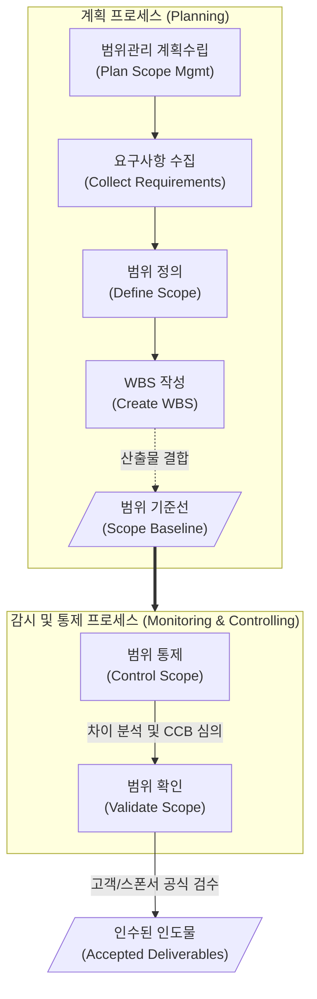

# 범위관리 (Scope Management)

---

## I. 프로젝트 성공을 위한 기준선 설정 및 통제 활동, 범위관리의 개요

* **정의**: 프로젝트가 목표를 달성하기 위해 포함해야 할 필수 작업(To-Do)과 포함하지 않아야 할 작업(Not-To-Do)을 명확히 정의하고 철저히 통제하는 프로젝트 관리 활동
* 프로젝트 3중 제약(범위, 일정, 원가)의 핵심 기반으로, [[WBS]](작업분류체계)를 통해 나머지 지식 영역의 산정 기준점 제공
* **필요성 및 특징**: 요구사항 변경 통제(Scope Creep 방지), 불필요한 기능 추가 방지(Gold Plating 방지), 이해관계자 간 명확한 인도물 기준 및 인수 조건 합의

---

## II. 범위관리의 개념도 및 핵심 프로세스 요소

### 가. 범위관리의 개념도 및 프로세스 흐름

* 요구사항 수집과 범위 정의를 거쳐 생성된 WBS를 기반으로 '범위 기준선'을 확정하고, 실행 과정에서 발생하는 변경을 통제(Control)하며 최종 인도물에 대한 고객의 승인(Validate)을 수행함

### 나. 범위관리의 핵심 기술 및 구성 요소

| 구분 | 요소기술(키워드) | 세부 설명 |
| --- | --- | --- |
| **기준선** | 범위 기준선 (Scope Baseline) | 프로젝트 범위 기술서, WBS, WBS 사전(Dictionary)이 결합된 확정된 범위의 기준점 |
| **분할 기법** | WBS (작업분류체계) | 프로젝트의 총 범위를 관리가 가능한 수준의 작업 패키지(Work Package) 단위로 계층화하여 분할 |
| **요구 추출** | 요구사항 추적 매트릭스 (RTM) | 요구사항의 출처에서부터 설계, 개발, 테스트에 이르는 전체 생명주기 동안의 이행 여부 추적 |
| **위험 요소** | 범위 팽창 (Scope Creep) | 공식적인 변경 통제 절차(CCB) 없이 고객의 요구나 내부 요인으로 범위가 지속적으로 늘어나는 현상 |
| **위험 요소** | 금도금 (Gold Plating) | 고객이 요구하지 않은 불필요한 부가 기능을 프로젝트 팀이 임의로 추가하여 자원을 낭비하는 현상 |
| **통제 활동** | 차이 분석 (Variance Analysis) | 설정된 범위 기준선과 실제 수행된 작업 성과 간의 차이를 분석하여 시정 조치 도출 |
| **통제 활동** | CCB (변경통제위원회) | 베이스라인 변경을 초래하는 범위 변경 요청을 심의, 승인 또는 기각하는 의사결정 기구 |
| **승인 활동** | 인스펙션 (Inspection) | 인도물이 인수 기준(Acceptance Criteria)을 충족하는지 고객과 함께 공식적으로 검토하고 측정 |

---

## III. 전통적 범위관리와 애자일 범위관리 비교 및 향후 전망

### 가. 전통적(Waterfall) 범위관리 vs 애자일(Agile) 범위관리 비교

| 비교 항목 | 전통적 범위관리 (Traditional) | 애자일 범위관리 ([[Agile]]) |
| --- | --- | --- |
| **관리 단위 및 도구** | WBS, 프로젝트 범위 기술서 | 제품 백로그(Product Backlog), 유저 스토리 |
| **범위 확정 시점** | 프로젝트 초기 기획/설계 단계 확정 | 스프린트(반복 주기)마다 지속적 점진적 구체화 |
| **변경에 대한 태도** | 변경 억제 (CCB를 통한 엄격한 통제) | 변경 환영 (비즈니스 가치 극대화를 위해 수용) |
| **승인 및 검수 방식** | 단계별 마일스톤 및 최종 인도 시 일괄 승인 | 매 스프린트 종료 시점의 스프린트 리뷰(Review)를 통한 인수 |
| **핵심 포커스** | 계획된 기준선(Baseline) 준수 및 차이 통제 | 고객 가치 중심의 우선순위(Priority) 조정 및 최소 기능 제품([[01_IT Tech/MVP]]) 인도 |

### 나. 범위관리의 최신 동향 및 산업 적용 방향

* **가치 기반 하이브리드(Hybrid) [[테일러링]]**: 최근 대형 IT 프로젝트에서는 전체 예산과 일정을 WBS 기반으로 통제하면서도, 실행 단계의 개발 범위는 애자일 백로그로 유연하게 관리하는 하이브리드 방법론 적용이 일반화됨.
* **AI 기반 ALM 도구의 활용**: Jira, Azure [[DevOps]] 등 최신 ALM 도구에 AI가 결합되어, 입력된 에픽(Epic)과 요구사항을 바탕으로 하위 태스크와 WBS를 자동 생성하고 잠재적인 Scope Creep 위험을 예측해 경고하는 지능형 통제 기능이 도입되고 있음.

---

### 🔗 연관 토픽

- **소속 도메인**: [[00_프로젝트관리_MOC|📋 프로젝트관리]]
- **세부 분류**: `2. 프로젝트 범위 & 일정 관리 (Scope & Schedule)`
- **핵심 연관 토픽**:
  - [[WBS|WBS (Work Breakdown Structure)]]
  - [[테일러링|테일러링 (Tailoring)]]
  - [[01_IT Tech/MVP]]
  - [[3점 산정]]
  - [[Agile]]
