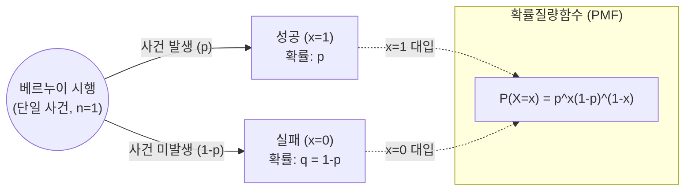

# 베르누이 분포 (Bernoulli Distribution)

---

## I. 이진 분류 확률 모델의 근간, 베르누이 분포의 개요

**가. 베르누이 분포의 정의**

* 단 1회의 시행에서 결과가 오직 성공(1) 또는 실패(0)의 두 가지 중 하나로만 나타나는 이산 확률 변수의 확률 분포 모델
* [[인공지능]] 및 통계학에서 이진 사건(Binary Event)을 수학적으로 모델링하기 위한 가장 기본적인 확률 분포

**나. 베르누이 분포의 등장배경 및 특징**

* **등장배경**: 동전 던지기, 제품 불량 여부 등 상호배타적인 두 가지 결과만 갖는 현상의 정량적 분석 및 예측 필요성 대두
* **특징**: **단일 시행**(1회 시행 전제), **상호배타성**(결과는 1 또는 0), **파생성**(n회 반복 시 이항 분포로 확장)

---

## II. 베르누이 분포의 개념도 및 핵심 수학적 요소

### 가. 베르누이 분포의 개념도 및 동작 원리

* 단 1회의 상호배타적 시행 결과(성공/실패)를 이산 확률 변수로 매핑하고, 이를 확률질량함수(PMF)를 통해 정량화하는 구조임

### 나. 베르누이 분포의 핵심 수학적/통계적 요소

| 구분 | 요소기술(키워드) | 세부 설명 |
| --- | --- | --- |
| **기본 전제** | 표본 공간 (Sample Space) | 결과값으로 오직 성공(1)과 실패(0)의 두 가지 원소 $\Omega = \{0, 1\}$ 만 가짐 |
| **기본 전제** | 모수 (Parameter) | $p$ ($0 \le p \le 1$); 사건이 성공할 확률을 의미하며, 분포의 형태를 결정함 |
| **함수 모델** | 확률질량함수 (PMF) | $P(X=x) = p^x(1-p)^{1-x}$ ($x \in \{0, 1\}$); $x=1$이면 $p$, $x=0$이면 $1-p$가 됨 |
| **통계 지표** | 기댓값 (Expected Value) | $E(X) = 1 \cdot p + 0 \cdot (1-p) = p$; 확률 변수 $X$의 평균값은 성공 확률과 동일 |
| **통계 지표** | 분산 (Variance) | $V(X) = p(1-p)$; 분포의 퍼짐 정도를 나타내며, 성공 확률 $p=0.5$일 때 최대가 됨 |
| **통계 지표** | 적률생성함수 (MGF) | $M_X(t) = E(e^{tX}) = (1-p) + pe^t$; 분포의 모멘트(기댓값, 분산 등)를 도출하는 함수 |
| **독립성** | 베르누이 시행 (Trial) | 각 시행은 독립적이어야 하며(Independent), 매 시행마다 성공 확률 $p$는 일정해야 함 |
| **확장성** | 이항 분포 (Binomial) | 베르누이 분포를 따르는 독립적인 시행을 $n$번 반복했을 때의 성공 횟수를 나타내는 분포 |

---

## III. 유사 이산 확률 분포 비교 및 인공지능/기계학습 활용 사례

### 가. 베르누이 분포와 주요 이산 확률 분포 비교

| 비교 항목 | 베르누이 분포 (Bernoulli) | 이항 분포 (Binomial) | 카테고리 분포 (Categorical) |
| --- | --- | --- | --- |
| **시행 횟수 ($n$)** | **단 1회** ($n=1$) | **$n$회 반복** ($n \ge 1$) | **단 1회** ($n=1$) |
| **결과 종류 (Class)** | 2가지 (성공/실패) | 2가지 (성공/실패) | **$K$가지** ($K \ge 3$) |
| **확률 변수 의미** | 1회 시행 시 성공 여부 | $n$회 시행 중 총 성공 횟수 | 1회 시행 시 $K$개 중 특정 범주 속할 확률 |
| **주요 파라미터** | 성공 확률 $p$ | 시행 횟수 $n$, 성공 확률 $p$ | 각 범주별 확률 벡터 $\mathbf{p} = (p_1, \dots, p_k)$ |
| **기계학습 매핑** | 이진 분류 (Binary) | 배치(Batch) 기반 불량률 추정 | 다중 [[클래스]] 분류 (Multi-class) |

### 나. 인공지능/머신러닝 분야의 핵심 활용 사례 및 동향

* **로지스틱 회귀 (Logistic Regression)**: 데이터가 특정 클래스에 속할 확률을 0과 1 사이의 값으로 예측하며, 타겟 변수가 베르누이 분포를 따른다고 가정하여 목적 함수(BCE)를 최적화함
* **베르누이 나이브 베이즈 (Bernoulli Naive Bayes)**: 텍스트 마이닝 및 스팸 메일 필터링 시, 문서 내 특정 단어의 '출현 여부(1/0)'만을 기반으로 문서를 이진 분류하는 데 활용됨
* **[[딥러닝]] 손실 함수 (Binary Cross Entropy)**: 신경망의 이진 분류 문제에서 모델의 출력값(예측 확률)과 실제 라벨(베르누이 분포) 간의 정보량 차이(KL-Divergence)를 최소화하는 비용 함수로 직접 응용됨

---

### 🔗 연관 토픽

- **소속 도메인**: [[00_인공지능_MOC|🤖 인공지능]]
- **세부 분류**: `1. 수학 · 통계학 & 데이터 전처리`
- **핵심 연관 토픽**:
  - [[확률분포]]
  - [[인공지능]]
  - [[Network Dessection]]
  - [[딥러닝]]
  - [[이상치]]
