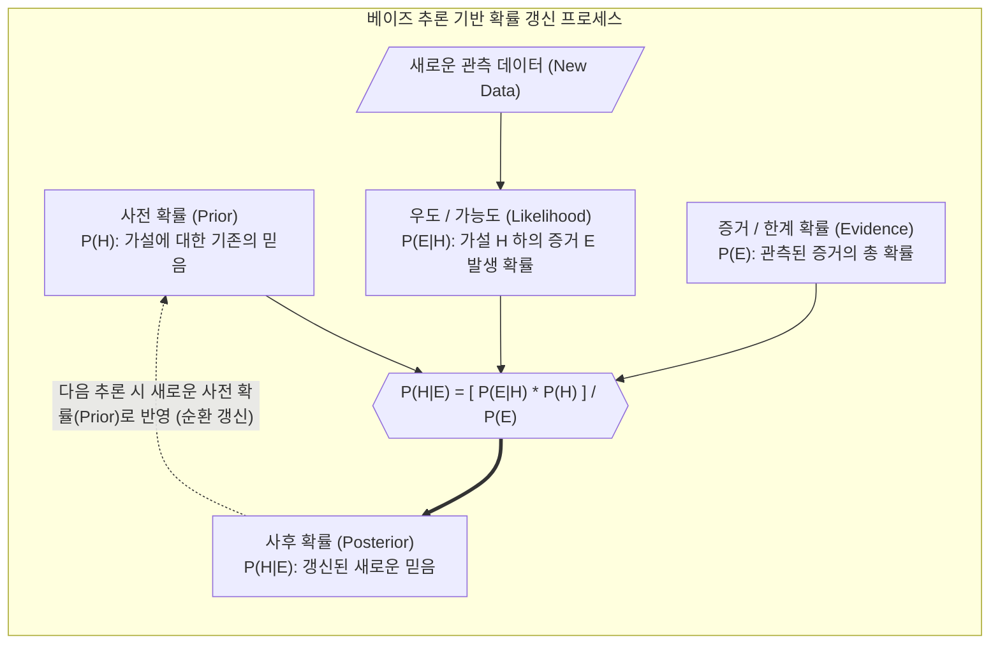

# 베이즈 추론 (Bayesian Inference)

---

## I. 불확실성 환경에서의 확률적 갱신 기법, 베이즈 추론의 개요

**가. 베이즈 추론의 정의**

* 새롭게 관측된 증거(Evidence)와 특정 가설에 대해 기존에 가지고 있던 사전 확률(Prior)을 결합하여, 불확실한 상황에 대한 사후 확률(Posterior)을 지속적으로 갱신하는 확률적 추론 기법

**나. 베이즈 추론의 필요성 및 특징**

* **필요성**: 제한된 데이터와 노이즈 환경에서의 합리적 의사결정 요구, 의료/금융 등 고위험(High-Risk) 도메인에서 [[인공지능]] 예측의 불확실성(Uncertainty) 정량화 필수
* **특징**: **믿음의 갱신(Belief Update)**(관측에 따른 확률 변화), **역확률 추론**(결과를 통해 원인을 추론), **기계학습 근간**(나이브 베이즈, BNN 등 베이지안 확률 모델의 기반)

---

## II. 베이즈 추론의 개념도 및 핵심 구성 요소

### 가. 베이즈 추론의 개념도 및 동작 원리

* 사전 확률 $P(H)$에 새로운 증거 기반의 우도 $P(E\vert{}H)$를 결합하여, 불확실성이 감소된 사후 확률 $P(H\vert{}E)$를 지속적으로 도출 및 갱신하는 선순환 구조임

### 나. 베이즈 추론의 핵심 기술 요소

| 구분 | 요소기술(키워드) | 세부 설명 |
| --- | --- | --- |
| **추론 지표** | 사전 확률 (Prior) | 새로운 사건이나 데이터가 관측되기 전에 가지고 있는 가설에 대한 주관적/경험적 확률 분포 |
| **추론 지표** | 사후 확률 (Posterior) | 새로운 증거(사건 E)가 관측된 이후에 베이즈 룰에 의해 업데이트된 가설(H)의 최종 확률 |
| **추론 지표** | 우도/가능도 (Likelihood) | 특정 가설이 참이라는 전제하에, 현재 관측된 데이터(증거)가 나타날 조건부 확률 |
| **근사 연산** | MCMC (마르코프 체인 몬테카를로) | 사후 확률 분포의 복잡한 적분 계산을 우회하기 위해 난수를 발생시켜 근사적으로 표본을 추출하는 기법 |
| **근사 연산** | 변분 추론 (Variational Inference) | 다루기 힘든 복잡한 사후 분포를 최적화(KLD 최소화)를 통해 단순한 근사 분포로 추정하여 계산 비용 절감 |
| **적용 모델** | 베이지안 네트워크 (Bayesian Network) | 확률 변수들 간의 조건부 독립성을 [[방향성 비순환 그래프]](DAG)로 표현한 확률적 추론 모델 |
| **적용 모델** | [[베이지안 딥러닝]] (BNN) | 신경망의 가중치를 고정된 단일값(Point Estimate)이 아닌 확률 분포로 취급하여 모델 예측의 불확실성을 계산 |
| **최적화** | 베이지안 최적화 (Bayesian Optimization) | 블랙박스 함수의 전역 최적해를 찾기 위해 과거의 탐색 결과를 사전 지식(Surrogate Model)으로 활용하는 튜닝 기법 |

---

## III. 빈도주의와 베이지안 관점 비교 및 향후 전망

### 가. 확률을 바라보는 통계적 관점 비교 (빈도주의 vs 베이지안)

| 비교 항목 | 빈도주의 추론 (Frequentist) | 베이즈 추론 (Bayesian) |
| --- | --- | --- |
| **확률의 정의** | 무한히 반복된 시행에서의 **객관적 발생 빈도** | 사건 발생 가능성에 대한 관찰자의 **주관적 믿음/확신도** |
| **모수 (Parameter)** | 고정되어 있는 불변의 상수 (알 수 없는 참값) | 확률 분포를 가지는 확률 변수 (데이터 관측에 따라 변동) |
| **추론 메커니즘** | 최대우도추정(MLE), [[유의확률|p-value]] 기반 [[가설 검정]] | 베이즈 정리에 의한 사후확률추정(MAP) 및 확률 갱신 |
| **주요 활용** | 임상 시험, 품질 관리, A/B 테스트 | 인공지능 불확실성 추론, 초거대 AI 하이퍼파라미터 튜닝 |

### 나. 베이즈 추론의 최신 동향 및 향후 전망

* **[[초거대 언어 모델|LLM]] 및 생성형 AI의 확률적 사고 제고**: 최근 거대 언어 모델(LLM)에 베이지안 추론 방식을 학습시켜, 모델이 단순히 다음 단어를 예측하는 것을 넘어 스스로 예측의 신뢰도를 평가하고 환각(Hallucination)을 줄이는 확률적 사고 능력을 개선하는 연구가 본격화됨.
* **의료/[[Smart Car(자율주행)|자율주행]] 등 안전 필수(Safety-Critical) AI의 핵심 기반**: 모델이 "자신이 무엇을 모르는지 아는 능력(Know what it doesn't know)"이 중요해짐에 따라, 베이지안 뉴럴 네트워크(BNN)와 [[MLOps]]가 결합하여 예측의 불확실성을 정량화하고 통제하는 방향으로 산업 적용이 확대될 전망임.

---

### 🔗 연관 토픽

- **소속 도메인**: [[00_인공지능_MOC|🤖 인공지능]]
- **세부 분류**: `1. 수학 · 통계학 & 데이터 전처리`
- **핵심 연관 토픽**:
  - [[베이지안 딥러닝]]
  - [[MLOps]]
  - [[가설 검정]]
  - [[유의확률|유의확률 (p-value)]]
  - [[인공지능]]
