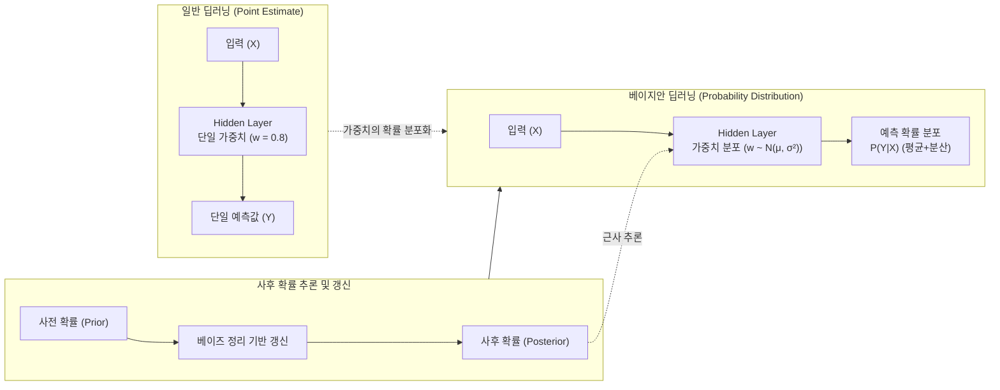

# 베이지안 딥러닝 (Bayesian Deep Learning)

---

## I. 신뢰성 있는 AI를 위한, 베이지안 딥러닝의 개요

**가. 베이지안 [[딥러닝]](BDL)의 정의**

* 인공신경망의 가중치(Weight)를 고정된 단일 값(Point Estimate)이 아닌 확률 분포(Probability Distribution)로 추정하여, 모델 예측의 불확실성(Uncertainty)을 정량화하는 딥러닝 기법

**나. 베이지안 딥러닝의 등장배경 및 특징**

* **등장배경**: 기존 딥러닝의 과확신(Overconfidence) 오류로 인한 치명적 사고 발생, [[Smart Car(자율주행)|자율주행]]/의료 등 안전 필수(Safety-Critical) 도메인에서의 높은 [[신뢰성]] 요구
* **특징**: **가중치의 확률 변수화**(사전/사후 확률 활용), **불확실성 분리**(Epistemic/Aleatoric), **강건성**(데이터 부족 및 OOD 데이터에 대한 유연한 대응)

---

## II. 베이지안 딥러닝의 개념도 및 핵심 기술 요소

### 가. 베이지안 딥러닝의 아키텍처 및 동작 원리

* 인공신경망의 각 노드 연결 가중치를 고정 상수가 아닌 평균(μ)과 분산(σ²)을 갖는 확률 분포로 치환하여 학습함
* 베이즈 정리를 통해 관측 데이터를 바탕으로 사후 확률 분포를 지속 갱신하며 결과의 불확실성을 측정함

### 나. 베이지안 딥러닝의 핵심 기술 및 구성 요소

| 구분 | 요소기술(키워드) | 세부 설명 |
| --- | --- | --- |
| **불확실성 유형** | 인식적 불확실성 (Epistemic) | 모델의 무지(데이터 부족)로 인해 발생하며, 학습 데이터가 추가될수록 불확실성이 감소함 |
| **불확실성 유형** | 우연적 불확실성 (Aleatoric) | 데이터 자체의 내재적 노이즈(센서 오류 등)로 인해 발생하며, 데이터가 추가되어도 감소하지 않음 |
| **추론 기법** | 변분 추론 (Variational Inference) | 계산이 복잡한 사후 확률 분포를 추정하기 위해, 다루기 쉬운 근사 분포를 설정하고 두 분포의 차이(KLD)를 최소화하는 기법 |
| **추론 기법** | MCMC (마르코프 체인 몬테카를로) | 사후 확률 분포로부터 무작위 샘플링을 반복하여 분포를 근사하는 기법으로, 정확도는 높으나 연산량이 매우 큼 |
| **실용적 근사** | MC [[Dropout]] (몬테카를로 드롭아웃) | 훈련뿐만 아니라 추론(Test) 시에도 Dropout을 적용하여 여러 번의 예측 결과를 앙상블, 베이지안 네트워크를 근사하는 기법 |
| **손실 함수** | ELBO (Evidence Lower Bound) | 변분 추론에서 사후 확률을 근사할 때 최대화해야 하는 목적 함수 (재구성 오차 최소화 + KLD 최소화) |
| **평가 지표** | NLL (Negative Log Likelihood) | 예측 분포가 실제 정답을 얼마나 잘 포함하는지(불확실성 측정의 정확도)를 평가하는 지표 |
| **평가 지표** | ECE (Expected Calibration Error) | 모델이 예측한 확신도(Confidence)와 실제 정확도(Accuracy) 간의 차이를 측정하는 신뢰성 지표 |

---

## III. 일반 딥러닝과 베이지안 딥러닝 비교 및 활용 동향

### 가. 일반 딥러닝(Standard DL)과 베이지안 딥러닝(BDL) 비교

| 비교 항목 | 일반 딥러닝 (Standard DL) | 베이지안 딥러닝 (BDL) |
| --- | --- | --- |
| **가중치 형태** | 고정된 단일 상수 (Point Estimate) | 확률 분포 (Probability Distribution) |
| **학습 방법** | 오차역전파 기반 최적화 (SGD, Adam 등) | 베이즈 룰 기반 사후 확률 분포 추정 (VI, MCMC 등) |
| **출력 형태** | 결정론적 단일 예측값 (예: 고양이 99%) | 예측값의 확률 분포 (예: 고양이일 확률 95% ± 4%) |
| **과적합(Overfitting)** | 데이터가 적을 때 과적합 및 과확신 발생 | 사전 확률 개입으로 정규화 효과 부여, 과적합 방어 |
| **연산 복잡도** | 상대적 낮음 (빠른 추론 속도) | 매우 높음 (분포 계산 및 샘플링 부하 발생) |

### 나. 베이지안 딥러닝의 활용 사례 및 최신 동향

* **LLM 환각(Hallucination) 탐지 및 통제**: [[초거대 언어 모델]](LLM)의 생성 텍스트에 베이지안 관점을 적용, 답변의 확신도를 수치화하여 모르는 질문에 대해 "모른다"고 답변할 수 있는 신뢰성(Calibration) 제고 기법으로 활용
* **의료 및 자율주행 OOD(Out-of-Distribution) 탐지**: 학습 데이터의 범주를 벗어난 예외 상황(미등록 장애물, 희귀 병변 등)을 마주했을 때, 높은 Epistemic 불확실성을 반환하여 자율 제어권을 인간에게 넘기도록 설계
* **경량화 추론 기술의 발전**: 연산 비용의 한계를 극복하기 위해, 사전 학습된 모델의 가중치 궤적을 활용하는 SWAG(Stochastic Weight Averaging-Gaussian) 및 에지([[EDGE|Edge]]) 디바이스 환경의 [[NPU]] 가속기 최적화 연구 활발 진행 중

---

### 🔗 연관 토픽

- **소속 도메인**: [[00_인공지능_MOC|🤖 인공지능]]
- **세부 분류**: `1. 수학 · 통계학 & 데이터 전처리`
- **핵심 연관 토픽**:
  - [[베이지안 모델]]
  - [[Dropout]]
  - [[베이즈 추론]]
  - [[추정 이론|추정 이론(Estimation Theory)]]
  - [[초거대 언어 모델|초거대 언어 모델(Large Language Model)]]
