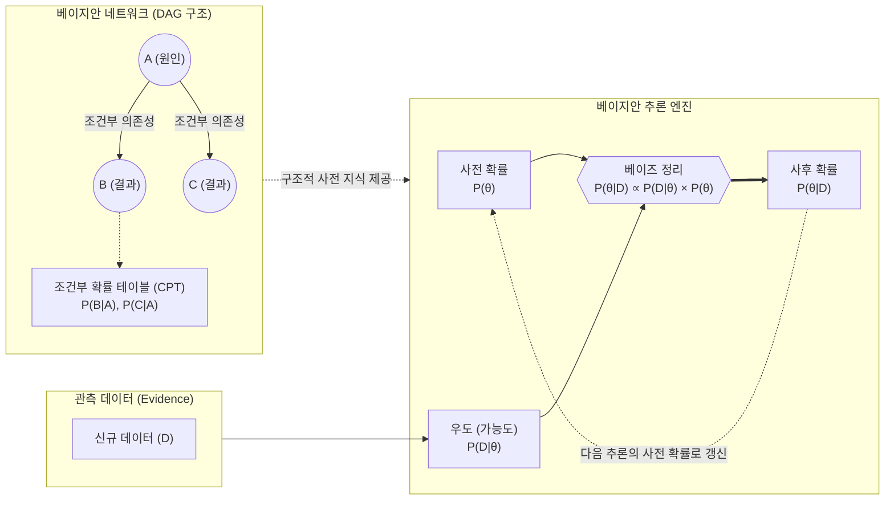

# 베이지안 모델 (Bayesian Model)

---

## I. 불확실성 정량화 및 확률적 추론 기반, 베이지안 모델의 개요

**가. 베이지안 모델의 정의**

* 변수들 간의 조건부 확률과 사전 지식(Prior)을 결합하여 사후 확률(Posterior)을 지속적으로 갱신하며, 데이터의 불확실성을 수학적으로 처리하는 확률적 추론 모델
* [[베이즈 정리]](Bayes' Theorem)를 근간으로, 변수를 점 추정(Point Estimate)이 아닌 확률 분포(Distribution)로 모델링하는 [[인공지능]]/통계 기법

**나. 베이지안 모델의 등장 배경 및 특징**

* **등장 배경**: 제한된 데이터와 노이즈 환경에서의 합리적 추론 필요, 기존 [[딥러닝]] 모델의 과확신(Overconfidence) 오류에 따른 치명적 사고 발생
* **핵심 특징**: **믿음의 갱신**(데이터 관측에 따른 사후 확률 업데이트), **불확실성 정량화**(인식적/우연적 불확실성 분리 및 측정), **사전 지식 반영**(전문가 지식의 모델 주입 가능)

---

## II. 베이지안 모델의 개념도 및 핵심 기술 요소

### 가. 베이지안 모델의 개념도 및 추론 원리

* 도메인 지식을 [[방향성 비순환 그래프]](DAG)로 모델링하고, 새로운 데이터(D)가 관측될 때마다 베이즈 정리를 통해 가설(θ)의 사후 확률을 순환적으로 갱신함

### 나. 베이지안 모델의 핵심 기술 및 구성 요소

| 구분 | 요소기술(키워드) | 세부 설명 |
| --- | --- | --- |
| **추론 기반** | 베이즈 정리 (Bayes' Rule) | 사전 확률과 우도를 결합하여 관측 데이터 기반의 사후 확률을 계산하는 수학적 토대 |
| **[[모델 구조]]** | 방향성 비순환 그래프 (DAG) | 변수(노드) 간의 인과관계 및 조건부 독립성을 방향성 있는 간선([[EDGE|Edge]])으로 표현 |
| **확률 표현** | 조건부 확률 테이블 (CPT) | 각 노드가 부모 노드의 상태에 따라 특정 값을 가질 확률을 정량화한 테이블 |
| **학습/추론** | MCMC (마르코프 체인 몬테카를로) | 복잡한 사후 확률 분포의 직접 적분이 어려울 때, 난수를 발생시켜 근사적으로 표본을 추출하는 추론 기법 |
| **학습/추론** | 변분 추론 (Variational Inference) | 다루기 힘든 사후 분포를 최적화 문제(KL Divergence 최소화)로 변환하여 단순한 근사 분포로 추정 |
| **응용 기법** | 베이지안 네트워크 (BN) | 다수의 변수 간 확률적 관계를 그래피컬하게 나타내어 인과관계 추론 및 진단에 활용 |
| **응용 기법** | [[베이지안 딥러닝]] (BDL) | 인공신경망의 가중치를 확률 분포로 취급(예: MC [[Dropout]])하여 예측의 불확실성을 산출 |
| **최적화** | 베이지안 최적화 (BO) | 대체 모델(Surrogate)을 활용하여 초거대 AI 모델의 하이퍼파라미터 등 전역 최적해를 효율적으로 탐색 |

---

## III. 베이지안 모델과 빈도주의 모델 비교 및 향후 전망

### 가. 확률론적 관점에 따른 추론 모델 비교

| 비교 항목 | 빈도주의 모델 (Frequentist Model) | 베이지안 모델 (Bayesian Model) |
| --- | --- | --- |
| **확률의 정의** | 무한 반복 시행 시 발생하는 **객관적 빈도** | 사건 발생에 대한 관찰자의 **주관적 믿음/확신도** |
| **파라미터(모수)** | 고정된 하나의 상수값 (알 수 없는 참값) | 확률 분포를 가지는 확률 변수 (데이터에 따라 변동) |
| **핵심 추론 방식** | 최대우도추정(MLE), [[유의확률|p-value]], 신뢰구간 검정 | 사후확률최대화(MAP), 베이즈 룰에 의한 확률 갱신 |
| **과적합(Overfitting)** | 데이터가 적을 경우 과적합 발생 위험 높음 | 사전 확률(Prior) 개입으로 자체 정규화 효과 발생 |
| **주요 활용 분야** | A/B 테스트, 품질 관리, 전통적 기계학습 모델 | 의료 진단 AI, [[Smart Car(자율주행)|자율주행]] 불확실성 정량화, [[AutoML (Automated Machine Learning)|AutoML]] |

### 나. 베이지안 모델의 최신 동향 및 향후 전망

* **거대 언어 모델([[초거대 언어 모델|LLM]])의 환각(Hallucination) 통제**: LLM이 생성하는 답변의 인식적 불확실성(Epistemic Uncertainty)을 베이지안 접근법으로 정량화하여, 모델이 '모르는 것은 모른다'고 응답하게 하는 [[신뢰성]] 향상 기법으로 적극 도입 중임.
* **안전 필수(Safety-Critical) 시스템의 필수 요건화**: 자율주행, AI 정밀 의료 등 예측 실패가 치명적 결과로 이어지는 도메인에서, 결정론적(Deterministic) 딥러닝의 한계를 극복하기 위해 베이지안 딥러닝(BNN) 기반의 OOD(Out-of-Distribution) 탐지 기술 적용이 표준으로 자리 잡을 전망임.

---

### 🔗 연관 토픽

- **소속 도메인**: [[00_인공지능_MOC|🤖 인공지능]]
- **세부 분류**: `1. 수학 · 통계학 & 데이터 전처리`
- **핵심 연관 토픽**:
  - [[베이지안 딥러닝]]
  - [[베이즈 정리|베이즈 정리 (이론)]]
  - [[Dropout]]
  - [[인공지능]]
  - [[유의확률|유의확률 (p-value)]]
