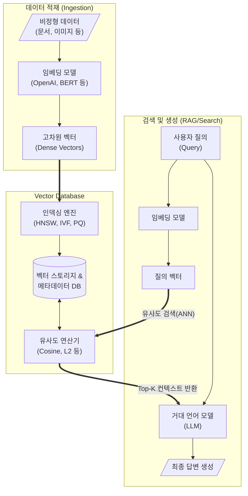

# 벡터 데이터베이스 (Vector Database)

---

## I. AI와 LLM의 핵심 인프라, 벡터 데이터베이스(Vector Database)의 개요

**가. 벡터 데이터베이스의 정의**

* 텍스트, 이미지, 오디오 등의 비정형 데이터를 AI 모델을 통해 고차원 벡터(Embedding) 형태로 변환하여 저장하고, 벡터 간의 [[유사도|유사도(Similarity)]] 연산을 통해 의미 기반(Semantic) 검색을 수행하는 특화 [[데이터베이스]] 시스템

**나. 벡터 데이터베이스의 필요성 및 특징**

* **필요성**: 거대 언어 모델([[초거대 언어 모델|LLM]])의 환각(Hallucination) 현상 방지, 최신 정보 및 기업 내부 데이터 기반의 검색 증강 생성(RAG) 파이프라인 구축 필수
* **특징**: **고차원 데이터 처리**(수백~수만 차원), **의미 기반 검색**(단어 일치가 아닌 문맥 일치 탐색), **ANN(Approximate Nearest Neighbor)** [[알고리즘]] 기반 초고속 검색

---

## II. 벡터 데이터베이스의 개념도 및 핵심 기술 요소

### 가. 벡터 데이터베이스의 개념도 및 동작 원리

* 원본 데이터를 벡터화하여 인덱싱(저장)하고, 사용자 질의 또한 벡터로 변환하여 저장된 벡터와의 거리/유사도를 계산(ANN)해 가장 밀접한 Top-K 문서를 추출하여 LLM에 컨텍스트로 제공함

### 나. 벡터 데이터베이스의 핵심 기술 요소

| 구분 | 요소기술(키워드) | 세부 설명 |
| --- | --- | --- |
| **데이터 변환** | 임베딩 (Embedding) | 비정형 데이터의 의미적 특성을 보존하여 컴퓨터가 연산 가능한 고차원 밀집 벡터(Dense Vector) 공간에 매핑하는 기술 |
| **인덱싱 알고리즘** | HNSW | 계층적 그래프 구조(Hierarchical Navigable Small World)를 이용하여 정확도와 검색 속도를 극대화한 최신 벡터 인덱싱 |
| **인덱싱 알고리즘** | IVF & PQ | 역색인(Inverted File) 클러스터링과 곱 양자화(Product Quantization)를 결합하여 메모리 사용량 절감 및 고속 검색 지원 |
| **유사도 측정** | 코사인 유사도 (Cosine) | 두 벡터 간의 사잇각을 계산하여 데이터의 크기에 상관없이 벡터의 방향성(의미)이 일치하는지 측정하는 메트릭 |
| **유사도 측정** | 유클리디안 거리 (L2) | 다차원 공간에서 두 점(벡터) 사이의 직선거리를 계산하여 기하학적으로 가장 가까운 데이터를 찾는 방식 |
| **검색 기법** | ANN 검색 | 정확한 최근접 이웃(KNN) 검색의 막대한 연산 비용을 줄이기 위해, 약간의 오차를 허용하면서 초고속으로 근사값을 찾는 기술 |
| **하이브리드 탐색** | 희소/밀집 융합 검색 | 전통적 키워드 기반 BM25(Sparse) 검색과 벡터 기반(Dense) 검색을 결합하여 정보 검색(IR)의 정확도 극대화 |
| **시스템 관리** | 메타데이터 필터링 | 벡터 유사도 탐색 전후에 날짜, 카테고리 등 속성 메타데이터 기반 필터링을 적용하여 쿼리 성능 및 적합성 향상 |

---

## III. 전통적 관계형 DB와의 비교 및 발전 동향

### 가. 벡터 데이터베이스 vs 관계형 DB(RDBMS) 비교

| 비교 항목 | 벡터 데이터베이스 (Vector DB) | 관계형 DB (RDBMS) |
| --- | --- | --- |
| **데이터 구조** | 고차원 수치 배열 (Dense Vectors) | 테이블 형태의 정형 데이터 (Row / Column) |
| **검색 방식** | 의미/문맥 기반 유사도 검색 (Semantic) | 키워드/정확도 기반 일치 검색 (Exact Match, [[SQL(Structured Query Language)|SQL]]) |
| **검색 결과** | 근사 최근접 이웃 (Top-K 결과) | 쿼리 조건에 정확히 부합하는 확정적 레코드 세트 |
| **주요 인덱스** | HNSW, IVF, PQ, ANNOY 등 | B-Tree, Hash [[RDBMS 인덱스(index)|Index]] 등 |
| **주요 제품** | Pinecone, Milvus, Chroma, Qdrant | Oracle, MySQL, PostgreSQL |
| **활용 분야** | RAG, 이미지/오디오 검색, 추천 시스템 | ERP, 금융 [[트랜잭션]](ACID 보장), 고객 정보 관리 |

### 나. 벡터 데이터베이스 기술 동향 및 산업 적용 방향

* **Native vs Extension 아키텍처 경쟁**: Pinecone, Milvus처럼 처음부터 벡터 연산에 최적화된 Native Vector DB와, 기존 RDBMS에 플러그인 형태로 추가되어 호환성을 높인 형태(예: PostgreSQL의 `pgvector`, RedisVL) 간의 하이브리드 아키텍처 도입 확산
* **멀티모달(Multi-modal) 지원 및 엣지 컴퓨팅**: 텍스트를 넘어 이미지, 비디오 융합 임베딩 저장이 일반화되고 있으며, [[온디바이스 AI]] 확산에 따라 경량화된 로컬/엣지용 임베디드 벡터 DB(예: Chroma, SQLite 기반 벡터) 적용 가속화

---

### 🔗 연관 토픽

- **소속 도메인**: [[00_인공지능_MOC|🤖 인공지능]]
- **세부 분류**: `1. 수학 · 통계학 & 데이터 전처리`
- **핵심 연관 토픽**:
  - [[SQL(Structured Query Language)]]
  - [[유사도|유사도(Similarity)]]
  - [[데이터 유형]]
  - [[데이터베이스]]
  - [[초거대 언어 모델|초거대 언어 모델(Large Language Model)]]
