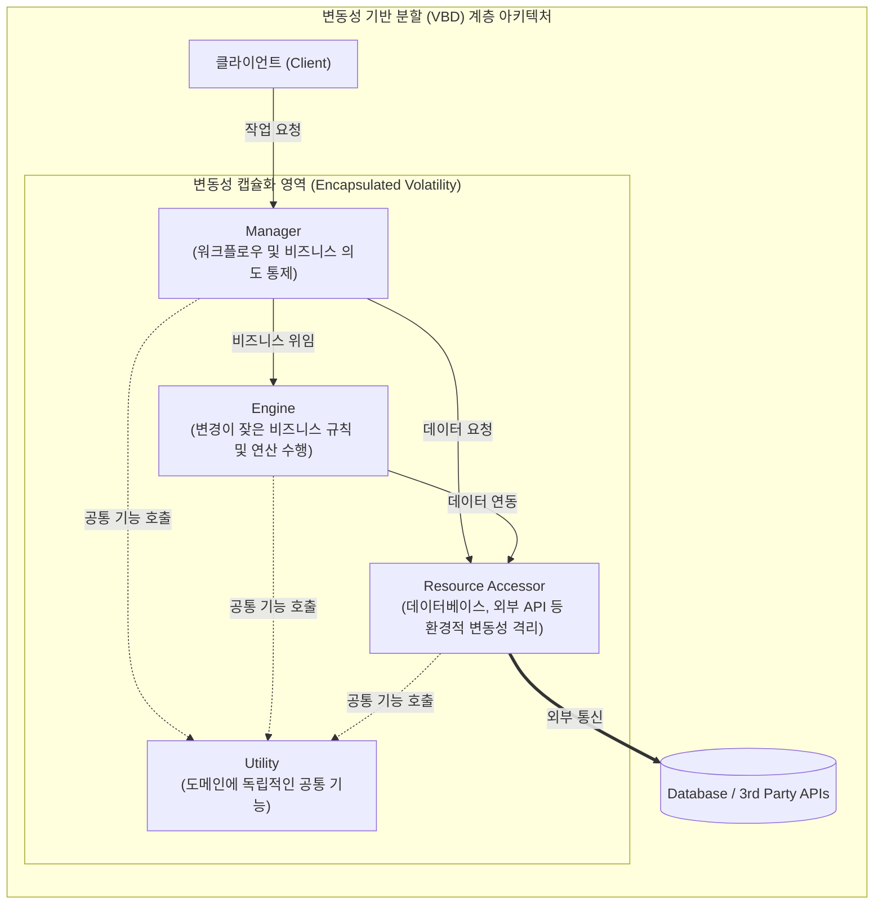

# 변동성 (Volatility)

---

## I. 시스템 생명력을 좌우하는 설계의 핵심 동인, 변동성의 개요

**가. 변동성의 정의**

* 비즈니스 규칙, 시장 요구사항, 외부 인터페이스, 기술 환경 등 시간의 흐름에 따라 소프트웨어 시스템 내에서 변경이 발생할 가능성과 그 빈도를 의미하는 핵심 설계 속성

**나. 변동성의 필요성 및 특징**

* **필요성**: 기존의 요구사항 기반 기능적 분할(Functional Decomposition)로 인한 연쇄적 파급 효과(Ripple Effect) 한계 극복 및 [[유지보수]] 비용 절감
* **특징**: **변동성 기반 분할(VBD)**(변경될 부분을 식별하여 [[캡슐화]]), **정보 은닉**(Parnas 원칙 적용), **[[결합도]] 분리**(안정적인 컴포넌트가 불안정한 컴포넌트에 의존하지 않도록 분리)

---

## II. 변동성의 개념도 및 핵심 기술 요소

### 가. 변동성 기반 분할(Volatility-Based Decomposition) 아키텍처

* 시스템이 제공해야 할 '기능(What it does)'이 아닌, 변경이 예상되는 '변동성(What could change)'을 식별하여 4가지 계층(Manager, Engine, Accessor, Utility)으로 엄격히 분할함.
* 특정 정책의 변화나 물리적 DB의 교체가 발생해도 외부 컴포넌트로 파급되지 않도록 인터페이스 뒤로 변동성을 완전히 은닉(Encapsulation)함.

### 나. 변동성 관리의 핵심 기술 요소

| 구분 | 요소기술(키워드) | 세부 설명 |
| --- | --- | --- |
| **컴포넌트 역할** | Manager (관리자) | 시스템의 전체 워크플로우와 비즈니스 흐름(What)을 통제하며, 세부적인 구현 로직(How)은 포함하지 않음 |
| **컴포넌트 역할** | Engine (엔진) | 비즈니스 룰, 할인율, [[알고리즘]] 등 변동성이 가장 높은 핵심 연산 로직(How)을 캡슐화하여 전담 수행 |
| **컴포넌트 역할** | Resource Accessor | 물리적 DB [[스키마]], 결제 PG 등 외부 시스템(Where)과의 연동 시 발생하는 환경적 변동성을 격리 및 번역 |
| **식별 원칙** | 변동성 축 (Axes of Volatility) | 시간 경과에 따른 고객 요구사항 변화 축 등 다각도로 변경 원인을 식별하여 1:1로 캡슐화 |
| **설계 원칙** | 정보 은닉 (Information Hiding) | 데이비드 파나스(David Parnas)의 설계 원칙으로, 잦은 변경이 일어나는 결정 사항을 인터페이스 뒤로 은닉 |
| **설계 원칙** | 의존성 역전 원칙 (DIP) | 변동성이 높은 구체적인 구현체(Concretion)에 의존하지 않고, 변동성이 낮은 [[추상화]](인터페이스)에 의존토록 설계 |
| **지표/측정** | 불안정도 지표 (Instability) | 컴포넌트의 유출/유입 결합도를 측정하여 변동성(I = Ce / (Ca+Ce))을 수치화하고 아키텍처 건전성을 모니터링 |
| **자동화 도구** | 코드 Churn 및 Git 분석 | 형상관리(Git) 커밋 이력과 코드 변경 빈도(Churn), 순환 복잡도(CCN)를 분석하여 잠재적 변동 집중 영역 자동 식별 |

---

## III. 변동성 기반 분할과 기능적 분할 비교 및 최신 활용 동향

### 가. 기능적 분할 vs 변동성 기반 분할 비교

| 비교 항목 | 기능적 분할 (Functional Decomposition) | 변동성 기반 분할 (Volatility-Based) |
| --- | --- | --- |
| **분할/설계 기준** | 시스템이 수행하는 **"기능 (What it does)"** | 향후 발생할 **"변경 및 변동성 (What could change)"** |
| **변경 시 파급 효과** | 연쇄적인 사이드 이펙트 발생 (Ripple Effect) | 해당 컴포넌트 내부로 국한 및 격리 (Encapsulated) |
| **생명주기 및 비용** | 변경 누적 시 아키텍처 부패 및 기하급수적 비용 증가 | 새로운 기능이 추가되어도 아키텍처 뼈대는 그대로 유지됨 |
| **접근 및 결합 방식** | 요구사항 명세서를 하향식(Top-down)으로 분해 | 식별된 변동성 요소를 인터페이스를 통해 통합(Composition) |

### 나. 아키텍처 변동성 분석의 최신 트렌드 및 산업 전망

* **AI/[[초거대 언어 모델|LLM]] 기반 에이전틱(Agentic) 변동성 분석**: 최근 LangChain 등 에이전트 기반 인공지능이 코드 저장소의 이력을 분석하여, 변동성이 집중된 핫스팟(Hotspot)을 자동으로 식별하고 리팩토링 및 분할 경계를 제안하는 기술 도입이 가속화되고 있음.
* **마이크로서비스([[MSA (Micro Service Architecture)|MSA]]) 경계 식별의 핵심 기준으로 진화**: 단순한 도메인 주도 설계([[DDD (Domain Driven Design)|DDD]])만으로는 잦은 배포 시 서비스 간 결합도 문제가 발생함에 따라, 변경의 주기(Rate of Change)와 **변동성 축**을 주요 척도로 삼아 Bounded Context를 구획하는 하이브리드 식별 방식이 대규모 IT 프로젝트의 표준으로 자리 잡고 있음.

---

### 🔗 연관 토픽

- **소속 도메인**: [[00_소프트웨어공학_MOC|🏗️ 소프트웨어공학]]
- **세부 분류**: `3. 요구사항 공학 & UML 객체지향 분석/설계`
- **핵심 연관 토픽**:
  - [[추상화|추상화 (Abstraction)]]
  - [[결합도]]
  - [[DDD (Domain Driven Design)]]
  - [[MSA (Micro Service Architecture)]]
  - [[유지보수]]
