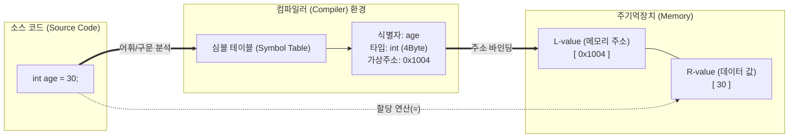

# 변수 (Variable)

---

## I. 프로그램 데이터의 추상화된 메모리 공간, 변수의 개요

* **정의**: 프로그램 실행 중 데이터를 저장, 참조, 조작하기 위해 주기억장치(메모리)에 할당된 명명된 논리적 데이터 보관 공간
* 하드웨어의 물리적 메모리 주소를 프로그래머가 이해하기 쉬운 식별자(Identifier)로 추상화하여 데이터 접근성 및 재사용성을 제공함
* **특징**: **상태 변경성**(런타임 중 데이터 갱신), **수명 주기**(메모리 할당 및 해제), **유효 범위**(가시성 및 접근 권한 제어)

---

## II. 변수의 개념도 및 핵심 구성 요소

### 가. 변수의 메모리 매핑 개념도 및 동작 원리

* 소스 코드의 변수 선언문은 컴파일러의 심볼 테이블에 기록되며, 실행 시 운영체제에 의해 물리적/[[가상 메모리]] 주소(L-value)와 실제 데이터(R-value)로 바인딩됨

### 나. 변수의 핵심 구성 요소 및 속성

| 구분 | 요소기술(키워드) | 세부 설명 |
| --- | --- | --- |
| **식별 체계** | 식별자 (Identifier) | 변수를 고유하게 구별하기 위해 프로그래머가 부여한 이름 (Naming Convention 적용) |
| **속성/크기** | 자료형 ([[Data Type]]) | 변수에 저장될 데이터의 종류(정수, 실수, 문자 등) 및 할당될 메모리의 크기 결정 |
| **공간/위치** | 메모리 주소 (L-value) | 데이터가 실제 저장되는 공간의 위치 반환값 (할당 [[연산자]] `=`의 왼쪽 객체 특성) |
| **저장 데이터** | 값 (R-value) | 해당 메모리 주소에 실제 저장되어 연산에 참여하는 데이터 (할당 연산자 `=`의 오른쪽 특성) |
| **접근 범위** | 스코프 (Scope) | 변수에 접근하고 참조할 수 있는 코드 내의 유효 범위 (전역 변수, 지역 변수, 블록 스코프 등) |
| **유지 기간** | 생명주기 (Lifetime) | 변수가 메모리에 할당되어 해제될 때까지의 시간 (정적 할당, 동적 할당, 자동 할당) |
| **관리 구조** | 심볼 테이블 (Symbol Table) | 컴파일러가 변수의 이름, 타입, 주소 등 모든 메타데이터를 저장하고 추적하는 해시 자료구조 |
| **할당 시점** | 바인딩 (Binding) | 변수의 식별자와 메모리 주소, 데이터 타입 등이 연결되는 시점 (정적 바인딩, 동적 바인딩) |

---

## III. 패러다임에 따른 변수의 특징 비교 및 최신 동향

### 가. 가변성(Mutability)에 따른 변수 관리 패러다임 비교

| 비교 항목 | 가변 변수 (Mutable Variable) | 불변 변수 (Immutable Variable) |
| --- | --- | --- |
| **기본 개념** | 선언 후 메모리 값 변경 가능 | 선언 및 초기화 후 값 변경 불가 (상수화) |
| **대표 키워드** | `var` (Kotlin/JS), `mut` (Rust) | `val` (Kotlin), `let` (Swift), `const` (JS) |
| **동시성 처리** | 멀티스레딩 시 경쟁 상태(Race Condition) 발생 | 상태가 변하지 않으므로 본질적으로 Thread-Safe |
| **적용 패러다임** | 명령형 프로그래밍, 절차/[[객체지향]] 프로그래밍 | 함수형 프로그래밍, 선언형 프로그래밍 |

### 나. 변수 관리 및 언어 설계의 최신 산업 동향

* **불변성(Immutability) 기본값(Default) 채택**: 데이터 레이스(Data Race)와 부작용(Side-effect)을 방지하기 위해 Rust, Swift 등 최신 언어들은 변수를 기본적으로 불변(Immutable) 상태로 취급하며, 필요 시 명시적 선언을 요구함.
* **타입 추론(Type Inference) 고도화**: 컴파일 타임의 타입 안정성(정적 타입)을 유지하면서도 개발 생산성을 높이기 위해 `auto`(C++), `var`(Java 10+) 등 컴파일러가 R-value를 분석하여 자료형을 자동 추론하는 기능이 표준화됨.

---

### 🔗 연관 토픽

- **소속 도메인**: [[00_컴퓨터구조_MOC|💻 컴퓨터구조]]
- **세부 분류**: `2. 캐시 & 메모리 계층 구조 · 스토리지`
- **핵심 연관 토픽**:
  - [[가상 메모리]]
  - [[Data Type]]
  - [[연산자]]
  - [[객체지향]]
  - [[메모리 관리]]
