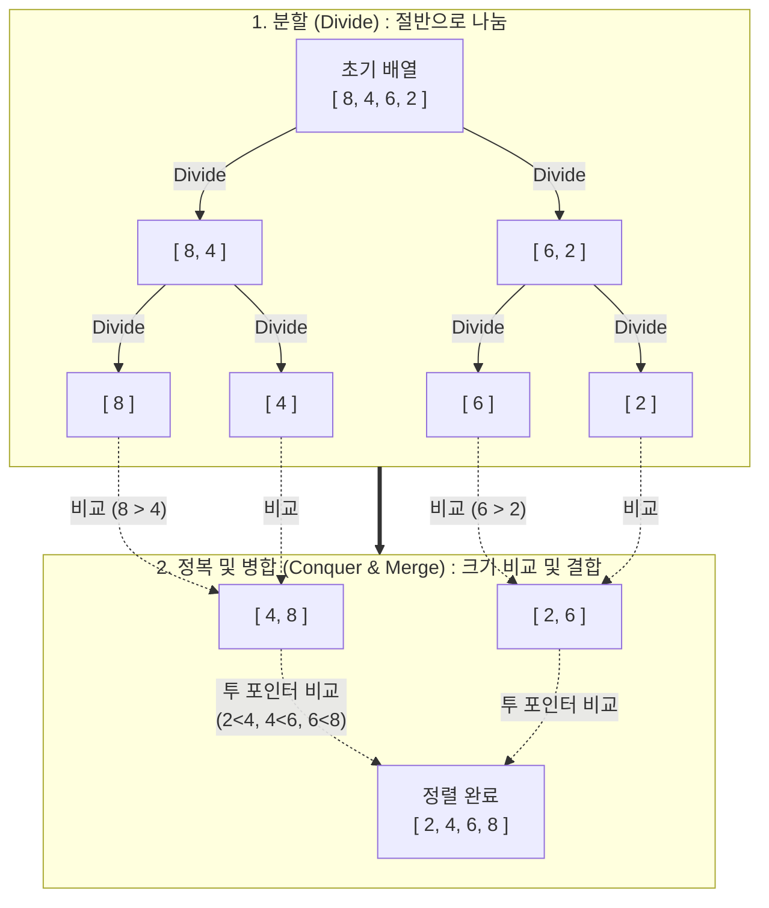

# 병합 정렬 (Merge Sort)

---

## I. 분할 정복 기반의 안정적인 @@@PROT_3@@@ 알고리즘, 병합 정렬의 개요

* **정의**: 분할 정복(Divide and Conquer) 기법을 기반으로, 배열을 더 이상 나눌 수 없을 때까지 재귀적으로 분할한 후 인접한 원소들을 크기순으로 정렬하며 병합(Merge)하여 최종 배열을 완성하는 정렬 [[알고리즘]]
* **특징**: **안정 정렬**(Stable Sort, 동일 값의 순서 보장), **항상 $O(N \log N)$ 보장**(데이터 분포에 영향을 받지 않음), **임시 메모리 요구**(병합 과정에서 $O(N)$의 추가 공간 필요)

---

## II. 병합 정렬의 개념도 및 핵심 기술 요소

### 가. 병합 정렬의 개념도 및 동작 원리

* **분할(Divide)**: 배열의 크기가 1이 될 때까지 재귀 호출을 통해 정확히 절반으로 지속 분할함 (하향식)
* **정복 및 병합(Conquer & Merge)**: 임시 배열을 활용하여 두 하위 배열의 원소를 투 포인터(Two Pointer) 방식으로 비교 후 정렬된 상태로 결합함 (상향식)

### 나. 병합 정렬의 핵심 기술 요소

| 구분 | 요소기술(키워드) | 세부 설명 |
| --- | --- | --- |
| **설계 패러다임** | 분할 정복 (Divide & Conquer) | 하향식으로 문제를 가장 작은 단위로 쪼개고(Divide), 해결한 뒤 상향식으로 합쳐(Conquer) 전체 문제를 해결 |
| **제어 구조** | 재귀 호출 (Recursion) | 스택([[Stack]]) 메모리를 활용하여 분할 함수의 호출 및 복귀를 처리하며 코드를 간결하게 구현 |
| **핵심 연산** | 2-Way 병합 (Merge) | 두 개의 정렬된 하위 배열의 인덱스를 가리키는 두 개의 포인터를 사용하여 작은 값부터 임시 배열에 복사 |
| **시간 복잡도** | $O(N \log N)$ | 트리 깊이 $\log_2 N$과 각 레벨의 병합 연산 $N$번이 곱해져 최선/평균/최악 모두 일정한 성능 보장 |
| **공간 복잡도** | $O(N)$ 보조 배열 (Auxiliary) | 제자리 정렬(In-place Sort)이 아니므로, 병합 시 원본 데이터 크기만큼의 추가 메모리 공간 할당 필수 |
| **정렬 특성** | 안정 정렬 (Stable Sort) | 병합 조건 시 앞쪽 배열과 뒤쪽 배열의 값이 같을 경우 앞쪽 값을 먼저 넣도록 구현하여 원래 순서 유지 |
| **자료구조 적용** | 연결 리스트 (Linked List) 정렬 | 배열과 달리 인덱스 접근 없이 포인터 변경만으로 병합이 가능하여 $O(1)$의 공간 복잡도로 정렬 가능 |
| **성능 최적화** | 병렬 병합 정렬 (Parallel Merge Sort) | 분할된 각 트리의 병합 작업을 다중 스레드(Multi-thread)에 분배하여 멀티코어 환경에서 성능 극대화 |

---

## III. 유사 @@@PROT_11@@@ 알고리즘 비교 및 최신 동향

### 가. 병합 정렬과 퀵 정렬(Quick Sort)의 핵심 비교

| 비교 항목 | 병합 정렬 (Merge Sort) | [[퀵 정렬|퀵 정렬 (Quick Sort)]] |
| --- | --- | --- |
| **기준 분할 방식** | 배열의 중앙(Mid) 인덱스를 기준으로 균등 분할 | 피벗(Pivot) 값을 기준으로 비균등 분할 (작은 값/큰 값) |
| **안정성 (Stability)** | **안정 정렬 (Stable)** | 불안정 정렬 (Unstable) |
| **추가 메모리 공간** | **$O(N)$** (임시 배열 필요) | $O(\log N)$ (재귀 호출을 위한 스택 메모리만 필요) |
| **최악 시간 복잡도** | **$O(N \log N)$** (항상 균등 분할됨) | $O(N^2)$ (이미 정렬된 경우 등 피벗이 극단적일 때) |
| **주요 활용 분야** | 연결 리스트 정렬, 외부 정렬(External Sort) | 배열 기반 일반적인 내부 정렬 알고리즘 |

### 나. 병합 정렬의 산업계 활용 및 최신 동향

* **팀 정렬(Tim Sort)의 근간**: 순수 병합 정렬은 보조 메모리 사용 및 재귀 호출 오버헤드가 있으므로, 현대 프로그래밍 언어(Python의 `sort()`, Java의 `Collections.sort()`)는 일정 크기 이하에서는 [[삽입 정렬]](Insertion Sort)을 수행하고 그 이상에서는 병합 정렬을 수행하는 하이브리드 알고리즘인 팀 정렬을 실무 표준으로 채택함.
* **분산 환경의 외부 정렬(External Sort)**: 데이터가 너무 커서 메모리에 한 번에 올릴 수 없는 대용량 데이터 처리 환경(Hadoop MapReduce, Spark 등)에서 Chunk 단위로 데이터를 나누어 정렬한 후 병합하는 다방향 병합(K-way Merge) 정렬이 빅데이터 처리의 핵심 메커니즘으로 활용되고 있음.

---

### 🔗 연관 토픽

- **소속 도메인**: [[00_컴퓨터구조_MOC|💻 컴퓨터구조]]
- **세부 분류**: `4. 기본 자료구조 (Data Structures)`
- **핵심 연관 토픽**:
  - [[퀵 정렬|퀵 정렬 (Quick Sort)]]
  - [[알고리즘]]
  - [[삽입 정렬|삽입 정렬 (Insertion Sort)]]
  - [[Stack]]
  - [[동적 계획법|동적 계획법 (Dynamic Programming)]]
