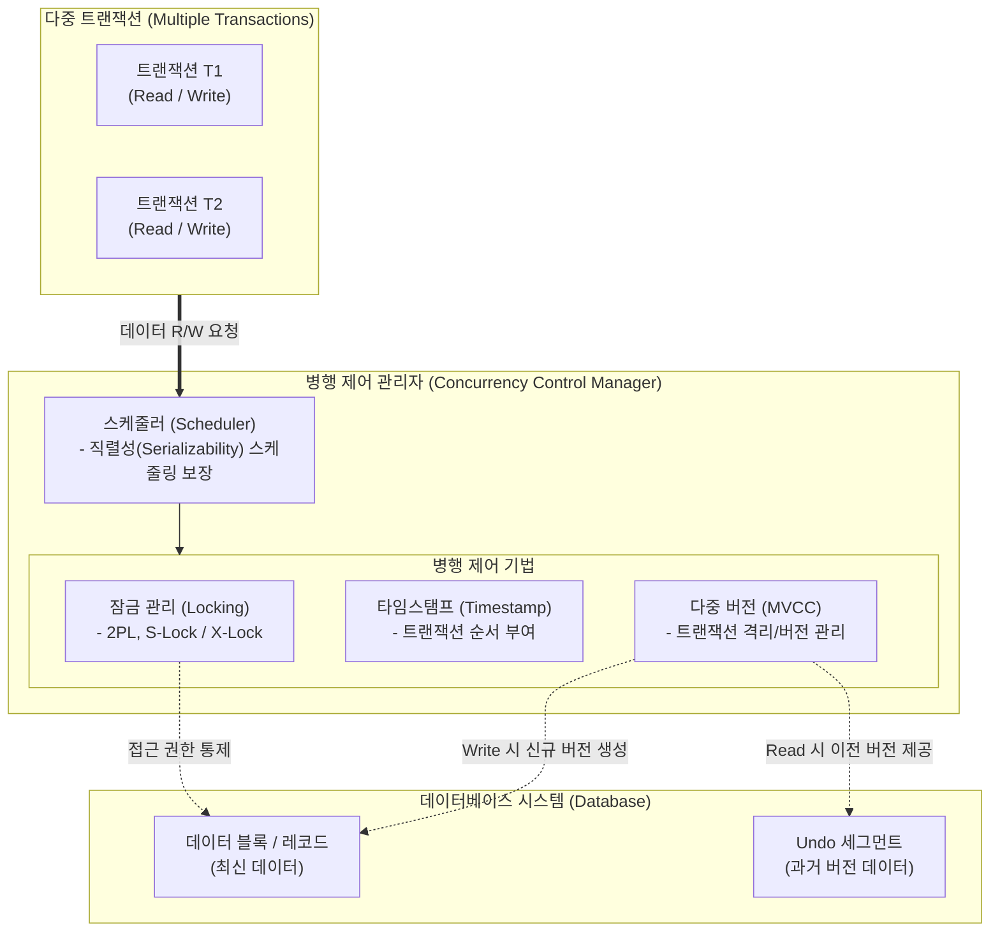

# 병행 제어 (Concurrency Control)

---

## I. 다중 트랜잭션의 일관성 보장 메커니즘, 병행 제어의 개요

**가. 병행 제어(Concurrency Control)의 정의**

* 다수의 사용자가 동시에 데이터베이스에 접근하여 트랜잭션을 수행할 때, 데이터의 일관성(Consistency)과 [[무결성]] 유지를 위해 상호작용을 제어하는 [[DBMS]] 핵심 기법

**나. 병행 제어의 목적 및 극복 과제**

* **주요 목적**: 트랜잭션의 직렬가능성(Serializability) 보장, ACID(특히 고립성) 유지, 시스템 [[처리량]](Throughput) 극대화
* **극복 과제 (미수행 시 문제점)**: 갱신 분실(Lost Update), 모순성(Inconsistency), 연쇄 복귀(Cascading Rollback), 비완료 의존성(Uncommitted Dependency)

---

## II. 병행 제어의 개념도 및 핵심 기술 요소

### 가. 병행 제어의 메커니즘 개념도

* **동작 흐름**: 다중 트랜잭션의 요청을 스케줄러가 수신하여, 잠금(Lock), 타임스탬프, 다중 버전(MVCC) 등의 기법을 통해 데이터 간의 충돌을 방지하고 직렬 가능한 스케줄로 변환 처리함.

### 나. 병행 제어의 핵심 기술 요소

| 구분 | 요소기술(키워드) | 세부 설명 |
| --- | --- | --- |
| **락킹 ([[Locking]])** | [[2PL]] (Two-Phase Locking) | 트랜잭션의 잠금(확장 단계)과 해제(수축 단계)를 분리하여 직렬가능성을 보장하는 비관적 제어 기법 |
| **락킹 (Locking)** | S-Lock / X-Lock | 데이터 읽기 시 공유 잠금(S-Lock), 쓰기 시 배타 잠금(X-Lock)을 부여하여 동시성 제어 |
| **순서 제어** | 타임스탬프 오더링 (TO) | [[트랜잭션]] 진입 시점에 고유 번호(시간)를 부여하여, 타임스탬프 순서대로 Read/Write를 수행하는 기법 |
| **최적화 기법** | 낙관적 검증 (Validation) | 데이터 조작 시에는 임시 복사본을 사용(Read)하고, 트랜잭션 종료 시점에 충돌 여부를 검증(Validate) 후 반영(Write) |
| **다중 버전** | MVCC (Multi-Version) | 데이터 갱신 시 기존 데이터를 Undo 영역에 보관해, 읽기(Reader)와 쓰기(Writer) 간의 잠금 대기(Block)를 제거하는 기법 |
| **격리 수준** | [[Isolation Level (격리 레벨고립성 수준)|Isolation Level]] | 동시성 수준에 따라 Read Uncommitted, Read Committed, Repeatable Read, Serializable 4단계로 제어 통제 |
| **교착 상태** | Wait-Die / Wound-Wait | 락 기반 환경에서 발생하는 데드락(Deadlock)을 예방하기 위해 타임스탬프 우선순위를 활용하는 회피 기법 |
| **단위 제어** | 잠금 단위 (Locking Granularity) | [[데이터베이스]], 테이블, 페이지, 행(Row) 등 락을 거는 크기 (단위가 클수록 동시성 저하, 작을수록 오버헤드 증가) |

---

## III. 병행 제어 주요 기법 비교 및 최신 동향

### 가. 병행 제어 주요 기법 비교 (비관적 vs 낙관적 vs MVCC)

| 비교 항목 | 비관적 병행 제어 (Pessimistic) | 낙관적 병행 제어 (Optimistic) | 다중버전 병행 제어 (MVCC) |
| --- | --- | --- | --- |
| **기본 가정** | 트랜잭션 간 **충돌이 잦을 것**이라 가정 | 트랜잭션 간 **충돌이 적을 것**이라 가정 | 성능을 위해 읽기/쓰기 충돌을 원천 회피 |
| **핵심 메커니즘** | 트랜잭션 시작 시 **락(Lock)** 선점 | 완료(Commit) 시점에 **검증(Validation)** | 갱신 시 **데이터 버전을 분리**하여 저장 |
| **대기(Block) 여부** | Lock 경합 발생 시 **대기 발생** | 대기 없음 (충돌 시 트랜잭션 **Rollback**) | **Reader와 Writer 간 대기 없음** |
| **주요 활용** | 전통적 RDBMS, 재고/티켓팅 시스템 | 충돌 확률이 낮은 대규모 Read-only 서비스 | Oracle, PostgreSQL, MySQL(InnoDB) 등 최신 RDBMS |

### 나. 병행 제어의 한계점 극복 및 최신 동향

* **분산 DB에서의 직렬화 보장 기술 진화**: 구글 스패너(Google Spanner)의 **TrueTime(원자 시계 및 GPS 기반)**, 콕로치DB([[CockroachDB]])의 **HLC(Hybrid Logical Clock)** 등 논리/물리적 시간을 결합하여 글로벌 분산 환경에서 엄격한 직렬가능성(Strict Serializability)을 보장하는 분산 병행 제어 기법이 차세대 표준으로 자리 잡음.
* **하드웨어 및 AI 기반 동시성 극대화**: HTM(Hardware Transactional Memory)을 활용해 [[CPU]] 캐시 레벨에서 트랜잭션 충돌을 초고속으로 감지 및 처리하고, AI 모델을 통해 워크로드 패턴을 분석하여 자율적으로 Lock 단위를 조절하는(Self-Tuning) 지능형 병행 제어 연구가 가속화되고 있음.

---

### 🔗 연관 토픽

- **소속 도메인**: [[00_운영체제_MOC|⚙️ 운영체제]]
- **세부 분류**: `6. 커널 아키텍처 & 입출력 시스템`
- **핵심 연관 토픽**:
  - [[2PL|2PL (Two-Phase Locking Protocol)]]
  - [[무결성]]
  - [[데이터베이스]]
  - [[트랜잭션]]
  - [[DBMS]]
