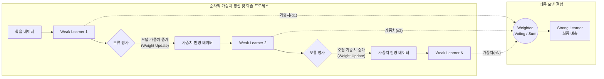

# 부스팅 (Boosting)

---

## I. 약한 학습기의 결합을 통한 성능 극대화, 부스팅의 개요

**가. 부스팅(Boosting)의 정의**

* 이전 모델이 오분류한 데이터에 가중치를 부여하여 순차적으로 학습함으로써, 여러 개의 약한 학습기(Weak Learner)를 결합해 예측 성능이 뛰어난 강한 학습기(Strong Learner)를 생성하는 앙상블(Ensemble) 기법

**나. 부스팅의 필요성 및 특징**

* **[[편향]](Bias) 감소**: 모델의 과소적합(Underfitting) 문제를 해결하고 높은 예측 정확도 확보
* **순차적 학습**: 이전 모델의 오류(Error)나 잔차(Residual)를 다음 모델의 학습에 직접적으로 반영
* **가중치 갱신**: 오답 데이터에 가중치를 높여 모델이 어려운 문제에 집중하도록 유도

---

## II. 부스팅의 동작 원리 및 핵심 기술 요소

### 가. 부스팅의 프로세스 및 동작 원리

* 이전 모델(Weak Learner)이 틀린 예측 데이터에 가중치를 부여하여 다음 모델이 집중적으로 학습하고, 최종적으로 각 모델의 성능에 비례한 가중치를 주어 결합(투표/합산)함.

### 나. 부스팅의 핵심 기술 및 알고리즘 요소

| 구분 | 요소기술(키워드) | 세부 설명 |
| --- | --- | --- |
| **학습 메커니즘** | 순차적 학습 (Sequential) | 이전 모델의 결과가 다음 모델의 입력 데이터(가중치/잔차)에 직접적인 영향을 미침 |
| **최적화 기법** | 가중치 갱신 (Weight Update) | 예측이 틀린 데이터 인스턴스의 가중치를 높여 다음 트리가 해당 오차를 보완하도록 유도 |
| **최적화 기법** | [[경사하강법]] (Gradient Descent) | 손실 함수(Loss Function)의 그래디언트(잔차)를 최소화하는 방향으로 트리를 순차적 생성 (GBM) |
| **결합 방식** | 가중 투표 (Weighted Voting) | 단순 다수결이 아닌, 각 약한 학습기의 오차율을 반영한 가중치(Alpha)를 부여하여 최종 결과 도출 |
| **[[알고리즘]]** | AdaBoost | 초기 부스팅 알고리즘으로, 오분류된 데이터 자체에 가중치를 부여하여 순차적으로 학습 |
| **알고리즘** | GBM (Gradient Boosting) | 가중치 대신 실제값과 예측값의 차이인 '잔차(Residual)'를 학습하여 모델 성능을 극대화 |
| **알고리즘** | XGBoost | GBM에 구조적 정규화(Regularization), 병렬 처리, 조기 종료(Early Stopping)를 추가해 과적합 방지 및 속도 향상 |
| **알고리즘** | LightGBM / CatBoost | 리프 중심(Leaf-wise) 트리 분할 및 범주형 데이터 자체 처리 등 대용량 데이터의 고속 처리에 최적화 |

---

## III. 부스팅(Boosting)과 배깅(Bagging) 비교 및 최신 동향

### 가. 앙상블 기법 비교 (Boosting vs Bagging)

| 비교 항목 | 부스팅 (Boosting) | [[배깅]] (Bagging) |
| --- | --- | --- |
| **학습 방식** | **순차적 학습** (Sequential, 의존적) | **병렬적 학습** (Parallel, 독립적) |
| **샘플링 방식** | 오답에 가중치를 부여한 가중 샘플링 | 복원 추출을 통한 무작위 샘플링 (Bootstrapping) |
| **핵심 목적** | **편향(Bias) 감소** (정확도 향상) | **분산(Variance) 감소** (과적합 방지, 안정성 향상) |
| **최종 결합** | 가중 투표 / 가중 합산 (Weighted Voting) | 다수결 (Majority Voting) / 평균 (Average) |
| **대표 알고리즘** | AdaBoost, GBM, XGBoost, LightGBM | Random Forest |
| **취약점** | 노이즈 데이터나 [[이상치]](Outlier)에 민감함 | 개별 트리의 정확도가 낮으면 전체 성능 저하 가능 |

### 나. 부스팅 기반 알고리즘의 한계점 극복 및 향후 전망

* **과적합(Overfitting) 제어 기술 강화**: 순차적 학습 특성상 노이즈까지 학습하여 과적합에 취약한 한계를 극복하기 위해, 최근 XGBoost, LightGBM 등은 L1/L2 정규화 및 트리의 깊이 제한, 조기 종료(Early Stopping) 기능을 기본적으로 탑재하여 안정성을 확보함.
* **정형 데이터 분석의 실질적 표준화**: 딥러닝이 비정형(이미지, 텍스트) 데이터에서 우위를 보인다면, 표 형식의 정형 데이터(Tabular Data) 및 금융 데이터 기반의 캐글(Kaggle) 등 글로벌 머신러닝 경진대회에서는 XGBoost와 LightGBM 기반의 부스팅 앙상블 모델이 현재까지도 가장 압도적인 성능을 내는 표준(De facto standard) 알고리즘으로 활용되고 있음.

---

### 🔗 연관 토픽

- **소속 도메인**: [[00_데이터베이스_MOC|🗄️ 데이터베이스]]
- **세부 분류**: `6. SQL 표준 문법 & 쿼리 성능 튜닝`
- **핵심 연관 토픽**:
  - [[배깅]]
  - [[분류화]]
  - [[경사하강법|경사하강법 (Gradient Descent Algorithm)]]
  - [[앙상블 학습|앙상블 학습(Ensemble Learning)]]
  - [[알고리즘]]
