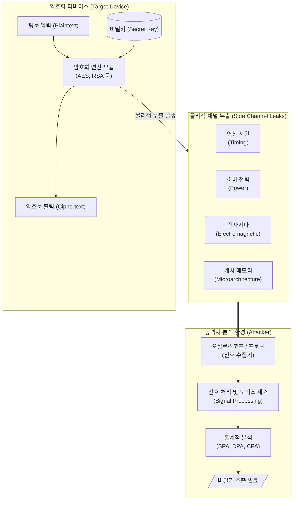

# 부채널 공격 (Side Channel Attack)

---

## I. 물리적 누출 정보 기반의 암호 키 탈취 위협, 부채널 공격의 개요

**가. 부채널 공격의 정의**

* [[암호화]] [[알고리즘]] 자체의 수학적 취약점이 아닌, 암호화 기기가 연산을 수행할 때 발생하는 물리적 누출 특성(전력 소모량, 연산 시간, 방사 전자파 등)을 측정하고 통계적으로 분석하여 암호 키 등 비밀 정보를 탈취하는 하드웨어 및 시스템 해킹 기법

**나. 부채널 공격의 등장배경 및 특징**

* **수학적 안전성의 우회**: [[AES]], [[RSA (Rivest Shamir Adleman)|RSA]] 등 강력한 암호 알고리즘도 물리적 구현체의 취약점을 통해 무력화 가능
* **공격 표면의 다변화**: IoT 기기, 스마트카드 등 물리적 접근이 용이한 엣지 디바이스의 폭발적 증가
* **클라우드 위협 대두**: 동일한 하드웨어([[CPU]], [[캐시 메모리]])를 공유하는 멀티 테넌트 환경에서의 마이크로아키텍처 부채널 위협 증가

---

## II. 부채널 공격의 개념도 및 핵심 기술 요소

### 가. 부채널 공격의 개념도 및 동작 원리

* 타겟 기기가 암호화 연산을 수행할 때 발생하는 물리적 신호(전력, 시간 등)를 수집 장비로 캡처한 후, 통계적 분석(상관관계 분석 등)을 통해 연산에 사용된 비밀키를 역산함.

### 나. 부채널 공격의 핵심 기술 요소

| 구분 | 요소기술(키워드) | 세부 설명 |
| --- | --- | --- |
| **공격 기법 (물리)** | 타이밍 공격 (Timing) | 조건 분기문(If-else) 등 비밀키 비트 값에 따라 달라지는 연산 처리 소요 시간을 정밀 측정하여 키 추출 |
| **공격 기법 (물리)** | 단순 전력 분석 (SPA) | 1회의 연산 중 발생하는 전력 소비 파형을 직접 관찰하여 알고리즘의 동작 특성과 비밀키를 유추 |
| **공격 기법 (물리)** | 차분 전력 분석 (DPA) | 대량의 평문을 암호화하며 수집한 전력 파형들을 통계적/수학적 기법으로 차분 연산하여 비밀키 추출 |
| **공격 기법 (논리)** | 캐시 부채널 공격 | CPU의 공유 캐시(L1, L2, LLC)에 대한 접근 시간차(Flush+Reload, Prime+Probe)를 이용하여 데이터 탈취 |
| **방어 기법 (소프트)** | 마스킹 (Masking) | 암호 연산 중간값에 난수(Random Value)를 XOR 연산 등으로 추가하여 전력 소비량과 비밀키의 상관관계 제거 |
| **방어 기법 (소프트)** | 블라인딩 (Blinding) | RSA 등 공개키 암호화 시, 입력 메시지에 난수를 곱해 예측 불가성을 부여하여 연산 시간 평준화 달성 |
| **방어 기법 (소프트)** | 상수 시간 (Constant-time) | 비밀키 값이나 분기 조건에 관계없이 항상 동일한 명령어 사이클(시간)을 소모하도록 코드를 작성 |
| **방어 기법 (하드)** | 물리적 차폐 / 노이즈 주입 | 칩 표면에 금속 쉴딩 적용, 전력선에 난수성 노이즈(Noise)를 인위적으로 주입하여 신호 측정 방해 |

---

## III. 전통적 암호 공격과의 비교 및 향후 전망

### 가. 일반 암호 공격과 부채널 공격 비교

| 비교 항목 | 일반 암호 공격 (Cryptanalysis) | 부채널 공격 (Side Channel Attack) |
| --- | --- | --- |
| **공격 대상** | 수학적 알고리즘의 결함, 해시 충돌, 키 공간 | 하드웨어/소프트웨어의 **물리적 구현체 특성** |
| **주요 공격 방식** | 무차별 대입(Brute-force), 사전 공격, 분석적 해독 | 물리 신호(전력, 시간, EM, 소음) 측정 및 통계 처리 |
| **사전 요구 사항** | 막대한 컴퓨팅 파워 (수학적 연산 필요) | 오실로스코프 등 **물리적 측정 장비 또는 캐시 접근 권한** |
| **대응 방안** | 키 길이 증가, 고도화된 최신 [[암호 알고리즘]] 채택 | 암호 모듈의 **마스킹, 하드웨어 쉴딩, 상수 시간 코딩** |

### 나. 부채널 공격의 최신 동향 및 산업 대응 전망

* **마이크로아키텍처 공격의 지속적 진화**: CPU의 추측 실행(Speculative Execution) 취약점을 이용한 스펙터(Spectre), 멜트다운(Meltdown) 계열의 부채널 공격이 퍼블릭 클라우드 인프라의 심각한 위협으로 상존하며, 지속적인 마이크로코드(Microcode) 패치 및 격리(Isolation) 기술이 요구됨.
* **AI/ML 모델 대상 부채널 공격 대두**: 최근 엣지 디바이스에 탑재된 신경망 연산 가속기([[NPU]] 등)의 전력/메모리 접근 패턴을 분석하여 고비용의 [[인공지능]] '모델 파라미터' 및 '학습 가중치'를 훔쳐내는(Model Extraction) 신종 부채널 공격이 학계를 중심으로 보고되고 있음.
* **양자 내성 암호(PQC) 이행 시점의 보안 고려**: 수학적으로 양자 컴퓨터 공격을 방어할 수 있는 PQC 알고리즘을 구현하더라도, IoT 기기에 적용 시 전력 및 시간 누출에 취약할 수 있으므로 설계 단계부터의 부채널 방어(Security by Design) 결합이 필수적임.

---

### 🔗 연관 토픽

- **소속 도메인**: [[00_보안_MOC|🛡️ 보안]]
- **세부 분류**: `2. 현대 암호학 & 키 관리 · 전자서명`
- **핵심 연관 토픽**:
  - [[RSA (Rivest Shamir Adleman)]]
  - [[AES]]
  - [[ECC|ECC(Elliptic Curve Cryptography)]]
  - [[FIPS (Federal Information Processing Standards)]]
  - [[IoT 보안 위협]]
