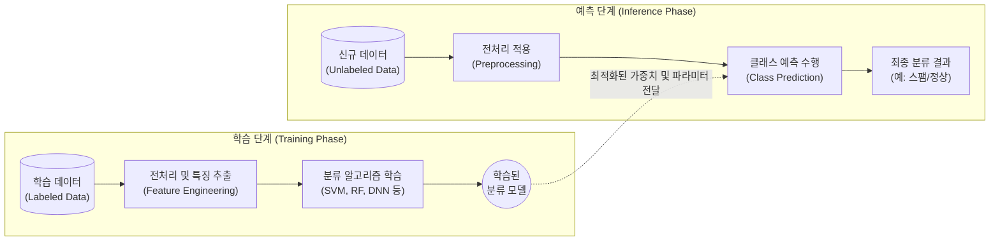

# 분류화 (Classification)

---

## I. 목표 변수 예측을 위한 지도 학습 기반 데이터 마이닝, 분류화의 개요

* **정의**: 사전에 레이블(Label)이 주어진 학습 데이터(Training Data)를 통해 특성과 [[클래스]] 간의 관계 모델을 생성하고, 이를 바탕으로 신규 데이터의 범주(Class)를 예측하는 지도 학습(Supervised Learning) 기법
* 전통적인 스팸 메일 필터링, 신용 불량자 예측부터 최근 AI 기반의 질병 진단, 이미지 객체 인식 등 다양한 의사결정 자동화의 핵심 기술로 활용됨
* **특징**:
* **지도 학습(Supervised Learning)**: 명확한 정답(Target Variable)이 존재하는 상태에서 패턴을 학습
* **이산형 출력**: 예측 결과가 연속된 수치가 아닌 특정 범주형(Categorical) 값(예: 성공/실패, A/B/C 등)으로 도출

---

## II. 분류화의 개념도 및 핵심 기술 요소

### 가. 분류화의 개념도 및 동작 원리

* 학습 단계에서 [[알고리즘]] 최적화를 통해 분류 경계면(Decision Boundary) 또는 규칙을 생성함
* 예측 단계에서 생성된 모델을 신규 데이터에 적용하여 해당 데이터가 속할 확률이 가장 높은 클래스를 할당함

### 나. 분류화의 핵심 기술 및 구성 요소

| 분류 | 요소기술(키워드) | 세부 설명 |
| --- | --- | --- |
| **알고리즘** | **로지스틱 회귀 (Logistic Regression)** | - 시그모이드(Sigmoid) 함수를 이용하여 데이터가 특정 클래스에 속할 확률을 0과 1 사이의 값으로 계산 |
| **알고리즘** | **[[서포트 벡터 머신]] (SVM)** | - 두 클래스 간의 여백(Margin)을 최대화하는 최적의 초평면(Hyperplane)을 찾아 분류 경계로 활용 |
| **알고리즘** | **앙상블 기법 (Ensemble)** | - [[배깅]](Random Forest) 및 [[부스팅]](XGBoost, LightGBM) 등 다수의 약한 학습기를 결합하여 분류 성능 극대화 |
| **알고리즘** | **[[의사결정나무]] (Decision Tree)** | - 정보 획득량(Information Gain)이나 지니 계수(Gini [[RDBMS 인덱스(index)|Index]])를 기준으로 데이터를 분기하여 규칙을 생성 |
| **평가지표** | **혼동 행렬 (Confusion Matrix)** | - 실제 정답과 모델의 예측값을 교차표(TP, TN, FP, FN)로 나타내어 분류 정확성을 입체적으로 분석 |
| **평가지표** | **F1-Score** | - 데이터 클래스 비율이 불균형할 때, 정밀도(Precision)와 재현율(Recall)의 조화평균을 통해 성능 평가 |
| **평가지표** | **ROC-AUC** | - 임계치 변화에 따른 FPR(위양성률) 대비 TPR(민감도)의 곡선 하단 면적으로 이진 분류 모델 성능 측정 |
| **최신기술** | **[[XAI]] (설명가능한 AI)** | - SHAP, [[LIME]] 알고리즘 등을 적용하여 분류 모델이 특정 클래스로 판별하게 된 핵심 특징(Feature Importance) 해석 제공 |

---

## III. 분류화와 회귀분석 비교 및 향후 동향

### 가. 지도 학습 주요 기법 비교 (분류화 vs 회귀분석)

| 비교 항목 | 분류화 (Classification) | [[회귀분석]] (Regression) |
| --- | --- | --- |
| **예측 대상 (Target)** | **범주형 (Categorical) 데이터** | **연속형 (Continuous) 데이터** |
| **주요 목적** | 데이터가 속할 **클래스(Class)** 또는 그룹 식별 | 데이터의 **수치적 크기** 또는 경향성 예측 |
| **출력값 형태** | 이산값 (Discrete) (예: 0/1, 고/중/저, 스팸/정상) | 연속값 (Continuous) (예: 주가, 온도, 매출액) |
| **대표 알고리즘** | SVM, 의사결정나무, 로지스틱 회귀, Naive Bayes | 선형 회귀, 다항 회귀, 릿지/라쏘 회귀, SVR |
| **모델 평가지표** | 정확도(Accuracy), F1-Score, ROC-AUC | 오차 기반 (MSE, RMSE, MAE), 결정계수($R^2$) |

### 나. 분류화 기술의 최신 동향 및 향후 전망

* **정형 데이터 [[딥러닝]](Tabular Deep Learning) 도입**: 기존 트리 계열 앙상블 모델이 장악하던 정형 데이터 분류 영역에 TabNet 등 어텐션(Attention) 기반의 딥러닝 모델이 도입되며 성능이 향상되고 있음
* **[[초거대 언어 모델|LLM]] 기반 Zero-shot/Few-shot 분류 확산**: 별도의 대규모 학습 데이터 구축 없이 프롬프트 엔지니어링과 거대 언어 모델(LLM)을 활용하여 텍스트의 의도, 감정, 스팸 여부를 즉각적으로 분류하는 방식이 산업계 표준으로 자리 잡고 있음

---

### 🔗 연관 토픽

- **소속 도메인**: [[00_데이터베이스_MOC|🗄️ 데이터베이스]]
- **세부 분류**: `6. SQL 표준 문법 & 쿼리 성능 튜닝`
- **핵심 연관 토픽**:
  - [[부스팅|부스팅 (Boosting)]]
  - [[배깅]]
  - [[딥러닝]]
  - [[XAI]]
  - [[LIME]]
