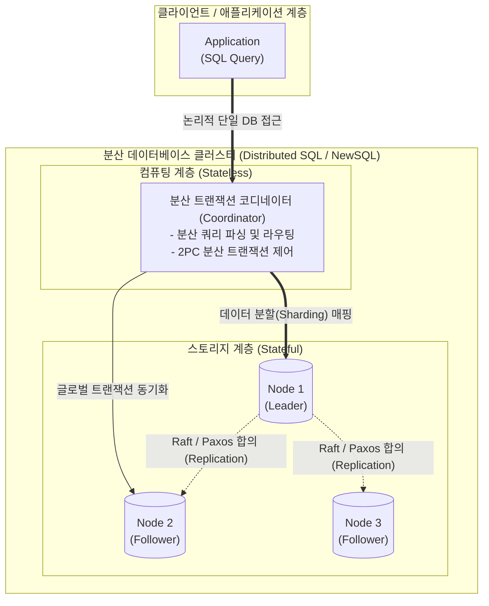

# 분산 데이터베이스 (Distributed Database)

---

## I. 글로벌 스케일의 데이터 정합성과 확장성, 분산 데이터베이스의 개요

**가. 분산 데이터베이스의 정의**

* 논리적으로는 하나의 시스템처럼 보이나, 물리적으로는 컴퓨터 네트워크를 통해 여러 노드(사이트)에 데이터가 분산 및 복제되어 관리되는 [[데이터베이스]] 관리 시스템
* 단일 데이터베이스의 처리 한계를 극복하고 글로벌 환경에서 투명성(Transparency)과 높은 가용성을 제공하기 위한 데이터 분산 저장 플랫폼

**나. 분산 데이터베이스의 등장배경 및 특징**

* **등장배경**: [[클라우드 네이티브]] 전환 가속화, 단일 장애점(SPOF) 회피, 글로벌 대규모 트래픽 처리를 위한 수평적 확장(Scale-out) 요구 급증
* **특징**: **6대 투명성** 보장, **글로벌 분산 [[트랜잭션]]** 처리, 장애 발생 시 무중단 운영 보장, 네트워크 파티션에 대응하는 **[[PACELC]]/CAP 이론** 적용

---

## II. 분산 데이터베이스의 개념도 및 핵심 기술 요소

### 가. 분산 데이터베이스의 아키텍처 및 동작 원리

* 사용자/애플리케이션은 분산 환경을 인지하지 못하고 논리적인 단일 DB로 접근함
* 내부적으로 코디네이터가 쿼리를 분석/분배하며, 스토리지 노드 간에는 분산 [[합의 알고리즘]](Raft/Paxos)을 통해 일관성 있는 복제를 수행함

### 나. 분산 데이터베이스의 핵심 기술 요소

| 구분 | 요소기술(키워드) | 세부 설명 |
| --- | --- | --- |
| **목표 지표** | 6대 투명성 (Transparency) | 사용자가 분산 여부를 인지하지 못하게 하는 특징 (분할, 위치, 지역사상, 복제, 병행, 장애 투명성 보장) |
| **설계/배치** | [[샤딩]](Sharding) 및 분할 | 데이터를 수평(Horizontal) 또는 수직(Vertical)으로 분할(Fragment)하여 다수의 노드에 분산 할당(Allocation) |
| **정합성** | 분산 합의 (Consensus Protocol) | 복제본 간의 상태 동기화 및 리더 선출을 위해 **Raft**, **Paxos** [[알고리즘]] 적용 (강한 일관성 보장) |
| **트랜잭션** | 2PC (Two-Phase Commit) | 분산된 노드에 걸친 트랜잭션의 원자성(Atomicity) 보장을 위해 준비(Prepare)와 커밋(Commit) 단계로 분리 실행 |
| **동시성 제어** | 논리적 분산 시계 (Logical Clock) | 글로벌 분산 환경에서 트랜잭션의 정확한 직렬화(Serializability)를 위해 **TrueTime**(GPS/원자시계) 및 **HLC** 활용 |
| **격리성 제어** | 분산 MVCC | 글로벌 타임스탬프를 기반으로 다중 버전 동시성 제어를 수행하여 읽기/쓰기 노드 간의 락(Lock) 대기 제거 |
| **데이터 처리** | 분산 쿼리 엔진 (Distributed Query) | 여러 노드에 흩어진 데이터를 [[조인|조인(Join)]] 및 집계 시 네트워크 I/O를 최소화하고 병렬 연산을 수행하는 쿼리 최적화기 |
| **이론적 기반** | CAP / PACELC 이론 | 분산 시스템에서 일관성(C), 가용성(A), [[파티셔닝|파티션]] 허용(P) 간의 상충 관계 및 장애/정상 상태에서의 성능 트레이드오프 모델 |

---

## III. 전통적 DB와의 패러다임 비교 및 최신 동향

### 가. 데이터베이스 아키텍처 패러다임 비교

| 비교 항목 | 전통적 RDBMS | [[NoSQL (CAP 이론 BASE 속성)|NoSQL]] | [[New SQL|NewSQL]] (최신 분산 데이터베이스) |
| --- | --- | --- | --- |
| **핵심 목적** | [[무결성]] 및 복잡한 트랜잭션 | [[HA(High Availability)|고가용성]] 및 빅데이터 처리 | **글로벌 확장성 + 강한 트랜잭션 (ACID)** |
| **확장 방식** | 수직적 확장 (Scale-Up) 중심 | 수평적 확장 (Scale-Out) | **수평적 확장 (Scale-Out)** |
| **일관성 보장** | 강한 일관성 (Strong Consistency) | 최종 일관성 (Eventual Consistency) | **분산 합의 기반 강한 일관성** |
| **대표 시스템** | Oracle, PostgreSQL, MySQL | MongoDB, Cassandra, Redis | **Google Spanner, [[CockroachDB]], TiDB** |

### 나. 분산 데이터베이스의 최신 기술 동향 및 향후 전망

* **HTAP (Hybrid Transactional/Analytical Processing) 진화**: 하나의 분산 데이터베이스 클러스터 내에서 실시간 트랜잭션([[OLTP]]) 처리와 대규모 데이터 분석([[OLAP]])을 동시에 간섭 없이 수행하는 HTAP 아키텍처(예: TiDB)가 표준으로 자리 잡는 추세임.
* **클라우드 네이티브 기반 자율 운영(Autonomous)**: [[쿠버네티스]](Kubernetes) 환경과 통합되어 데이터 볼륨의 자동 샤딩, 무중단 스케일링, 자가 치유(Self-healing)를 지원하는 Serverless 분산 데이터베이스 형태로 산업계 도입이 가속화되고 있음.

---

### 🔗 연관 토픽

- **소속 도메인**: [[00_데이터베이스_MOC|🗄️ 데이터베이스]]
- **세부 분류**: `4. 물리 저장 구조 & 인덱스 최적화`
- **핵심 연관 토픽**:
  - [[무결성]]
  - [[트랜잭션]]
  - [[New SQL]]
  - [[OLTP]]
  - [[파티셔닝|파티션]]
