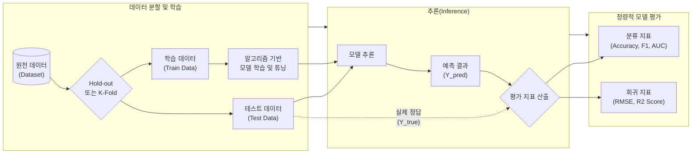

# 분석 모델 평가 방법

---

## I. 최적의 알고리즘 선정과 일반화 성능 검증, 분석 모델 평가 방법의 개요

**가. 분석 모델 평가 방법의 정의**

* 기계학습 및 데이터 마이닝을 통해 생성된 예측/분류 모델이 새로운 미지의 데이터에 대해 얼마나 정확하고 [[신뢰성]] 있게 동작하는지 정량적 지표를 통해 검증하는 과정

**나. 분석 모델 평가의 필요성 및 특징**

* **과적합(Overfitting) 방지**: 학습 데이터에만 편향되는 현상을 방지하고 모델의 [[일반화]] 성능(Generalization Performance) 확보
* **최적 모델 선정**: 다양한 알고리즘과 하이퍼파라미터 튜닝 결과 중 비즈니스 목적(비용 최소화, 정확도 극대화 등)에 가장 부합하는 모델 채택
* **태스크 맞춤형 지표**: 분류(Classification), 회귀(Regression), 군집(Clustering) 등 문제 유형에 따라 상이한 평가 메트릭(Metric) 적용

---

## II. 분석 모델 평가 방법의 개념도 및 핵심 기술 요소

### 가. 분석 모델 평가 프로세스 개념도

* 학습 데이터로 훈련된 모델에 테스트 데이터(비정답 데이터)를 입력하여 예측값(Y_pred)을 도출하고, 이를 실제 정답(Y_true)과 비교하여 정량적 평가 지표를 산출함

### 나. 분석 모델 평가의 핵심 기술/지표 요소

| 구분 | 요소기술(키워드) | 세부 설명 |
| --- | --- | --- |
| **분류 평가 지표** | 혼동 행렬 (Confusion Matrix) | 실제 클래스와 예측 클래스의 일치 여부를 TP, FP, FN, TN 4가지 교차 영역으로 매핑한 척도 표 |
| **분류 평가 지표** | F1-Score | 정밀도(Precision)와 재현율(Recall)의 조화 평균으로, 데이터 클래스가 불균형할 때 모델 성능을 정확히 평가 |
| **분류 평가 지표** | ROC-AUC | 임계값 변화에 따른 FPR(위양성율) 대비 TPR(민감도) 곡선 아래의 면적값(1에 가까울수록 우수) |
| **회귀 평가 지표** | RMSE (Root Mean Square Error) | 실제값과 예측값의 오차 제곱합의 평균(MSE)에 루트를 씌운 값으로, [[이상치]](Outlier)에 민감하게 반응함 |
| **회귀 평가 지표** | R² (결정 계수) | 전체 데이터의 분산 대비 회귀 모델이 설명하는 분산의 비율로, 0~1 사이의 값을 가지며 1에 가까울수록 적합도가 높음 |
| **군집 평가 지표** | 실루엣 계수 (Silhouette Score) | 군집 내 데이터 [[응집도]](Cohesion)와 타 군집 간 분리도(Separation)를 측정하여 -1 ~ 1 사이로 평가 |
| **검증 기법** | K-Fold 교차 검증 | 전체 데이터를 K개의 폴드(Fold)로 나누어 K번 반복 학습 및 검증을 수행, 특정 테스트 셋에 대한 과적합 방지 |
| **검증 기법** | 홀드 아웃 (Hold-out) | 전체 데이터셋을 Train(학습), Validation(검증), Test(평가) 세트로 고정 분할하여 모델 성능을 평가 |

---

## III. 분류(Classification)와 회귀(Regression) 평가 방법 비교 및 향후 동향

### 가. 분류 평가 지표와 회귀 평가 지표 비교

| 비교 항목 | 분류 모델 평가 (Classification) | 회귀 모델 평가 (Regression) |
| --- | --- | --- |
| **예측 대상 (Target)** | 이산형(Discrete), 범주형 데이터 (예: 합격/불합격, 스팸 여부) | 연속형(Continuous), 수치형 데이터 (예: 주택 가격, 기온, 매출액) |
| **평가 핵심 관점** | 실제 클래스를 얼마나 **정확히 맞추었는지(분류 적중률)**의 척도 | 실제값과 예측값의 **차이(오차, Error)가 얼마나 적은지**의 척도 |
| **주요 평가 지표** | Accuracy(정확도), Precision(정밀도), Recall(재현율), F1-Score, ROC-AUC | MAE(평균절대오차), MSE(평균제곱오차), RMSE, MAPE, R²(결정계수) |
| **활용 분야** | 이미지 객체 인식, 불량 판정, 스팸 필터링 | 주식 가격 예측, 수요 예측, 센서 이상 온도 예측 |

### 나. 모델 평가 기술의 최신 동향 및 산업 적용 방향

* **[[초거대 언어 모델|LLM]] 맞춤형 평가 [[프레임워크]] 부상**: 생성형 AI 및 대형 언어 모델(LLM)의 발전으로 정형화된 메트릭을 넘어, **BLEU, ROUGE** 같은 텍스트 [[유사도]] 평가 및 **LLM-as-a-Judge**(AI가 AI의 답변 논리를 평가) 방식이 새로운 평가 표준으로 자리잡음.
* **[[MLOps]] 기반 지속적 평가(Continuous Evaluation)**: 배포 이후 운영 환경에서 발생하는 **Data Drift**(데이터 분포 변화) 및 **Concept Drift**(목표 변수의 의미 변화)를 실시간으로 탐지하여, 모델 성능 하락을 즉각적으로 경고하고 재학습(Retraining)을 트리거하는 자동화된 파이프라인 모니터링이 필수적으로 요구됨.

---

### 🔗 연관 토픽

- **소속 도메인**: [[00_데이터베이스_MOC|🗄️ 데이터베이스]]
- **세부 분류**: `6. SQL 표준 문법 & 쿼리 성능 튜닝`
- **핵심 연관 토픽**:
  - [[일반화]]
  - [[유사도|유사도(Similarity)]]
  - [[데이터 분석 거버넌스|데이터 분석 거버넌스 (Data Analytics Governance)]]
  - [[빅데이터 분석 기법|빅데이터 분석 기법 (알고리즘)]]
  - [[탐색적 데이터 분석과 확증적 데이터 분석]]
