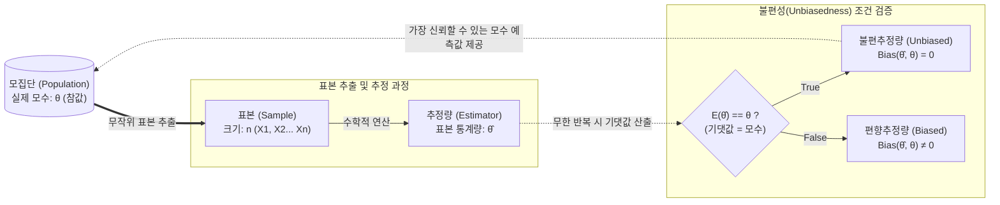

# 불편추정량 (Unbiased Estimator)

---

## I. 모집단의 모수 추정을 위한 통계적 척도, 불편추정량의 개요

**가. 불편추정량의 정의**

* 모집단의 모수(Parameter)를 추정하기 위해 추출한 표본 통계량(Statistic)의 기댓값이 실제 모집단의 모수와 정확히 일치하는 추정량 (즉, $E(\hat{\theta}) = \theta$)
* 표본 추출과 추정 과정에서 구조적인 [[편향]](Bias)이 발생하지 않아 객관적인 모수 추론이 가능한 통계적 지표

**나. 불편추정량의 필요성 및 특징**

* **객관성 및 [[신뢰성]] 확보**: 표본 오차로 인한 편향(Bias)을 제거하여, 모집단 특성 추론 시 체계적 오차(Systematic Error) 최소화
* **베셀 보정(Bessel's Correction)**: 표본 분산 산출 시 데이터 개수 $n$이 아닌 자유도 $n-1$로 나누어 불편성(Unbiasedness)을 확보
* **머신러닝 최적화 근간**: 딥러닝의 확률적 [[경사하강법]](SGD)에서 미니 배치의 그래디언트가 전체 그래디언트의 불편추정량으로 작용하여 전역 최적해(Global Minimum) 탐색 보장

---

## II. 불편추정량의 개념도 및 핵심 기술 요소

### 가. 불편추정량의 통계적 추론 개념도 및 동작 원리

* 표본 통계량의 분포 중심(기댓값)이 모수 $\theta$와 정확히 일치할 때 이를 불편추정량으로 정의하며, 머신러닝의 파라미터 업데이트 및 손실 함수 검증의 핵심 지표로 활용됨

### 나. 불편추정량의 핵심 구성 및 기술 요소

| 구분 | 요소기술(키워드) | 세부 설명 |
| --- | --- | --- |
| **핵심 변수** | 모수 (Parameter, $\theta$) | 모집단 전체의 특성을 나타내는 고유한 참값 (예: 모평균 $\mu$, 모분산 $\sigma^2$) |
| **핵심 변수** | 추정량 (Estimator, $\hat{\theta}$) | 모수를 추정하기 위해 표본 데이터들을 이용하여 계산된 통계량의 함수식 |
| **평가 지표** | 기댓값 (Expected Value) | 동일한 크기의 표본을 무한히 반복 추출하여 구한 추정량들의 평균적인 위치 |
| **평가 지표** | 편향 (Bias) | 추정량의 기댓값과 실제 모수와의 차이 ($Bias = E(\hat{\theta}) - \theta$) |
| **주요 사례** | 표본 평균 (Sample Mean) | 모평균의 가장 대표적인 불편추정량 ($E(\bar{X}) = \mu$) |
| **주요 사례** | 표본 분산 (Sample Variance) | 모분산 추정 시 편향을 없애기 위해 $n$ 대신 $n-1$(자유도)로 나눈 불편분산 적용 |
| **추가 특성** | 일치성 (Consistency) | 표본의 크기($n$)가 무한히 커질수록 추정량 $\hat{\theta}$가 모수 $\theta$에 확률적으로 수렴하는 성질 |
| **평가 기준** | 최소분산 (MVUE) | 다수의 불편추정량 중 분산(Variance)이 가장 작아 효율성(Efficiency)이 가장 높은 추정량 |

---

## III. 불편추정량과 편향추정량의 비교 및 인공지능/ML 분야 활용 동향

### 가. 불편추정량과 편향추정량의 핵심 비교

| 비교 항목 | 불편추정량 (Unbiased Estimator) | 편향추정량 (Biased Estimator) |
| --- | --- | --- |
| **성립 조건** | $E(\hat{\theta}) = \theta$ (기댓값이 모수와 일치) | $E(\hat{\theta}) \neq \theta$ (기댓값이 모수와 불일치) |
| **편향 (Bias)** | $Bias(\hat{\theta}, \theta) = 0$ | $Bias(\hat{\theta}, \theta) \neq 0$ (체계적 오차 존재) |
| **표본 분산 분모** | $n - 1$ (베셀 보정 적용) | $n$ (표본 크기 그대로 사용) |
| **장점** | 모수의 참값을 평균적으로 정확하게 추정 | 상황에 따라 분산(Variance)을 대폭 줄일 수 있음 |
| **주요 활용** | 기초 통계적 추론, 경사하강법(SGD) 그래디언트 계산 | 릿지(Ridge), 라쏘(Lasso) 회귀 등 정규화(Regularization) 모델 |

### 나. 인공지능 및 머신러닝 분야의 추정량 활용 동향

* **편향-분산 트레이드오프 (Bias-Variance Tradeoff)**: 머신러닝 모델 평가 시, 수학적으로 완벽한 불편추정량(편향=0)을 추구하면 모델이 학습 데이터에 과적합되어 분산(Variance)이 기하급수적으로 커지는 현상 발생. 최근 산업계에서는 L1/L2 정규화를 통해 약간의 편향(Bias)을 허용하더라도 분산을 크게 낮춰 [[일반화]] 성능(Generalization)을 높이는 편향추정량 모델을 선호함.
* **[[강화학습]](RL)의 가치 추정 (Value Estimation)**: 몬테카를로(MC) 방식은 반환값의 불편추정량을 제공하나 분산이 크고, TD(Temporal Difference) 학습은 편향추정량이나 분산이 작은 특성이 있어, 최근 PPO, SAC 등 최신 알고리즘은 두 추정량의 장점을 결합한 GAE(Generalized Advantage Estimation)를 표준으로 사용함.

---

### 🔗 연관 토픽

- **소속 도메인**: [[00_인공지능_MOC|🤖 인공지능]]
- **세부 분류**: `1. 수학 · 통계학 & 데이터 전처리`
- **핵심 연관 토픽**:
  - [[중심극한정리|중심극한정리 (Central Limit Theorem)]]
  - [[추정통계|추정통계 (Estimation Statistics)]]
  - [[경사하강법|경사하강법 (Gradient Descent Algorithm)]]
  - [[추정 이론|추정 이론(Estimation Theory)]]
  - [[할루시네이션|할루시네이션(Hallucination)]]
