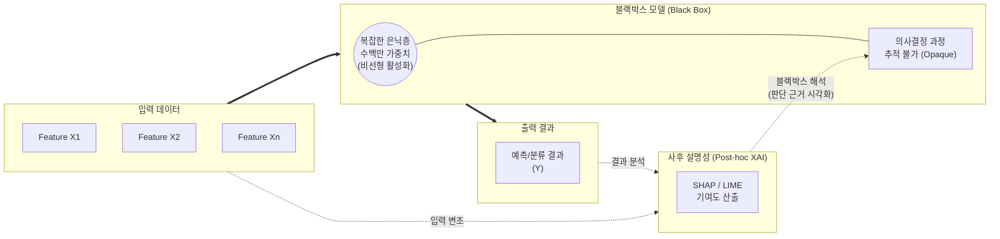

# 블랙박스 모델 (Black Box Model)

---

## I. 고성능 예측과 해석 불가성의 딜레마, 블랙박스 모델의 개요

**가. 블랙박스 모델의 정의**

* 입력(Input)과 출력(Output)의 관계는 알 수 있으나, 내부의 복잡한 수학적 연산 과정과 의사결정 도출 논리를 인간이 직관적으로 이해하거나 역추적하기 어려운 기계학습 및 [[딥러닝]] 모델

**나. 블랙박스 모델의 등장배경 및 특징**

* **등장배경**: 비정형 데이터(이미지, 텍스트) 처리와 초거대 모델([[초거대 언어 모델|LLM]]) 발전으로 인해 파라미터 수가 기하급수적으로 증가하며 알고리즘의 복잡도 극대화
* **핵심특징**: **트레이드오프**(정확도는 매우 높으나 해석력은 현저히 낮음), **불투명성**(은닉층 연산의 추적 불가), **[[XAI]](설명 가능한 AI)의 필요성 대두**

---

## II. 블랙박스 모델의 개념도 및 핵심 기술 요소

### 가. 블랙박스 모델의 개념도 및 동작원리

* 입력 데이터가 복잡한 수식과 다층 구조(은닉층)를 통과하여 예측 결과를 산출하나 그 과정을 알 수 없어, 이를 해석하기 위해 [[LIME]]/SHAP 등 사후 설명(Post-hoc) XAI 기법을 외부에 결합하여 해석을 시도함

### 나. 블랙박스 모델의 핵심 속성 및 해석 기술 요소

| 구분 | 요소기술(키워드) | 세부 설명 |
| --- | --- | --- |
| **대표 모델** | 심층신경망 (DNN) | 다수의 은닉층과 비선형 활성화 함수가 결합되어 가중치의 직관적 의미 상실 |
| **대표 모델** | 앙상블 (Ensemble) | [[랜덤 포레스트]], XGBoost 등 다수의 약한 학습기(Tree)가 결합되어 추적 복잡도 증가 |
| **핵심 한계점** | 의사결정의 불투명성 | 모델이 특정 결론(예: 대출 거절, 암 진단)을 내린 합리적 근거를 사용자에게 제시 불가 |
| **핵심 한계점** | 숨겨진 [[편향]] (Hidden Bias) | 학습 데이터의 편향성이나 윤리적 차별 요소가 모델 내부에 숨겨져 있어 감사(Audit) 곤란 |
| **사후 해석 기술** | SHAP | 게임 이론의 섀플리 값(Shapley Value)을 기반으로 개별 피처가 최종 예측에 미친 기여도를 수치화 |
| **사후 해석 기술** | LIME | 분석하고자 하는 데이터 포인트 주변에 국소적(Local)으로 단순한 선형 대리 모델을 생성하여 해석 |
| **사후 해석 기술** | Grad-CAM | [[CNN]] 기반 이미지 분류 모델에서 예측에 결정적 영향을 미친 영역을 히트맵(Heatmap) 형태로 시각화 |
| **대리 분석** | 대리 모델 (Surrogate) | 블랙박스 모델의 입출력 데이터를 모방하여 학습한, 본질적으로 해석 가능한 화이트박스 모델([[의사결정나무]] 등) |

---

## III. 블랙박스 모델과 화이트박스 모델 비교 및 향후 전망

### 가. 블랙박스 모델 vs 화이트박스 모델 비교

| 비교 항목 | 블랙박스 모델 (Black Box Model) | 화이트박스 모델 (White/Glass Box Model) |
| --- | --- | --- |
| **내부 해석력** | 매우 낮음 (불투명성, Opaque) | 매우 높음 (투명성, Transparent) |
| **예측 성능/정확도** | 대체로 매우 높음 (비선형적, 복잡한 패턴 매칭) | 비교적 낮거나 도메인 한계 존재 |
| **주요 [[알고리즘]]** | 심층 딥러닝(CNN, [[RNN (Recurrent Neural Network)|RNN]], Transformer), 부스팅 앙상블 | 다중 선형 회귀, 의사결정나무(Decision Tree), 규칙 기반(Rule-based) |
| **최적 활용 도메인** | 비전(Vision), 자연어 처리, 초거대 AI | 금융 신용 평가, 의료 진단, 법률/규제 준수 시스템 |
| **설명 제공 방식** | LIME, SHAP 등 사후 설명(Post-hoc) 기법 적용 | 모델 자체의 가중치, 트리 분기 기준(Node) 직접 확인 |

### 나. 향후 동향 및 산업 적용 방향

* **설명 요구권(Right to Explanation)의 법제화**: 유럽의 GDPR 및 EU AI Act 등 글로벌 AI 규제가 강화됨에 따라, 금융/의료/[[Smart Car(자율주행)|자율주행]] 등 고위험(High-Risk) 분야에서는 블랙박스 모델의 단독 사용이 제한되고 사후 설명성(XAI) 탑재가 법적 의무화되는 추세임.
* **본질적 해석 가능한 기계학습(IML)으로의 진화**: 사후 설명 기법(Post-hoc) 자체의 부정확성 한계를 극복하기 위해, 모델 설계 단계부터 고성능과 설명성을 동시에 확보하는 EBM(Explainable [[부스팅|Boosting]] Machine) 및 신경-기호주의(Neuro-Symbolic) AI 연구가 활발히 진행 중임.

---

### 🔗 연관 토픽

- **소속 도메인**: [[00_인공지능_MOC|🤖 인공지능]]
- **세부 분류**: `4. 거대언어모델 (LLM) & 생성형 AI`
- **핵심 연관 토픽**:
  - [[딥러닝]]
  - [[편향]]
  - [[XAI]]
  - [[CNN|CNN (Convolutional Neural Network)]]
  - [[RNN (Recurrent Neural Network)]]
