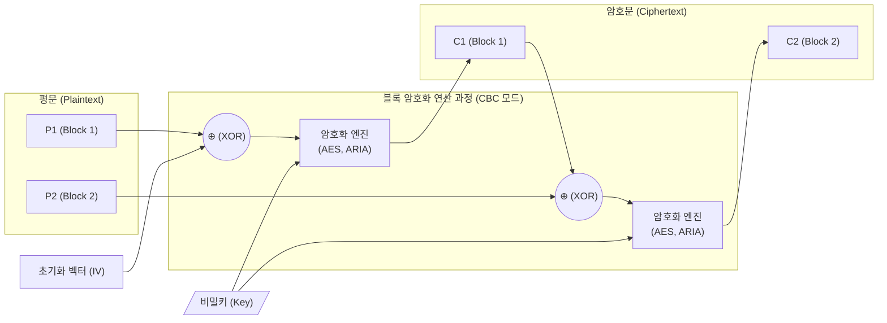

# 블록 암호화 (Block Cipher)

---

## I. 데이터 기밀성 보장을 위한 대칭키 기반, 블록 암호화의 개요

**가. 블록 암호화의 정의**

* 평문을 고정된 크기의 블록(Block, 예: 64bit, 128bit) 단위로 분할하고, 대칭키를 사용하여 각 블록을 독립적으로 또는 연쇄적으로 암호화하는 기법
* 샤논(Shannon)의 암호 설계 원칙인 혼돈(Confusion)과 확산(Diffusion)을 다중 라운드에 걸쳐 반복 수행하여 암호문의 안전성을 확보하는 [[암호 알고리즘]]

**나. 블록 암호화의 등장배경 및 특징**

* **대용량 데이터 처리**: 스트림 암호 대비 대용량 파일 및 [[데이터베이스]] 등 저장 데이터(Data at Rest)의 암호화에 적합
* **운영 모드(Mode of Operation)**: 평문 길이가 블록 크기의 배수가 아닐 때 패딩(Padding)을 사용하며, 안전성 강화를 위해 블록 간 연쇄 반응을 유도하는 운영 모드(CBC, GCM 등) 필수 적용
* **구조적 특성**: 크게 Feistel 구조([[DES]], SEED)와 SPN 구조([[AES]], ARIA)로 나뉘어 하드웨어/소프트웨어 효율성 최적화

---

## II. 블록 암호화의 개념도 및 핵심 기술 요소

### 가. 블록 암호화의 개념도 및 동작 원리 (CBC 운영 모드 기준)

* 평문을 고정된 블록으로 나누고, 첫 블록은 IV와 XOR 연산 후 [[암호화]] 수행
* 이전 블록의 암호문(C1)을 다음 평문(P2)과 연쇄적으로 XOR(체이닝)하여, 동일한 평문 블록이라도 다른 암호문이 출력되도록 패턴 분석 공격 원천 차단

### 나. 블록 암호화의 핵심 기술 요소

| 구분 | 요소기술(키워드) | 세부 설명 |
| --- | --- | --- |
| **설계 원리** | 혼돈 (Confusion) | 암호문과 평문/키 간의 상관관계를 숨기는 성질 (주로 비선형 함수인 S-Box로 구현) |
| **설계 원리** | 확산 (Diffusion) | 평문이나 키의 한 비트 변화가 암호문 전체 비트에 영향을 미치도록 분산 (P-Box로 구현) |
| **기본 구조** | Feistel 구조 | 블록을 L/R 좌우로 분할, 라운드 함수 $F$ 연산 후 교차, 역함수 불필요 (DES, SEED 적용) |
| **기본 구조** | SPN 구조 | 전체 블록을 병렬로 Substitution-Permutation 연산, 고속 처리 가능, 역함수 필요 (AES, ARIA 적용) |
| **운영 모드** | Modes of Operation | 다중 블록 처리 방식 결정 (ECB, CBC, CFB, OFB, CTR 등), 기밀성과 [[무결성]] 결합(AEAD, GCM) |
| **부품 기술** | 키 [[스케줄링]] (Key Schedule) | 하나의 메인 비밀키(Master Key)로부터 각 라운드에 사용할 다수의 서브키(Sub-key)를 파생 생성 |
| **부품 기술** | 패딩 (Padding) | 평문의 길이가 블록 크기의 배수가 아닐 때, 부족한 공간을 특정 규칙(PKCS#5, PKCS#7)으로 채움 |
| **성능 최적화** | AES-NI (하드웨어 가속) | [[CPU]] 내에 암호화 처리 전용 명령어 셋을 내장하여 소프트웨어 연산 오버헤드를 극소화 |

---

## III. 블록 암호화 vs 스트림 암호화 비교 및 최신 동향

### 가. 블록 암호화와 스트림 암호화 비교

| 비교 항목 | 블록 암호화 (Block Cipher) | 스트림 암호화 (Stream Cipher) |
| --- | --- | --- |
| **암호화 단위** | 고정 크기 블록 (64bit, 128bit 등) | 비트(Bit), 바이트(Byte) 단위의 스트림 |
| **처리 속도** | 상대적으로 느림 (라운드 반복, 체이닝) | 매우 빠름 (연속적인 XOR 연산 위주) |
| **에러 파급 효과** | 체이닝 모드(CBC) 사용 시 에러 확산 발생 | 해당 비트에만 에러 국한 (동기식 스트림의 경우) |
| **적용 분야** | 대용량 데이터 저장(DB, 파일), 통신 채널 보안 | 무선 통신(WLAN), 실시간 멀티미디어 스트리밍 |
| **대표 [[알고리즘]]** | AES, DES, ARIA, SEED | RC4, A5/1, ChaCha20 |

### 나. 향후 전망 및 산업 동향

* **양자 컴퓨터 위협 대응**: 그로버(Grover) 알고리즘 도입 시 대칭키의 유효 키 길이가 절반으로 단축됨. 양자 내성 확보를 위해 AES-128을 배제하고 **AES-256 이상의 장기(Long-term) 키 사용**이 업계 표준으로 강제화되는 추세.
* **인증형 암호(AEAD) 중심 재편**: 기밀성만 제공하는 기존 모드(CBC) 대신, 기밀성과 무결성(인증)을 동시에 초고속으로 보장하는 **AES-GCM, ChaCha20-Poly1305**의 TLS 1.3 기본 채택 확산.
* **경량 암호화(LWC)로의 확장**: 리소스가 극히 제한된 IoT/센서 네트워크 환경을 위해 설계된 초경량 블록/스트림 암호(NIST 표준 ASCON 등) 적용 본격화.

---

### 🔗 연관 토픽

- **소속 도메인**: [[00_보안_MOC|🛡️ 보안]]
- **세부 분류**: `1. 정보보안 원칙 & 거버넌스 · 인증`
- **핵심 연관 토픽**:
  - [[암호화|암호화 (Encryption)]]
  - [[암호 알고리즘]]
  - [[DES]]
  - [[전자봉투|전자봉투(Digital Envelope)]]
  - [[AES]]
