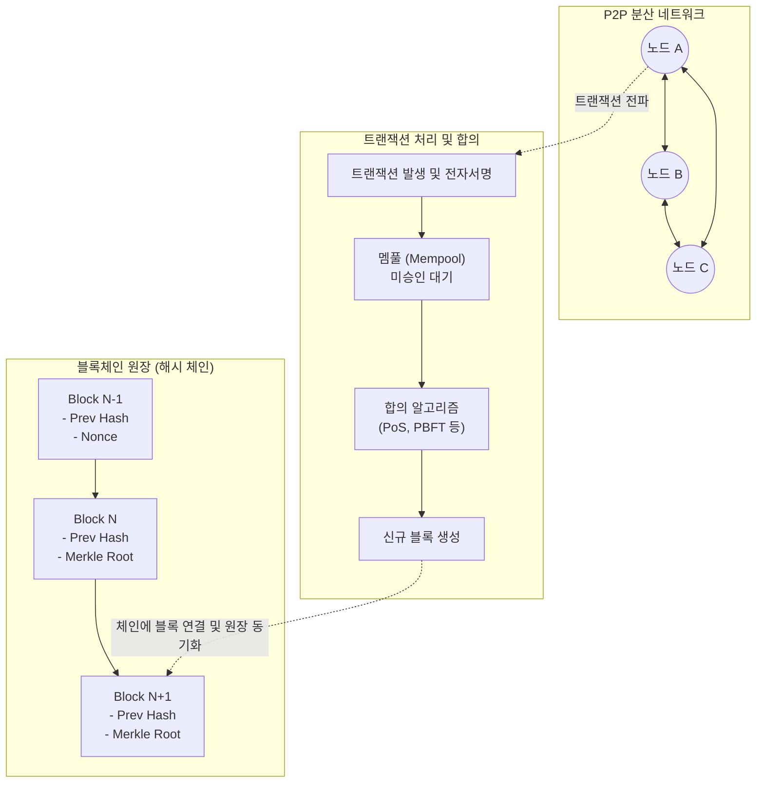

# 블록체인 (Block Chain)

---

## I. 신뢰 기반의 분산 원장 기술, 블록체인의 개요

**가. 블록체인(Block Chain)의 정의**

* 네트워크 내의 모든 참여자(Node)가 [[암호화]] 기술과 합의 알고리즘을 통해 [[트랜잭션]] 기록을 공동으로 검증하고 분산 저장하는 P2P 기반의 분산 원장 기술(DLT, Distributed Ledger Technology)

**나. 블록체인의 필요성 및 특징**

* **필요성**: 중앙 집중형 시스템의 단일 장애점(SPOF) 극복, 중개자 없는 상호 신뢰 보장 및 거래 비용 절감
* **핵심 특징**: **탈중앙화**(중앙 통제 기관 부재), **불변성**(해시 체인 구조로 위변조 불가), **투명성**(모든 거래 내역 공유 및 추적 가능)

---

## II. 블록체인의 개념도 및 핵심 기술 요소

### 가. 블록체인의 아키텍처 및 동작 원리

* 발생한 트랜잭션은 P2P 네트워크를 통해 전파되며, 참여 노드 간의 합의 알고리즘을 거쳐 유효성이 검증된 후 새로운 블록으로 생성되어 기존 체인에 암호학적으로 연결됨

### 나. 블록체인의 핵심 기술 요소

| 구분 | 요소기술(키워드) | 세부 설명 |
| --- | --- | --- |
| **네트워크** | P2P 네트워크 (Peer-to-Peer) | 중앙 서버 없이 개별 노드 간 직접 통신하여 데이터를 전파하고 원장을 동기화(Gossip Protocol) |
| **암호화** | 해시 함수 (Hash Function) | SHA-256 등을 활용하여 가변 길이의 데이터를 고정 길이로 변환, 데이터 [[무결성]] 보장 |
| **암호화** | 비대칭키 및 전자서명 | 개인키로 서명하고 공개키로 검증하여 트랜잭션의 송신자 부인 방지 및 소유권 증명 |
| **자료구조** | 머클 트리 (Merkle Tree) | 블록 내 다수의 트랜잭션을 해시 트리 형태로 구성하여, 거래 위변조 여부를 신속하게 검증 |
| **신뢰 제어** | [[합의 알고리즘]] (Consensus) | 불특정 다수의 노드 간 데이터 일치성을 보장하는 규칙 (PoW, PoS, DPoS, PBFT 등) |
| **응용 실행** | 스마트 컨트랙트 (Smart Contract) | 사전에 정의된 조건 충족 시 중개자 없이 블록체인 위에서 자동으로 실행되는 소프트웨어 코드 |
| **응용 실행** | [[EVM(Earned Value Management, 획득 가치 관리)|EVM]] (Ethereum Virtual Machine) | 스마트 컨트랙트가 실행되는 튜링 완전성(Turing-complete)을 갖춘 격리된 독립 런타임 환경 |
| **확장성** | 레이어 2 (Layer 2 / Rollup) | 메인넷(L1)의 연산 부담을 줄이기 위해 오프체인에서 연산 후 결괏값만 온체인에 기록하는 기술 |

---

## III. 퍼블릭/프라이빗 블록체인 비교 및 향후 동향

### 가. 퍼블릭(Public) 블록체인과 프라이빗(Private) 블록체인 비교

| 비교 항목 | 퍼블릭 블록체인 (Public) | 프라이빗/컨소시엄 블록체인 (Private/Consortium) |
| --- | --- | --- |
| **참여 권한** | 제한 없음 (누구나 네트워크 참여 및 검증 가능) | 사전 승인된 특정 노드/기관만 참여 가능 |
| **처리 속도(TPS)** | 낮음 (수십~수백 TPS, 대규모 합의 소요) | 높음 (수천 TPS 이상, 소수 노드 합의) |
| **운영 주체** | 탈중앙화 커뮤니티 (운영 주체 없음) | 특정 기업 또는 컨소시엄 협의체 |
| **암호화폐/보상** | 필수 (네트워크 유지를 위한 인센티브 구조) | 불필요 (필요시 내부 토큰 형태로만 운용) |
| **대표 사례** | Bitcoin, Ethereum, Solana | Hyperledger Fabric, R3 Corda |

### 나. 블록체인 기술의 최신 동향 및 산업 적용 전망

* **모듈러 블록체인(Modular Blockchain)으로의 진화**: 기존 단일(Monolithic) 체인의 한계를 극복하기 위해 실행(Execution), 합의(Consensus), 데이터 [[HA(High Availability)|가용성]](Data Availability) 계층을 분리하여 확장성과 유연성을 극대화하는 아키텍처(예: Celestia)가 시장 주도.
* **실물 자산 토큰화(RWA, Real World Asset) 본격화**: 부동산, 채권, 미술품 등 전통 금융권의 실물 자산을 블록체인 기반의 토큰으로 발행하여 유동성을 공급하고 분할 소유를 지원하는 STO(토큰증권) 산업 및 기관 자본의 유입 가속화.
* **영지식 증명([[영지식증명|ZKP]]) 기반 프라이버시 및 스케일링 강화**: 데이터 자체를 공개하지 않고도 그 데이터가 참임을 증명하는 영지식 증명 기술이 ZK-Rollup 등 레이어2 확장성 솔루션과 DID(분산 신원 증명)의 핵심 기술로 자리 잡으며 트릴레마(Trilemma) 해결을 견인 중.

---

### 🔗 연관 토픽

- **소속 도메인**: [[00_디지털서비스_MOC|🚀 디지털서비스]]
- **세부 분류**: `2. 블록체인 & 분산원장 · Web3`
- **핵심 연관 토픽**:
  - [[합의 알고리즘|합의 알고리즘 (Consensus Algorithm)]]
  - [[무결성]]
  - [[영지식증명|영지식증명(Zero Knowledge Proof)]]
  - [[Web 3.0]]
  - [[CBDC]]
