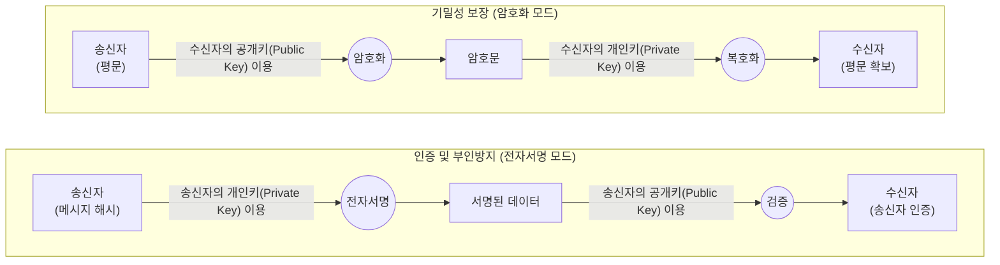

# 비대칭키 암호화 (Asymmetric-key Cryptography)

---

## I. 기밀성과 부인 방지를 동시 제공하는, 비대칭키 암호화의 개요

**가. 비대칭키 암호화의 정의**

* [[암호화]](Encryption)와 복호화(Decryption)에 서로 다른 두 개의 키(공개키, 개인키)를 사용하여 [[기밀성]], [[무결성]], 인증, 부인 방지 기능을 제공하는 암호화 기법
* 수신자의 공개키로 암호화하여 기밀성을 확보하거나, 송신자의 개인키로 서명하여 인증 및 부인 방지를 수행하는 공개키 기반 암호화 구조

**나. 비대칭키 암호화의 등장배경 및 특징**

* **대칭키의 한계 극복**: $N(N-1)/2$개로 기하급수적으로 증가하는 대칭키의 키 분배(Key Distribution) 및 관리 문제 해결 (비대칭키는 $2N$개 소요)
* **수학적 난제 기반**: 소인수분해([[RSA (Rivest Shamir Adleman)|RSA]]), 이산대수(ElGamal), 타원곡선([[ECC]]) 등 역산이 극히 어려운 단방향 수학적 난제(Trapdoor One-way Function) 활용
* **다목적 보안성**: 기밀성 보장(암호화 모드)과 인증/부인 방지 보장(전자서명 모드)을 동시 또는 선택적으로 지원

---

## II. 비대칭키 암호화의 개념도 및 핵심 기술 요소

### 가. 비대칭키 암호화의 개념도 및 동작 원리

* **암호화 모드**: 수신자만이 가진 개인키로만 복호화할 수 있도록, 누구나 접근 가능한 '수신자의 공개키'로 데이터를 암호화하여 전송 (기밀성 보장)
* **전자서명 모드**: 송신자만이 가진 개인키로 데이터를 서명하고, 누구나 '송신자의 공개키'로 서명을 검증하여 송신 사실 증명 (인증/부인방지)

### 나. 비대칭키 암호화의 핵심 알고리즘 및 구성 요소

| 구분 | 요소기술(키워드) | 세부 설명 |
| --- | --- | --- |
| **기반 [[알고리즘]]** | RSA | 두 개의 큰 소수의 곱을 소인수분해하기 어렵다는 수학적 난제에 기반한 사실상의 표준 공개키 알고리즘 |
| **기반 알고리즘** | ECC (타원곡선암호) | 타원곡선 상의 이산대수 문제에 기반하며, RSA 대비 짧은 키 길이(256bit)로 동일한 보안 강도(RSA 3072bit) 제공 |
| **기반 알고리즘** | [[DSA]] / KCDSA | 이산대수 문제를 기반으로 미국(DSA) 및 한국(KCDSA)에서 표준화한 전자서명 전용 알고리즘 |
| **키 구성요소** | 공개키 (Public Key) | 타인에게 공개되는 키로, 데이터 암호화(기밀성 목적) 또는 전자서명 검증에 사용됨 |
| **키 구성요소** | 개인키 (Private Key) | 소유자만 비밀리에 보관하는 키로, 데이터 복호화 또는 전자서명(인증 목적) 생성에 사용됨 |
| **인프라 체계** | PKI (공개키 기반 구조) | 공개키의 무결성과 소유자를 증명하기 위해 공인인증기관(CA)이 인증서(X.509)를 발급하는 신뢰 인프라 |
| **보안 서비스** | 기밀성 (Confidentiality) | 권한이 없는 자가 데이터를 읽을 수 없도록 암호화하여 통신 채널 상의 스니핑(Sniffing) 위협 차단 |
| **보안 서비스** | 부인 방지 (Non-repudiation) | 송신자가 메시지를 전송했거나 서명한 사실을 사후에 부인할 수 없도록 법적/기술적 증거 제공 |

---

## III. 대칭키와의 비교 및 비대칭키 암호화의 향후 전망

### 가. 비대칭키 암호화와 대칭키 암호화 비교

| 비교 항목 | 비대칭키 암호화 (Asymmetric Key) | [[대칭키 암호화]] (Symmetric Key) |
| --- | --- | --- |
| **키 구성 및 개수** | 공개키, 개인키 (사용자 당 2개, 총 $2N$개) | 단일 비밀키 (네트워크 당 총 $N(N-1)/2$개) |
| **암·복호화 키** | 서로 다름 (이종 키 체계) | 서로 같음 (동일 키 체계) |
| **처리 속도 / 효율** | 매우 느림 / 복잡한 수학 연산 ([[CPU]] 부하 큼) | 매우 빠름 / 단순 비트/XOR 연산 |
| **키 분배 문제** | 해결됨 (공개키만 공개, PKI 인증서 활용) | 미해결 (안전한 키 교환 채널 별도 필요) |
| **대표 알고리즘** | RSA, ECC, ElGamal | [[AES]], ARIA, SEED, [[DES]] |
| **주요 활용 분야** | 전자서명, 대칭키(세션키) 교환, 인증 | 대용량 파일 암호화, DB 암호화, 디스크 암호화 |

### 나. 비대칭키 암호화의 한계점 극복 및 최신 산업 동향

* **하이브리드 암호 체계의 표준화**: 비대칭키의 느린 처리 속도를 극복하기 위해, 대용량 데이터는 대칭키(세션키)로 고속 암호화하고, 해당 세션키를 비대칭키로 안전하게 교환하는 하이브리드 방식(예: TLS/SSL [[프로토콜]])이 인터넷 보안통신의 절대적 표준으로 자리매김함.
* **양자 컴퓨터 위협과 양자 내성 암호(PQC)로의 마이그레이션**: 쇼어(Shor) 알고리즘을 탑재한 양자 컴퓨터가 상용화될 경우 기존 RSA 및 ECC 체계가 붕괴할 위험에 직면함. 이에 따라 미국 NIST는 2024년 격자 기반(Lattice-based) 암호 등 양자 내성 암호 표준([[FIPS (Federal Information Processing Standards)|FIPS]] 203, 204, 205)을 확정하여 공표하였으며, 전 세계 금융 및 공공 인프라의 알고리즘 마이그레이션(Crypto Agility)이 본격화되고 있음.

---

### 🔗 연관 토픽

- **소속 도메인**: [[00_보안_MOC|🛡️ 보안]]
- **세부 분류**: `1. 정보보안 원칙 & 거버넌스 · 인증`
- **핵심 연관 토픽**:
  - [[기밀성]]
  - [[대칭키 암호화]]
  - [[암호화|암호화 (Encryption)]]
  - [[DSA]]
  - [[DES]]
