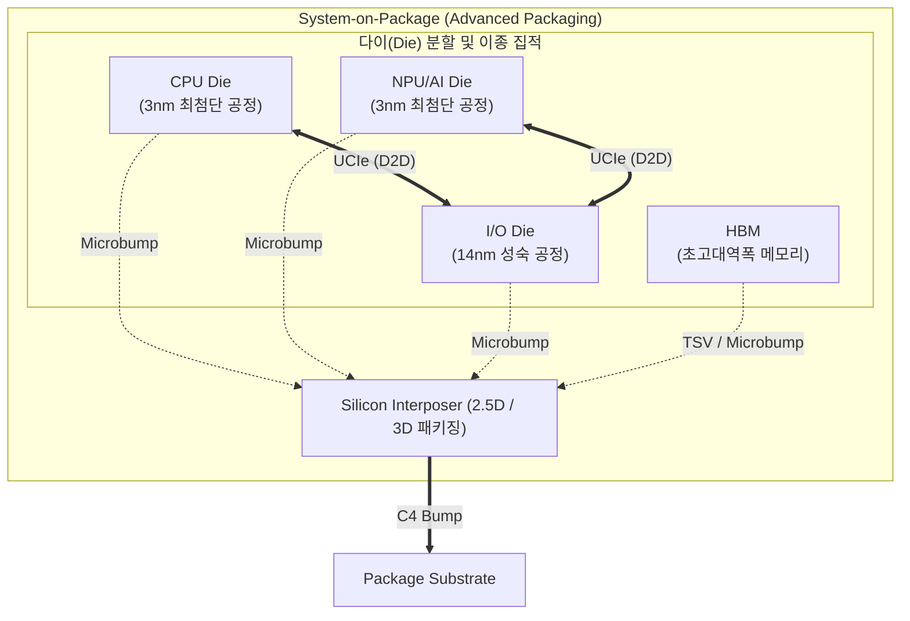

# 시스템 반도체 (비메모리 반도체)

---

## I. 모놀리식 한계 극복을 위한 차세대 연산 프로세서, 시스템 반도체의 개요

가. **시스템 반도체(비메모리 반도체)의 정의**

* 데이터의 연산, 제어, 논리 작업 등 정보 처리를 목적으로 하며, 최근 AI 연산 효율 극대화를 위해 칩렛(Chiplet) 및 이종 집적(Heterogeneous Integration) 기술을 기반으로 진화 중인 초고성능 프로세서

나. **시스템 반도체의 필요성 및 핵심 특징**

* **모놀리식(Monolithic) 설계의 한계 극복**: 3nm 등 초미세 공정 진입에 따른 레티클(Reticle) 크기 제한 우회, 수율 저하 및 웨이퍼 비용 급증 문제 해결
* **기능별 공정 최적화 및 [[모듈화]]**: 연산([[CPU]]/[[NPU]])은 최첨단 공정, 입출력(I/O)은 성숙 공정으로 분리 생산 후 하나의 패키지로 조립하여 비용 효율성 및 유연성 확보

---

## II. 시스템 반도체(칩렛 기반)의 개념도 및 핵심 기술 요소

### 가. 시스템 반도체(칩렛 및 이종 집적 기반)의 아키텍처 및 동작 원리

* **기능별 다이 분할**: 단일 칩을 기능별(연산, I/O 등) 독립된 다이로 분할 설계 및 개별 생산
* **D2D 및 패키징 통합**: UCIe 기반 초고속 인터페이스로 다이 간 통신을 수행하며, 실리콘 인터포저와 TSV를 활용한 첨단 패키징을 통해 단일 시스템(SoC)처럼 동작

### 나. 시스템 반도체의 핵심 기술 요소

| 분류 | 요소기술(키워드) | 세부 설명 |
| --- | --- | --- |
| **설계 패러다임** | [[칩렛|칩렛 (Chiplet)]] | 단일 칩을 기능별 소형 다이로 분할, 불량률 최소화 및 수율 극대화 |
| **아키텍처** | 이종 집적 (Heterogeneous) | 로직, 메모리(HBM), 아날로그 등 이종 다이를 단일 패키지로 통합 |
| **통신 인터페이스** | D2D (Die-to-Die) | 칩렛 간 초저지연, 고대역폭 데이터 전송을 위한 물리 계층 인터커넥트 기술 |
| **통신 인터페이스** | UCIe | 다양한 제조사의 칩렛 간 원활한 호환 및 연결을 보장하는 범용 표준 |
| **첨단 패키징** | 2.5D 패키징 | 실리콘 인터포저 상단에 칩렛과 HBM을 수평으로 병렬 배치하는 고밀도 집적 (예: CoWoS) |
| **첨단 패키징** | 3D 패키징 | 다이를 수직으로 적층하여 배선 길이를 최소화하고 실장 면적 극대화 (예: Foveros) |
| **연결 소자** | TSV (Through Silicon Via) | 칩에 미세 홀을 뚫어 상하단 다이를 전극으로 직접 연결하는 실리콘 관통 전극 기술 |
| **성능 가속** | [[HBM|HBM (High Bandwidth Memory)]] | DRAM 다이를 수직 적층하여 시스템 반도체의 데이터 병목(Memory Wall) 현상 해소 |

---

## III. 시스템 반도체의 비교 및 향후 전망

### 가. 시스템 반도체(비메모리) vs 메모리 반도체 비교

| 비교 항목 | 시스템 반도체 (비메모리) | [[메모리 반도체]] |
| --- | --- | --- |
| **설계 목적 및 기능** | 데이터 연산, 제어, 논리 추론 (정보 처리 중심) | 데이터 및 명령어 저장 (정보 기억 중심) |
| **대표 제품군** | CPU, [[GPU]], NPU, AP, CIS 등 | DRAM, NAND Flash, HBM 등 |
| **생산 및 비즈니스 구조** | 다품종 소량 생산, 팹리스/파운드리/OSAT 중심 분업화 | 소품종 대량 생산, IDM(종합반도체기업) 중심 일괄 처리 |
| **핵심 기술 경쟁력** | 아키텍처 설계 역량(IP), 칩렛 분할, 2.5D/3D 첨단 패키징 | 초미세 나노 노광 공정, 초고단 수직 적층 기술 (V-NAND) |

### 나. 시스템 반도체의 향후 전망 및 동향

* **AI 중심 모듈형 칩렛 대중화**: 2026년 이후 GPGPU를 넘어 신경망 처리 가속기(NPU) 및 [[PIM|PIM(Processing-In-Memory)]] 블록을 결합하는 맞춤형 하이브리드 칩렛 아키텍처 도입 가속화
* **첨단 패키징 패권 경쟁 및 생태계 고도화**: TSMC(CoWoS), 인텔(Foveros), 삼성전자 등 글로벌 파운드리 간 3D 하이브리드 본딩(Hybrid Bonding) 기술 경쟁 심화 및 UCIe 기반의 개방형 칩렛 생태계 확산

---

### 🔗 연관 토픽

- **소속 도메인**: [[00_컴퓨터구조_MOC|💻 컴퓨터구조]]
- **세부 분류**: `1. CPU 프로세서 & 마이크로아키텍처`
- **핵심 연관 토픽**:
  - [[CPU]]
  - [[GPU]]
  - [[NPU|NPU(Neural Processing Unit)]]
  - [[HBM|HBM (High Bandwidth Memory)]]
  - [[메모리 반도체|메모리 반도체 (Memory Semiconductor)]]
