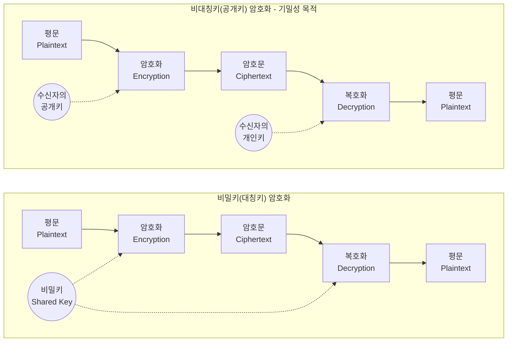

# 비밀키 암호화와 비대칭키 암호화

---

## I. 데이터 기밀성과 무결성 보장을 위한, 비밀키와 비대칭키 암호화의 개요

가. **비밀키(대칭키)와 비대칭키(공개키) 암호화의 정의**

* **비밀키 [[암호화]] (Symmetric)**: 암호화와 복호화에 동일한 키(Secret Key)를 사용하여 대용량의 데이터를 고속으로 안전하게 처리하는 암호화 기법
* **[[비대칭키 암호화]] (Asymmetric)**: 암호화용 공개키(Public Key)와 복호화용 개인키(Private Key)를 분리하여 대칭키의 키 분배(Key Distribution) 문제를 근본적으로 해결한 암호화 기법

나. **암호화 방식의 필요성 및 핵심 특징**

* **비밀키**: 대용량 데이터 처리 적합, 연산 속도 빠름, N명 네트워크 시 키 관리 난해($N(N-1)/2$개) 및 키 교환 시 탈취 취약
* **비대칭키**: 키 사전 공유 불필요(키 배송 문제 해결), 인증 및 부인방지(전자서명) 제공, 복잡한 수학적 연산으로 인한 처리 속도 저하

---

## II. 비밀키/비대칭키 암호화의 개념도 및 핵심 기술 요소

### 가. 비밀키 및 비대칭키 암호화의 동작 원리

* **비밀키 동작**: 송신자와 수신자가 사전에 안전하게 공유한 단일 암호키로 암복호화 수행
* **비대칭키 동작**: 수신자가 만인에게 공개한 '공개키'로 송신자가 암호화하고, 수신자만이 보유한 '개인키'로 복호화 수행 (전자서명 시에는 송신자 개인키로 암호화)

### 나. 암호화 기법의 핵심 알고리즘 및 구성 요소

| 구분 | 요소기술(키워드) | 세부 설명 |
| --- | --- | --- |
| **비밀키(블록)** | AES ([[AES|Advanced Encryption Standard]]) | SPN 구조, 128/192/256비트 가변 키 길이를 지원하는 미국 표준 [[알고리즘]] |
| **비밀키(블록)** | ARIA, SEED | KISA, NSRI 등에서 개발한 국내 표준 [[암호 알고리즘]] (ISMS, 공공기관 필수) |
| **비밀키(스트림)** | RC4, LFSR | 비트/바이트 단위 연산(XOR)으로 처리 속도가 매우 빠른 스트림 암호화 (WEP/WPA 적용) |
| **비대칭키** | [[RSA (Rivest Shamir Adleman)|RSA (Rivest-Shamir-Adleman)]] | 두 개의 큰 소수를 곱한 소인수분해의 수학적 난해성에 기반한 인터넷 표준 알고리즘 |
| **비대칭키** | [[ECC]] (Elliptic Curve Cryptography) | 타원곡선 이산대수 문제 기반, 짧은 키(256bit)로 RSA(3072bit)와 동등한 보안 강도 제공 |
| **응용/활용** | KDC (Key Distribution Center) | 대칭키 암호 체계에서 N개의 노드 간 키 배포 및 관리를 중앙 집중화한 신뢰 기관 |
| **응용/활용** | 전자서명 (Digital Signature) | 비대칭키를 역방향으로 적용(송신자 개인키 암호화), 데이터 [[무결성]] 및 송신자 부인방지 제공 |
| **응용/활용** | 하이브리드 암호화 (TLS/[[IP Sec|IPSec]]) | 속도가 느린 비대칭키로 '대칭 세션키'를 안전하게 교환하고, 실제 데이터는 대칭키로 암호화 |

---

## III. 비밀키와 비대칭키 암호화의 비교 및 향후 전망

### 가. 비밀키 암호화와 비대칭키 암호화 상세 비교

| 비교 항목 | 비밀키 암호화 (Symmetric) | 비대칭키 암호화 (Asymmetric) |
| --- | --- | --- |
| **사용 키(Key)** | 암호화 키 = 복호화 키 | 암호화 키(공개키) ≠ 복호화 키(개인키) |
| **보안 메커니즘** | 혼돈(Confusion), 확산(Diffusion) | 수학적 난제 (소인수분해, 이산대수 등) |
| **연산 속도 / 크기** | 매우 빠름 / 데이터 크기 증가 미미 | 느림 (대칭키 대비 10~1000배) / 암호문 크기 증가 |
| **키 관리 갯수** | $N(N-1)/2$ 개 (N명 기준, 기하급수적) | $2N$ 개 (N명 기준, 선형적 증가) |
| **제공 보안 서비스** | [[기밀성]] (Confidentiality) | 기밀성, 무결성, 인증, 부인방지(Non-repudiation) |
| **주요 활용 분야** | 대용량 DB 암호화, 디스크 암호화, 영상 전송 | 인증서(PKI), 전자서명, 암호화폐(지갑 생성), 세션키 교환 |

### 나. 암호화 기술의 한계점 극복 및 향후 동향

* **양자 컴퓨터 위협 및 쇼어(Shor) 알고리즘**: 대규모 양자 컴퓨터 상용화 시 기존 공개키 암호(RSA, ECC)의 소인수분해 및 이산대수 문제가 다항시간 내 해독되는 'Q-Day' 위협 도래
* **[[양자내성암호]](PQC; Post-Quantum Cryptography) 전환**: 양자 알고리즘으로도 풀기 어려운 격자(Lattice), 해시(Hash), 다변량(Multivariate) 다항식 기반의 새로운 비대칭키 암호 체계로의 표준화 및 마이그레이션 가속화 (NIST 주도 크리스탈-카이버 등 표준 채택)

---

### 🔗 연관 토픽

- **소속 도메인**: [[00_보안_MOC|🛡️ 보안]]
- **세부 분류**: `1. 정보보안 원칙 & 거버넌스 · 인증`
- **핵심 연관 토픽**:
  - [[암호화|암호화 (Encryption)]]
  - [[기밀성]]
  - [[암호 알고리즘]]
  - [[IP Sec]]
  - [[비대칭키 암호화]]
