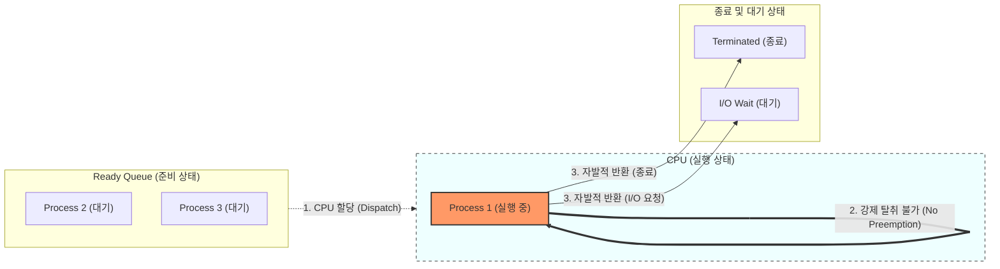

# 비선점형 스케줄링

---

## I. 안정적 프로세스 처리, 비선점형 스케줄링의 개요

* **정의**: 특정 프로세스가 [[CPU]]를 할당받아 실행 상태에 들어가면, [[프로세스]] 스스로 종료되거나 I/O 처리를 위해 대기 상태로 전환될 때까지 다른 프로세스가 CPU를 강제로 빼앗을 수 없는 CPU [[스케줄링]] 기법
* **등장배경**: 초기 일괄 처리(Batch Processing) 시스템에서 프로세스 처리 시간의 예측성을 높이고, 잦은 문맥 교환으로 인한 시스템 부하를 방지하기 위해 등장
* **특징**:
* 예측성 및 [[신뢰성]]: 프로세스의 응답시간을 예측하기 용이함
* 오버헤드 최소화: [[문맥 교환]](Context Switching)에 따른 자원 낭비 최소화
* 단점 존재: 짧은 작업이 긴 작업의 종료를 기다려야 하는 호위 효과(Convoy Effect) 발생 위험

---

## II. 비선점형 스케줄링의 개념도 및 핵심 기술 요소

### 가. 비선점형 스케줄링의 동작 개념도

* 실행 중인 프로세스(Process 1)는 외부의 인터럽트나 타임 슬라이스 만료에 의해 CPU를 뺏기지 않음
* 자발적 반환(프로세스 종료 또는 I/O 발생)이 일어날 때까지 CPU 독점 수행 유지

### 나. 비선점형 스케줄링의 유형 및 핵심 요소

| 구분 | 요소기술(기법) | 세부 설명 및 특징 |
| --- | --- | --- |
| **도착시간 기준** | **FCFS (First Come First Served)** | - 준비 큐에 도착한 순서대로 CPU를 할당하는 가장 단순한 [[알고리즘]]- 긴 프로세스 뒤의 짧은 프로세스들이 대기하는 호위 효과 발생 |
| **실행시간 기준** | **SJF (Shortest [[작업|Job]] First)** | - 큐에 대기 중인 프로세스 중 실행 시간이 가장 짧은 프로세스에 먼저 할당- 평균 대기시간을 최소화하나, 실행 시간이 긴 프로세스의 기아 현상 우려 |
| **응답비율 기준** | **HRN (Highest Response-ratio Next)** | - SJF의 [[기아|기아(Starvation)]] 현상을 보완하기 위해 대기 시간과 실행 시간을 모두 고려- 우선순위 산출 공식: `(대기 시간 + 실행 시간) / 실행 시간` |
| **기한/순위 기준** | **우선순위 (Priority) 스케줄링** | - 프로세스별로 우선순위를 부여하여 가장 높은 순위를 가진 프로세스부터 실행- 동적 혹은 정적으로 순위 부여, 선점형으로도 구현 가능 |
| **기한/순위 기준** | **기한부 (Deadline) 스케줄링** | - 프로세스가 특정 기한(Deadline) 내에 완료되도록 스케줄링하는 기법- 기한 내 처리 불가능 시 작업 자체를 포기하여 자원 낭비 방지 |
| **성능 해결 기법** | **에이징 (Aging)** | - SJF나 우선순위 기법에서 발생하는 무한 연기(기아 현상)를 방지하는 기법- 큐에 오래 대기한 프로세스의 우선순위를 점진적으로 높여 실행을 보장 |
| **주요 평가 지표** | **Turnaround Time (반환 시간)** | - 프로세스가 시스템에 제출된 후 완료되어 시스템을 빠져나갈 때까지의 총 시간 |
| **주요 평가 지표** | **Waiting Time (대기 시간)** | - 프로세스가 완료될 때까지 준비 큐에서 대기한 시간의 총합 |

---

## III. 비선점형 vs 선점형 스케줄링 비교 및 향후 전망

### 가. 비선점형과 선점형 스케줄링의 상세 비교

| 비교 항목 | 비선점형 스케줄링 (Non-preemptive) | 선점형 스케줄링 (Preemptive) |
| --- | --- | --- |
| **개념/제어권** | 프로세스가 자발적으로 CPU를 반환 (종료/대기) | OS가 강제로 CPU 제어권을 회수 가능 |
| **문맥 교환 (Context Switch)** | 발생 빈도 낮음 (오버헤드 최소화) | 발생 빈도 높음 (오버헤드 큼) |
| **응답성 (Response Time)** | 낮음 (앞선 작업이 끝날 때까지 대기) | 높음 (타임 퀀텀 등에 의해 빠른 응답 가능) |
| **기아(Starvation) 현상** | SJF, 우선순위 기법 등에서 발생 빈도 높음 | 우선순위 기반 방식에서 발생 가능 (에이징으로 보완) |
| **적합한 시스템** | 일괄 처리(Batch) 시스템, 백그라운드 작업 | 시분할(Time-sharing) 시스템, 실시간 대화형 시스템 |
| **대표 알고리즘** | FCFS, SJF, HRN, [[기한부 스케줄링]] | Round Robin(RR), SRT, MLQ, MLFQ |

### 나. 비선점형 스케줄링의 활용 분야 및 향후 전망

* **제한적 활용과 특수 목적 시스템 유지**: 현대의 [[OS(운영체제)|운영체제]](Linux, Windows 등)는 사용자 경험과 빠른 응답성을 위해 주로 선점형(RR, CFS 등) 방식을 채택하고 있으나, 시스템 콜(System Call) 처리 중 일부 [[커널]] 모드 진입 시 데이터 일관성을 위해 비선점 메커니즘을 부분적으로 차용함.
* **HPC 및 배치 프로세싱 고도화**: 대규모 AI 모델 학습이나 과학 연산(HPC) 시스템에서는 중간 [[인터럽트]] 없이 연산(Burst)을 끝까지 수행하는 것이 효율적이므로, 단위 작업에 비선점적 큐잉(Queueing) 기법을 혼합하여 스루풋(Throughput)을 극대화하는 형태로 발전 중.

---

### 🔗 연관 토픽

- **소속 도메인**: [[00_운영체제_MOC|⚙️ 운영체제]]
- **세부 분류**: `1. 프로세스 & 스레드 관리`
- **핵심 연관 토픽**:
  - [[프로세스]]
  - [[커널|커널(Kernel)]]
  - [[OS(운영체제)]]
  - [[스케줄링]]
  - [[인터럽트|인터럽트 (Interrupt)]]
