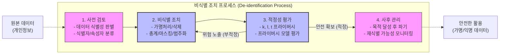

# 비식별화 (De-identification)

---

## I. 안전한 데이터 활용, 비식별화의 개요

* **정의**: 데이터셋에서 특정 개인을 식별할 수 없도록 개인정보의 일부 또는 전부를 삭제하거나 변형하여 프라이버시를 보호하는 일련의 기술 및 조치 과정
* **등장배경**: [[데이터 3법]] 개정에 따른 '가명정보' 도입, AI 학습 및 빅데이터 분석을 위한 양질의 데이터 확보 필요성 증가, GDPR 등 글로벌 개인정보보호 규제 강화
* **특징**:
* 프라이버시 보호와 데이터 유용성(Utility) 간의 트레이드오프(Trade-off) 최적화 필수
* 단순 식별자 제거뿐만 아니라 준식별자(QI, Quasi-Identifier)에 의한 추론 공격 방어
* KISA 가이드라인 기반 단계별 조치 및 정량적 프라이버시 모델(k-l-t) 검증 적용

---

## II. 비식별화 처리 프로세스 및 핵심 기술 요소

### 가. 비식별화 처리 프로세스 (KISA 가이드라인 기준)

* 원본 데이터에서 직접 식별자와 준식별자를 분리한 후 비식별 조치 기법 적용
* 조치된 데이터는 프라이버시 모델(k, l, t)을 통해 정량적으로 안전성을 평가한 후 통과 시 활용

### 나. 비식별화 핵심 기술 요소

| 구분 | 요소기술(키워드) | 세부 설명 |
| --- | --- | --- |
| **조치 기법** | **가명처리 (Pseudonymization)** | - 직접 식별자를 다른 값으로 대체하여 식별력 하향 (휴리스틱, [[암호화]], 교환 방법 등) |
| **조치 기법** | **총계처리 (Aggregation)** | - 개별 데이터 값을 총합, 평균 값 등으로 변환하여 특정 개인 식별 방지 (부분합, 라운딩) |
| **조치 기법** | **데이터 삭제 (Deletion)** | - 식별성이 높은 단일 데이터 값이나 레코드 자체를 삭제 (식별자 삭제, 특정 레코드 삭제) |
| **조치 기법** | **데이터 범주화 (Suppression)** | - 특정 데이터 값을 범주(구간)화 하여 정확한 값을 은닉 (상/하단 코딩, 범위 방법) |
| **조치 기법** | **데이터 마스킹 (Masking)** | - 데이터의 일부 또는 전체를 '*', 공백 등 대체 문자로 가림 처리 (주민번호 뒷자리 마스킹 등) |
| **평가 모델** | **k-익명성 (k-Anonymity)** | - 주어진 데이터셋에서 동일한 준식별자(QI) 집단을 가진 레코드가 최소 k개 이상 존재하도록 보장 |
| **평가 모델** | **l-다양성 (l-Diversity)** | - k-익명성 군집 내에서 민감 정보(Sensitive Attribute)가 최소 l개 이상의 다양한 값을 갖도록 보장 |
| **평가 모델** | **t-근접성 (t-Closeness)** | - 특정 군집 내 민감 정보의 분포와 전체 데이터셋의 민감 정보 분포 차이를 t 이하로 유지 |

---

## III. 데이터 활용 관점의 비식별화 수준 비교 및 향후 동향

### 가. 가명정보와 익명정보 비교

| 비교 항목 | 가명정보 (Pseudonymized Data) | 익명정보 (Anonymized Data) |
| --- | --- | --- |
| **정의** | 추가 정보의 사용/결합 없이는 특정 개인을 알아볼 수 없도록 조치한 정보 | 시간, 비용, 기술 등을 합리적으로 고려할 때 어떠한 방법으로도 특정 개인을 알아볼 수 없는 정보 |
| **재식별 가능성** | 추가 정보(매핑 테이블 등) 접근 시 재식별 **가능** | 어떠한 경우라도 재식별 **불가능** (완전한 비식별) |
| **법적 지위** | [[개인정보보호법]] 상 **개인정보의 일종으로 취급됨** | 개인정보보호법의 **적용을 받지 않음** (비규제 대상) |
| **활용 범위** | 동의 없이 통계작성, 과학적 연구, 공익적 기록 보존 목적 활용 | 상업적 목적, 외부 공개 등 제약 없이 자유로운 활용 |

### 나. 비식별화 기술의 한계점 극복 및 향후 발전 동향

* **차원 저주의 한계 극복**: 고차원 데이터(이미지, 음성 등)에서는 기존 k-익명성 등의 모델이 무력화되는 현상 발생 방지를 위해 최신 프라이버시 모델 연구 활발
* **프라이버시 강화 기술(PET, Privacy Enhancing Technologies)로의 진화**:
* **재현데이터 (Synthetic Data)**: 원본 데이터의 통계적 특성만 유지한 채 [[딥러닝]]([[GAN (Generative Adversarial Network)|GAN]] 등)으로 생성한 가상 데이터 활용 증가
* **[[차분 프라이버시]] (Differential Privacy)**: [[데이터베이스]] 통계 응답에 수학적 잡음(Noise)을 추가하여 원본 데이터 추론 원천 차단
* **[[연합 학습]] 및 동형 암호**: 데이터의 이동 없이 로컬에서 분산 학습하거나(Federated Learning), 암호화된 상태 그대로 연산([[동형 암호|Homomorphic Encryption]])하여 원시 데이터 노출 위험 제거

---

### 🔗 연관 토픽

- **소속 도메인**: [[00_보안_MOC|🛡️ 보안]]
- **세부 분류**: `6. 개인정보보호 & 프라이버시 강화 기술`
- **핵심 연관 토픽**:
  - [[차분 프라이버시]]
  - [[데이터 3법|데이터 3법 (Data 3 Acts)]]
  - [[개인정보보호법]]
  - [[ISO IEC 20889|ISO/IEC 20889]]
  - [[동형 암호|동형 암호 (Homomorphic Encryption)]]
