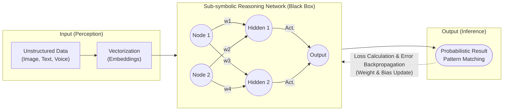

# 비심볼릭 추론 (Sub-symbolic Reasoning)

---

## I. 대규모 데이터와 통계적 확률 기반, 비심볼릭 추론의 개요

* **정의**: 지식이나 규칙을 인간이 읽을 수 있는 명시적인 기호(Symbol)로 정의하지 않고, 인공신경망 내 다차원 연속 벡터와 가중치(Weight)의 분산된 파라미터 형태로 암묵적 지식을 인코딩하여 문제를 해결하는 [[인공지능]] 추론 방식
* **특징**:
* **데이터 중심 학습 (Data-driven)**: 사람이 규칙을 하드코딩하지 않고, 대량의 데이터로부터 기계가 스스로 통계적 패턴과 특징(Feature)을 추출
* **연결주의 (Connectionism)**: 단일 논리나 규칙이 아닌, 노드(뉴런) 간 연결 강도(가중치)의 집합적 행위(Collective behavior)를 통해 추론 결과 도출
* **강건성 및 [[일반화]]**: 비정형 데이터(이미지, 음성 등)의 노이즈 처리에 탁월하며, 복잡한 패턴을 일반화하여 추론하는 역량이 뛰어남

---

## II. 비심볼릭 추론의 개념도 및 핵심 기술 요소

### 가. 비심볼릭 추론의 개념도 및 동작 원리

* 연속적인 다차원 벡터 데이터를 입력받아 노드 간 연결(가중치)을 거치며 특징을 추출하고, 활성화 함수를 통해 비선형적이고 확률적인 추론 결과를 도출함
* 출력된 추론값과 정답 간의 오차(Loss)를 [[역전파]](Backpropagation)하여 가중치를 미세조정하는 방식으로 지식을 누적함

### 나. 비심볼릭 추론의 핵심 기술 및 구성 요소

| 분류 | 핵심 기술 (키워드) | 세부 설명 |
| --- | --- | --- |
| **지식 표현** | 분산 표현 (Distributed Representation) | 단일 사실이 아닌 다차원 벡터(Vector) 공간에 특징을 분산 매핑하여 지식을 암묵적으로 표현함 |
| **추론 구조** | 인공신경망 (ANN, Deep Learning) | 뇌의 시냅스 구조를 모방한 연결주의 기반 다층 네트워크 ([[CNN]], [[RNN (Recurrent Neural Network)|RNN]], Transformer 등) |
| **지식 저장** | 가중치 및 [[편향]] (Weight & Bias) | 노드 간 연결 강도를 조절하여 학습된 패턴과 통계적 확률 지식을 모델 내부에 저장하는 파라미터 |
| **비선형성** | 활성화 함수 (Activation Function) | 선형 결합된 입력 신호에 비선형성을 부여하여 복잡한 패턴을 추론 (ReLU, Sigmoid, Softmax) |
| **오차 평가** | 손실 함수 (Loss Function) | 모델의 확률적 예측값과 실제 정답 사이의 오차 거리를 수치화하여 최적화 방향 제시 (Cross-Entropy 등) |
| **최적화** | 역전파 및 [[경사하강법]] (Backpropagation) | 출력층의 오차를 역방향으로 전파하여 수백만 개의 가중치를 통계적으로 갱신하고 학습시킴 |
| **결과 도출** | 확률적 추론 (Probabilistic Inference) | 참/거짓의 명확한 논리가 아닌, 정답일 확률이 가장 높은 통계적 추정값을 결과로 반환함 |
| **설명력** | 블랙박스 (Black-box Model) | 노드에 분산된 파라미터로 추론하므로 결과 도출에 대한 명시적이고 논리적인 인과관계 설명이 어려움 |

---

## III. 비심볼릭 추론과 심볼릭 추론의 비교 및 향후 전망

### 가. 비심볼릭 추론과 심볼릭 추론 비교

| 비교 항목 | 비심볼릭(Sub-symbolic) 추론 | 심볼릭(Symbolic) 추론 |
| --- | --- | --- |
| **접근 패러다임** | 연결주의 (Connectionism), 데이터 중심 | 기호주의 (Symbolism), 규칙/논리 중심 |
| **지식 표현 방식** | 다차원 연속 벡터, 인공신경망의 가중치 | IF-THEN 논리 규칙, 온톨로지(Ontology), 트리 |
| **학습 및 추론 메커니즘** | 대량 데이터 학습, 통계적 최적화 (귀납적) | 전문가 지식 하드코딩, 연역적 논리 추론 |
| **장점** | 비정형 데이터/노이즈에 강건함, 확장성 탁월 | 명확한 추론 근거 제시 가능 (설명 가능성, 투명성) |
| **단점 및 한계** | 설명력 부족(블랙박스), 막대한 컴퓨팅/데이터 요구 | 예외 상황 대처 취약, 지식 확장의 병목(Rule Explosion) |
| **대표 기술 및 모델** | [[딥러닝]], [[초거대 언어 모델|LLM]] (GPT 등 생성형 AI), Word2Vec | 전문가 시스템(Expert System), 지식 그래프, 퍼지 논리 |

### 나. 비심볼릭 추론의 한계 극복 및 발전 동향

* **뉴로-심볼릭 AI (Neuro-Symbolic AI)로의 진화**: 비심볼릭 추론의 뛰어난 패턴 지각(Perception) 능력과 심볼릭 추론의 논리적 인지(Cognition) 및 해석력을 결합하여, 두 방식의 한계를 상호 보완하는 하이브리드 아키텍처 연구 가속화
* **설명 가능한 AI ([[XAI]]) 및 프롬프팅 발전**: 거대 언어 모델(LLM)과 같은 비심볼릭 모델의 블랙박스 문제를 완화하기 위해 사후 설명 기법이나 생각의 사슬(Chain of Thought)을 도입하여 심볼릭 추론의 단계적 특성을 모사함으로서 환각(Hallucination) 현상 방지 및 [[신뢰성]] 확보 시도

---

### 🔗 연관 토픽

- **소속 도메인**: [[00_인공지능_MOC|🤖 인공지능]]
- **세부 분류**: `1. 수학 · 통계학 & 데이터 전처리`
- **핵심 연관 토픽**:
  - [[CNN|CNN (Convolutional Neural Network)]]
  - [[딥러닝]]
  - [[인공지능]]
  - [[편향]]
  - [[XAI]]
