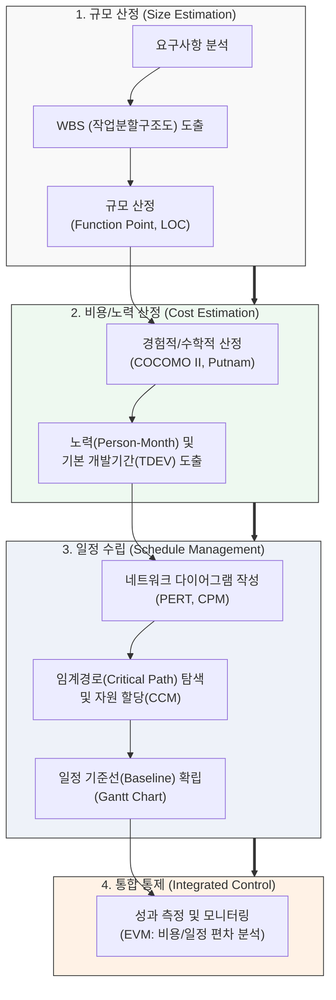

# 비용산정 및 일정관리 모델

---

## I. 프로젝트 성공의 핵심, SW 비용산정 및 일정관리 모델의 개요

* **정의**: 소프트웨어 프로젝트의 성공적인 완수를 위해 요구사항을 기반으로 소요되는 노력(비용)을 정량적으로 예측하고, 이를 바탕으로 최적의 작업 순서와 개발 기간을 수립·통제하는 일련의 관리 기법
* **필요성**:
* 불확실성의 원뿔(Cone of Uncertainty) 최소화 및 예산 초과/납기 지연 방지
* 한정된 프로젝트 자원(인력, 시간)의 최적 할당 및 위험 병목 구간 사전 식별

* **특징**: 규모 산정(Size) $\rightarrow$ 노력/비용 산정(Cost) $\rightarrow$ 일정 수립(Schedule) $\rightarrow$ 통합 통제([[EVM(Earned Value Management, 획득 가치 관리)|EVM]])의 유기적 프로세스로 구성됨

---

## II. 비용산정 및 일정관리 모델의 연계 개념도 및 핵심 요소

### 가. 비용산정 및 일정관리 연계 개념도

* [[WBS]]를 통해 도출된 기능 규모(FP)를 수학적 비용 모델(COCOMO)에 대입하여 총 소요 노력(MM)을 산출한 뒤, 이를 바탕으로 PERT/[[CPM]] 네트워크를 구성하여 최종 프로젝트 일정을 확립함.

### 나. 비용산정 및 일정관리 핵심 모델 및 요소 기술

| 분류 | 요소기술(키워드) | 세부 설명 |
| --- | --- | --- |
| **규모 산정** | **FP ([[Function Point]])** | - 소프트웨어가 제공하는 기능을 데이터/트랜잭션으로 분류하여 논리적 규모를 측정하는 기법 |
| **비용 산정** | **COCOMO II** | - SW 규모(LOC, FP)와 프로젝트 특성(복잡도 등)을 매개변수로 하여 소요 노력(MM)을 산출하는 수학적 모델 |
| **비용 산정** | **Putnam 모델** | - Rayleigh-Norden 곡선을 기반으로 프로젝트 생명주기 전반에 걸친 노력의 분포를 추정하는 동적 모델 |
| **일정 수립** | **PERT (프로그램 평가 리뷰)** | - 작업 소요 기간의 불확실성을 고려하여 3점 추정(비관, 낙관, 기대)을 통해 일정을 산정하는 확률적 네트워크 기법 |
| **일정 수립** | **CPM (임계경로법)** | - 작업의 선후 관계를 바탕으로 여유시간(Float)이 0인 최장 경로(Critical Path)를 찾아 일정 단축의 기준점을 제공하는 결정론적 기법 |
| **일정 수립** | **[[CCM]] (임계사슬법)** | - 자원 제약(Resource Constraint)을 고려하여 일정을 수립하고, 프로젝트/피딩 버퍼(Buffer)를 두어 납기를 관리하는 골드랫(Goldratt) 모델 |
| **일정 시각화** | **Gantt Chart (간트 차트)** | - 프로젝트 작업 일정과 선후 관계를 시간 축을 기준으로 막대그래프 형태로 시각화하여 가독성 제공 |
| **통합 통제** | **EVM (획득가치관리)** | - 계획가치(PV), 획득가치(EV), 실제원가(AC)를 통해 비용편차(CV)와 일정편차(SV)를 통합적으로 분석하는 성과 측정 모델 |

---

## III. 전통적 방식과 애자일(Agile) 방식의 비교 및 최신 동향

### 가. 전통적(Waterfall) 모델과 애자일(Agile) 산정/일정관리 비교

| 구분 | 전통적 방법론 (계획 주도형) | 애자일 방법론 (가치 주도형) |
| --- | --- | --- |
| **핵심 철학** | 사전 완벽한 분석 및 확정된 일정/비용 준수 | 불확실성 수용, 반복적 인도를 통한 비즈니스 가치 창출 |
| **규모/노력 산정** | FP (기능 점수), COCOMO II 모델 활용 | Story Point (스토리 포인트), Planning Poker (플래닝 포커) |
| **일정 수립 도구** | WBS, PERT, CPM, Gantt Chart | Product/Sprint Backlog, Time-boxing (Sprint) |
| **진척 통제 기법** | EVM (Earned Value Management) 기반 분산 분석 | Burn-down Chart, Burn-up Chart, Kanban Board |

### 나. 비용/일정관리 분야 최신 트렌드 및 향후 전망

* **AI/ML 기반 데이터 주도적 예측**: 과거 프로젝트의 방대한 형상관리 이력 및 Jira 등 이슈 트래킹 데이터를 기계학습(Machine Learning)하여, 초기의 불확실성(Cone of Uncertainty)을 대폭 줄이는 AI 기반 자동 비용/일정 추정 모델 도입 가속화
* **하이브리드(Hybrid) 프로젝트 관리 체계**: 대형 공공/금융 프로젝트에서 상위 레벨의 일정/예산은 전통적 모델(WBS, EVM)로 관리하고, 하위 실행 단계는 애자일(Sprint, Kanban)로 진행하는 하이브리드(Bi-modal) [[프레임워크]] 적용 확산

---

### 🔗 연관 토픽

- **소속 도메인**: [[00_프로젝트관리_MOC|📋 프로젝트관리]]
- **세부 분류**: `2. 프로젝트 범위 & 일정 관리 (Scope & Schedule)`
- **핵심 연관 토픽**:
  - [[WBS|WBS (Work Breakdown Structure)]]
  - [[CPM|CPM (Critical Path Management)]]
  - [[EVM(Earned Value Management, 획득 가치 관리)]]
  - [[CCM|CCM (Critical Chain Management)]]
  - [[프로젝트 일정관리|프로젝트 일정관리(Project Schedule Management)에 대하여 설명하시오]]
