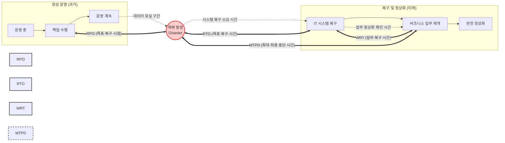

# 비즈니스 연속성 계획 (BCP)

---

## I. 중단 없는 서비스 제공, 비즈니스 연속성 계획(BCP)의 개요

* **정의**: 자연재해, 사이버 공격 등 예기치 않은 중단 사태 발생 시, 조직의 핵심 비즈니스 기능을 허용 가능한 수준으로 유지하고 신속하게 복구하기 위한 전사적 대응 전략 및 계획
* **등장배경 및 특징**:
* **배경**: IT 시스템 의존도 심화, [[랜섬웨어]] 및 대규모 클라우드 장애 발생에 따른 전사적 생존 전략 필요성 대두 (단순 IT 복구인 [[DRP(RTO, RPO 등)|DRP]]의 한계 극복)
* **특징**: 비즈니스 영향 분석([[BIA (Business Impact Analysis)|BIA]]) 기반 우선순위 산정, [[ISO 22301]](BCMS) 국제 표준 기반, 예방-대비-대응-복구의 라이프사이클 관리

---

## II. BCP의 핵심 프로세스 및 주요 복구 목표 지표

### 가. BCP 재해 발생 시 복구 목표 시간(Timeline) 개념도

* 재해 발생(Incident) 시점을 기준으로 과거의 데이터 손실 허용량(RPO)과 미래의 시스템 복구(RTO) 및 업무 재개(WRT) 시간을 산정하여 MTPD 내에 서비스를 정상화하는 구조

### 나. BCP 체계 구축 핵심 구성요소 및 기술 지표

| 구분 | 요소기술(키워드) | 세부 설명 |
| --- | --- | --- |
| **위험 분석** | **BIA (비즈니스 영향 분석)** | - 재해 발생 시 비즈니스에 미치는 재무적/운영적 영향을 정량/정성적으로 분석하여 핵심 업무 식별 |
| **위험 분석** | **RA (위험 평가)** | - 조직에 발생 가능한 위협(Threat)과 취약성(Vulnerability)을 식별하고 발생 가능성과 영향도 평가 |
| **복구 지표** | **RPO (Recovery Point Objective)** | - 업무 중단 시 허용 가능한 최대 데이터 손실 시점 (과거 기준, 백업 주기 결정 기준) |
| **복구 지표** | **RTO (Recovery Time Objective)** | - 업무 중단 시점부터 IT 시스템(서버, 네트워크 등)이 복구되어 가동될 때까지의 목표 시간 |
| **복구 지표** | **WRT (Work Recovery Time)** | - IT 시스템 복구 후, 데이터 검증 및 잔여 작업 처리를 통해 실제 비즈니스 업무가 재개되는 시간 |
| **복구 지표** | **MTPD (최대 허용 중단 시간)** | - 조직의 생존에 치명적인 영향을 미치지 않고 감내할 수 있는 최대 시간 (`MTPD ≥ RTO + WRT`) |
| **복구 체계** | **DRP (재난 복구 계획)** | - [[BCP]]의 하위 개념으로, 정보통신(IT) 시스템 및 데이터 인프라 복구에 초점을 맞춘 세부 기술 계획 |
| **표준 인증** | **ISO 22301 (BCMS)** | - 비즈니스 연속성 관리 체계 수립, 구현, [[유지보수]] 및 지속적 개선을 위한 국제 표준 인증 |

---

## III. BCP와 DRP 비교 및 최근 발전 동향

### 가. BCP(비즈니스 연속성 계획)와 DRP(재난 복구 계획) 비교

| 비교 항목 | BCP (Business Continuity Plan) | DRP (Disaster Recovery Plan) |
| --- | --- | --- |
| **목적 및 관점** | 전사적 비즈니스 및 비즈니스 [[프로세스]] 연속성 확보 | IT 인프라, 시스템, 데이터의 신속한 기술적 복구 |
| **관리 범위** | 조직 인력, 프로세스, 대체 사업장, 협력사 등 전사 범위 | 서버, 네트워크, DB, 스토리지 등 IT 자산 국한 |
| **주요 활동** | BIA/RA 수행, 대체 업무 프로세스 가동, 위기 커뮤니케이션 | 데이터 백업/소산, [[DRS (Disaster Recovery System)|DRS]](DR센터) 페일오버(Fail-over) |
| **주도 부서** | 경영진(C-Level), 현업 부서(Business Unit), 총괄 부서 | [[CIO]], CISO, IT 부서 및 인프라 운영팀 |

### 나. 최근 BCP 패러다임 변화 및 적용 동향

* **[[사이버 레질리언스|사이버 레질리언스(Cyber Resilience)]] 통합**: 단순 물리적 재해(화재, 지진 등) 대비를 넘어, 랜섬웨어 및 APT 공격에 대응하기 위한 **사이버 볼트(Cyber Vault)** 및 논리적 망분리(Air-Gap) 백업 아키텍처 결합
* **[[DRaaS]] (Disaster Recovery as a Service) 확산**: 클라우드 인프라의 탄력성을 활용하여 초기 투자 비용(CAPEX)을 최소화하고, Pay-as-you-go 모델로 중소기업까지 BCP/DRP 체계를 용이하게 구축하는 클라우드 기반 복구 센터 전환 가속화

---

### 🔗 연관 토픽

- **소속 도메인**: [[00_경영전략_MOC|📈 경영전략]]
- **세부 분류**: `1. 경영 환경 분석 & 전략 수립 프레임워크`
- **핵심 연관 토픽**:
  - [[BCP|BCP (Business Continuity Planning)]]
  - [[DRP(RTO, RPO 등)]]
  - [[CIO]]
  - [[BIA (Business Impact Analysis)]]
  - [[DRaaS]]
