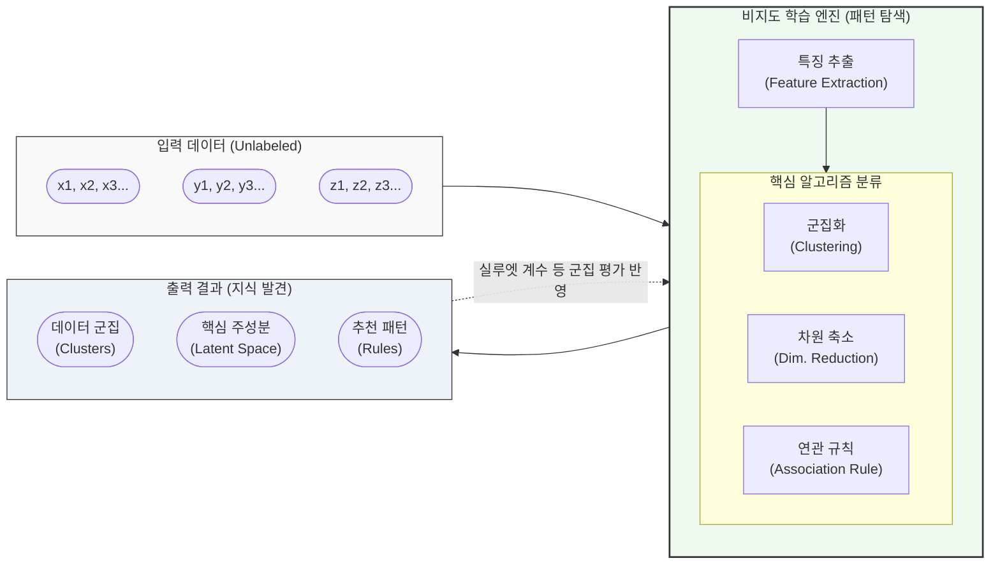

# 비지도 학습 (Unsupervised Learning)

---

## I. 데이터의 숨겨진 패턴 탐색, 비지도 학습의 개요

* **정의**: 정답(Label)이 없는 원시 데이터(Raw Data)를 입력받아 [[알고리즘]] 스스로 데이터 간의 유사성, 통계적 특성, 숨겨진 구조와 패턴을 찾아내는 기계학습 기법
* **등장배경**: 수작업 레이블링(Labeling)에 따른 막대한 시간과 비용 문제 해결, 폭발적으로 증가하는 비정형 데이터의 효율적 분석 및 군집화 필요성 대두
* **특징**:
* **데이터 탐색 및 전처리**: 탐색적 데이터 분석([[EDA]]) 및 [[지도학습]] 전 피처 추출(Feature Extraction) 용도로 활용
* **목적 함수의 차이**: 명시적 정답과의 오차 최소화가 아닌, 군집 내 [[응집도]](Cohesion) 최대화 및 분리도(Separation) 최대화 등을 목표로 함

---

## II. 비지도 학습의 개념도 및 핵심 기술 요소

### 가. 비지도 학습의 개념도 및 동작 프로세스

* 레이블이 없는 데이터를 입력받아 특징을 추출하고, 군집화/차원축소/연관규칙 알고리즘을 통해 의미 있는 그룹 분리, 주요 차원 압축, 항목 간 패턴을 도출함

### 나. 비지도 학습의 핵심 알고리즘 및 기술 요소

| 분류 | 요소기술(알고리즘) | 세부 설명 |
| --- | --- | --- |
| **군집화 (Clustering)** | **K-Means** | - 사전에 k개의 중심(Centroid)을 설정하고, 거리 기반으로 데이터를 할당하여 군집을 형성하는 기법 |
| **군집화 (Clustering)** | **[[DBSCAN(밀도 기반 클러스터링)|DBSCAN]]** | - 밀도(Density) 기반 군집화로, 데이터가 밀집된 공간을 묶어내며 노이즈 처리 및 비선형 군집에 강함 |
| **[[차원 축소]] (Dim. Reduction)** | **[[PCA(Principal Component Analysis)|PCA]] (주성분 분석)** | - 데이터의 분산(Variance)을 최대로 보존하는 직교 축을 찾아 고차원 데이터를 저차원으로 선형 변환 |
| **차원 축소 (Dim. Reduction)** | **t-SNE** | - 데이터 간의 유사도를 확률 분포로 변환하여 고차원 데이터를 2~3차원으로 시각화하는 비선형 차원 축소 |
| **연관 규칙 (Association)** | **Apriori** | - '[[지지도]], 신뢰도, 향상도'를 기반으로 [[트랜잭션]] 내 자주 발생하는 항목 집합(Frequent Itemset)을 탐색 |
| **연관 규칙 (Association)** | **FP-Growth** | - 후보 집합을 생성하지 않고 FP-Tree 구조를 활용하여 Apriori의 속도 및 메모리 병목 문제를 개선 |
| **생성 모델 (Generative)** | **[[GAN (Generative Adversarial Network)|GAN]] / [[VAE]]** | - 훈련 데이터의 확률 분포를 비지도 방식으로 학습하여 기존에 없던 새로운 가상의 데이터를 생성하는 기법 |
| **평가 지표 (Evaluation)** | **실루엣 계수 (Silhouette)** | - 군집 내 데이터 응집도와 타 군집과의 분리도를 계산하여 -1 ~ 1 사이의 값으로 군집화 품질을 평가 |

---

## III. 비지도 학습과 지도 학습 비교 및 향후 전망

### 가. 지도 학습(Supervised) vs 비지도 학습(Unsupervised) 비교

| 비교 항목 | 지도 학습 (Supervised Learning) | 비지도 학습 (Unsupervised Learning) |
| --- | --- | --- |
| **학습 데이터** | 입력 데이터(X) + **정답 레이블(Y) 존재** | 입력 데이터(X)만 존재 (**정답 레이블 없음**) |
| **학습 목적** | 과거 데이터를 기반으로 미래 값/[[클래스]] **예측** | 데이터 내의 고유한 구조 및 패턴 **탐색 및 발견** |
| **주요 태스크** | 분류(Classification), 회귀(Regression) | 군집화(Clustering), 차원축소, 이상탐지, 연관분석 |
| **대표 알고리즘** | [[서포트 벡터 머신|SVM]], Random Forest, [[CNN]], [[RNN (Recurrent Neural Network)|RNN]] | K-Means, PCA, Apriori, Autoencoder |
| **평가 방법** | 정확도(Accuracy), F1-Score, RMSE 등 명확함 | 실루엣 계수, 군집 내 제곱합(WCSS) 등 휴리스틱함 |
| **비용 및 한계** | 고비용의 데이터 레이블링 필요, 과적합 위험 | 결과 해석의 주관성 개입, 명확한 성능 측정의 어려움 |

### 나. 비지도 학습의 최신 트렌드 및 향후 동향

* **자기지도 학습(Self-Supervised Learning)으로의 진화**: 비지도 학습의 일종으로, 데이터 자체의 일부를 마스킹(Masking)하고 이를 예측하는 과정(Pretext Task)을 통해 레이블 없이도 강력한 표현(Representation)을 학습하는 기법으로 발전
* **초거대 AI 및 생성형 AI의 기반 (Foundation Model)**: GPT 계열의 [[초거대 언어 모델|LLM]](거대 언어 모델)과 비전(Vision) 파운데이션 모델들은 방대한 웹 데이터를 비지도/자기지도 학습 방식으로 사전 학습(Pre-training)하여 범용적 인지 능력을 확보하는 추세임
* **이상 탐지([[Anomaly(이상현상)|Anomaly]] Detection) 고도화**: 정상 데이터의 분포만을 학습하여(예: Isolation Forest, Autoencoder 재구성 오차) 제조 공정의 결함, 금융 사기(FDS), 네트워크 침입 등을 탐지하는 산업적 응용 가속화

---

### 🔗 연관 토픽

- **소속 도메인**: [[00_인공지능_MOC|🤖 인공지능]]
- **세부 분류**: `1. 수학 · 통계학 & 데이터 전처리`
- **핵심 연관 토픽**:
  - [[PCA(Principal Component Analysis)]]
  - [[차원 축소|차원 축소(Dimensionality Reduction)]]
  - [[DBSCAN(밀도 기반 클러스터링)]]
  - [[GAN (Generative Adversarial Network)]]
  - [[서포트 벡터 머신|서포트 벡터 머신 SVM(Support Vector Machine)]]
