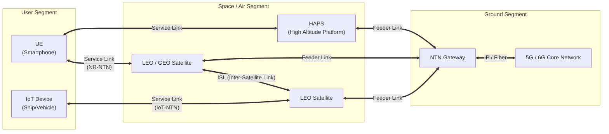

# 비지상네트워크 (NTN, Non-Terrestrial Networks)

---

## I. 6G 초공간 통신을 위한 핵심 인프라, NTN의 개요

* **정의**: 지상 기지국 대신 저궤도(LEO)·정지궤도(GEO) 위성 및 성층권 통신 플랫폼(HAPS)을 활용하여 지상, 해상, 공중 전역에 3차원 초공간 통신 커버리지를 제공하는 이동통신 네트워크 기술
* **배경/특징**:
* 지상망(TN) 커버리지 한계 극복 및 해상/항공/오지 등 통신 음영지역 완전 해소
* 3GPP Release 17/18을 통해 5G 기반 위성 통신(NR-NTN, IoT-NTN) 표준화 완료 및 6G 핵심 기술로 진화
* 재난·재해 발생 시 지상 인프라 파괴에 대비한 통신 생존성 및 회복탄력성(Resilience) 보장

---

## II. NTN의 개념도 및 핵심 기술 요소

### 가. NTN의 개념도 및 동작 원리

* 단말(UE)이 **Service Link**를 통해 위성/HAPS에 접속하고, 위성은 **Feeder Link**를 거쳐 지상 [[게이트웨이]](GW) 및 코어망(CN)으로 데이터를 라우팅하는 3D 융합 통신망 구조

### 나. NTN의 핵심 기술 요소

| 구분 | 핵심 기술 | 세부 설명 |
| --- | --- | --- |
| **접속 규격** | NR-NTN | 5G NR(New Radio) 기반 광대역 위성 통신 기술 (스마트폰 직결용) |
| **접속 규격** | IoT-NTN | NB-IoT, eMTC 기반 저전력/소용량/광역 사물인터넷 위성 통신 |
| **지연 관리** | Timing Advance (TA) | 위성과의 먼 거리로 인한 긴 전파 지연(Propagation Delay) 사전 보상 및 동기화 |
| **이동성 제어** | 도플러 천이 보상 | 저궤도 위성의 고속 이동에 따른 주파수 변화(Doppler Shift)를 단말/기지국에서 사전/사후 보상 |
| **전송 [[신뢰성]]** | HARQ 최적화 | 긴 왕복지연시간(RTT)을 고려하여 HARQ [[프로세스]] 비활성화 또는 타이머/윈도우 크기 확장 |
| **망 인프라** | HAPS | 성층권(고도 약 20km)에 위치하여 준정지 상태로 저지연 통신을 제공하는 비행 플랫폼 |
| **망 인프라** | LEO ([[저궤도 위성]]) | 고도 300~1,500km에 위치, 짧은 지연시간(Low Latency)으로 초고속 서비스 제공 (예: 스타링크) |
| **위성 연동** | ISL (Inter-Satellite Link) | 지상 게이트웨이를 거치지 않고 위성 간 직접 데이터를 라우팅하여 글로벌 백홀망 구성 |

---

## III. NTN과 TN(지상 네트워크) 비교 및 향후 전망

### 가. NTN vs TN (Terrestrial Network) 비교

| 비교 항목 | NTN (비지상 네트워크) | TN (지상 네트워크) |
| --- | --- | --- |
| **핵심 인프라** | 저궤도/중궤도/정지궤도 위성, HAPS | 셀룰러 기지국(gNB/eNB), 광케이블 |
| **커버리지 영역** | 글로벌, 초공간 (해상, 사막, 공중 포함 완전 커버) | 도심, 인구 밀집 지역 중심 (2D 위주) |
| **전파 지연 (RTT)** | 높음 (LEO: 수십 ms ~ GEO: 수백 ms) | 매우 낮음 (수 ms 이내, URLLC 지원) |
| **도플러 효과** | 매우 큼 (LEO 위성의 시속 2~3만 km 이동) | 상대적으로 작음 (보행자, 차량 이동 수준) |
| **주파수 대역** | L, S, C, Ku, Ka 밴드 | Sub-6GHz, mmWave (28GHz 등) |
| **표준화 기반** | 3GPP Release 17/18 이후 (6G 핵심) | 3GPP Release 15/16 (5G 핵심) |

### 나. 향후 전망 및 동향

* **3D 초공간 네트워크 진화**: 6G 시대에는 지상망(TN)과 비지상망(NTN)이 물리적/논리적으로 완전 융합(Integration)되어 하나의 코어망에서 끊김 없는 핸드오버 제공
* **D2D(Device to Device) 위성 통신 가속**: 별도의 위성 안테나 없이 일반 스마트폰에서 저궤도 위성과 직접 통신(Direct-to-Cell)하는 상용 서비스(Starlink-T-Mobile 연동 등) 확대 추세
* **해결 과제**: 단말의 배터리 소모 최소화 기술, 위성 간 핸드오버 최적화, 주파수 혼간섭 방지 및 글로벌 주파수 대역 할당(WRC) 협의 지속 필요

---

### 🔗 연관 토픽

- **소속 도메인**: [[00_네트워크_MOC|🌐 네트워크]]
- **세부 분류**: `4. 무선 및 차세대 이동통신 (5G/6G/Wi-Fi)`
- **핵심 연관 토픽**:
  - [[저궤도 위성|저궤도 위성 (LEO, Low Earth Orbit)]]
  - [[6G]]
  - [[게이트웨이]]
  - [[프로세스]]
  - [[신뢰성]]
