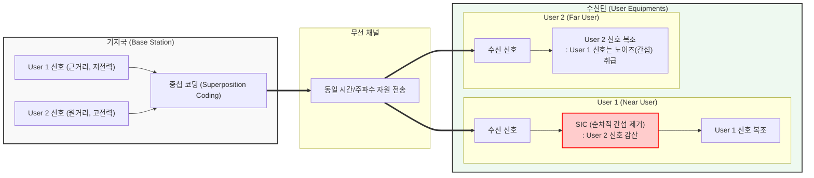

# 비직교 다중접속 (NOMA)

---

## I. 주파수 효율 극대화, 비직교 다중접속(NOMA)의 개요

* **정의**: 동일한 시간, 주파수, 공간 자원 상에서 서로 다른 송신 전력(Power) 또는 비직교 코드(Code)를 할당하여, 다수의 사용자가 동시에 접속할 수 있도록 지원하는 다중 접속 기술
* **등장배경 및 특징**:
* **대규모 연결성(mMTC)**: 5G/6G 시대의 폭발적인 IoT 기기 연결 요구 증대
* **스펙트럼 한계 극복**: 기존 직교 다중 접속(OMA, OFDMA 등)의 한정된 자원 블록 할당 한계 극복 필요
* **특징**: 중첩 코딩(SC) 및 순차적 간섭 제거(SIC) 활용, 사용자 공평성(Fairness) 향상, 높은 스펙트럼 효율(Spectral Efficiency) 제공

---

## II. NOMA의 개념도 및 핵심 기술 요소

### 가. NOMA의 동작 개념도 (전력 기반 NOMA)

* 기지국은 채널 상태가 나쁜 원거리 단말에 고전력을 할당하여 신호를 중첩(SC) 전송함
* 근거리 단말은 강한 신호(원거리 단말 신호)를 먼저 해독하여 제거(SIC)한 후 자신의 신호를 복조함

### 나. NOMA의 핵심 기술 요소

| 분류 | 요소기술(키워드) | 세부 설명 |
| --- | --- | --- |
| **송신 기술** | **중첩 코딩 (SC, Superposition Coding)** | - 여러 사용자의 신호를 상이한 전력 레벨로 묶어 동일한 무선 자원 블록에 다중화하여 전송하는 기법 |
| **수신 기술** | **순차적 간섭 제거 (SIC)** | - 수신 신호 중 전력이 가장 센 간섭 신호부터 순차적으로 복조 및 감산하여 원하는 신호를 추출하는 기법 |
| **자원 관리** | **전력 할당 (Power Allocation)** | - 채널 이득이 낮은 사용자(Far)에게 더 높은 전력을, 높은 사용자(Near)에게 낮은 전력을 할당하는 [[알고리즘]] |
| **자원 관리** | **사용자 페어링 (User Pairing)** | - SIC 성능 극대화를 위해 채널 상태 차이(Channel Gain Difference)가 큰 사용자들을 하나의 그룹으로 묶는 기술 |
| **도메인 분류** | **Power-Domain NOMA** | - 송신 전력의 차이(Power Domain)를 이용하여 다중 접속을 구현하는 방식 (다운링크에 주로 적용) |
| **도메인 분류** | **Code-Domain NOMA** | - 성긴 코드 다중 접속(SCMA) 등 비직교 패턴이나 코드를 사용하여 자원을 공유하는 방식 (업링크에 주로 적용) |
| **피드백 제어** | **CSI (채널 상태 정보) 확보** | - 기지국이 최적의 전력 할당과 페어링을 수행하기 위해 단말로부터 정확한 채널 환경 정보를 수집하는 기술 |
| **신호 검출** | **MPA (Message Passing Algorithm)** | - 코드 기반 NOMA 수신단에서 다중 사용자 간섭을 최소화하며 신호를 검출하기 위한 복잡도 감소 알고리즘 |

---

## III. NOMA와 OMA의 비교 및 향후 전망

### 가. 비직교 다중접속(NOMA)과 직교 다중접속(OMA) 비교

| 비교 항목 | NOMA (Non-Orthogonal Multiple Access) | OMA (Orthogonal Multiple Access) |
| --- | --- | --- |
| **자원 분할 방식** | **비직교 기반** (동일 시간/주파수 자원 공유) | **직교 기반** (시간/주파수/코드 분할 할당) |
| **사용자 간섭 (MUI)** | 발생함 (단말에서 의도적 수용 및 제거) | 발생하지 않음 (이론적 상호 간섭 제로) |
| **수신단 복잡도** | **높음** (단말에서 SIC 등 신호 처리 필수) | 낮음 (할당된 자원 블록만 디코딩) |
| **주파수 효율성** | 매우 높음 (제한된 자원에 다수 기기 수용) | 상대적으로 낮음 (자원 블록 수에 비례) |
| **대표 기술** | Power-domain NOMA, SCMA, PDMA | TDMA, FDMA, CDMA, **OFDMA (4G/5G)** |
| **주요 적용 목표** | 5G Advanced, **6G 초연결성(mMTC)** 지원 | 4G LTE, 5G NR 기본 접속 환경 지원 |

### 나. 향후 전망 및 동향

* **머신러닝(ML) 연계 최적화**: 다수 사용자의 동적인 환경에서 최적의 'User Pairing' 및 'Power Allocation'을 실시간으로 수행하기 위해 심층강화학습(DRL) 등 AI 기반 무선 자원 관리 기법 도입 활발
* **6G 통신의 핵심 다중접속 기술**: 6G의 초광대역·초공간·초연결 시나리오를 충족하기 위해 IRS(지능형 반사 표면), Massive [[MIMO]] 기술과 NOMA를 결합하여 스펙트럼 효율을 극대화하는 방향으로 연구 가속화

---

### 🔗 연관 토픽

- **소속 도메인**: [[00_네트워크_MOC|🌐 네트워크]]
- **세부 분류**: `4. 무선 및 차세대 이동통신 (5G/6G/Wi-Fi)`
- **핵심 연관 토픽**:
  - [[다중화|다중화(Multiplexing)]]
  - [[MIMO]]
  - [[5G|5G 주요 기술]]
  - [[알고리즘]]
  - [[RFID]]
