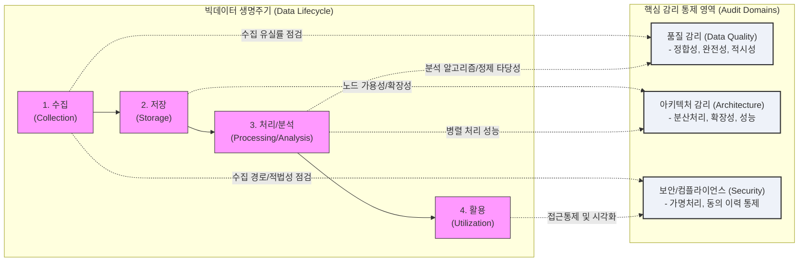

# 빅데이터 감리 (Big Data Audit)

---

## I. 데이터 신뢰성 확보 및 규제 준수, 빅데이터 감리의 개요

* **정의**: 빅데이터 플랫폼의 수집, 저장, 처리, 분석, 활용에 이르는 수명주기 전반에 걸쳐 데이터의 품질, 아키텍처 확장성, 분석 모델 타당성 및 법적 규제 준수 여부를 객관적으로 점검하고 평가하는 통제 활동
* **등장배경 및 특징**:
* **규제 강화**: [[데이터 3법]]([[개인정보보호법]] 등) 개정 및 [[마이데이터]] 확산에 따른 데이터 활용 적법성 및 [[비식별화]](가명/익명처리) 조치 검증 요구 증대
* **AI 기반 확보**: AI/ML 모델 성능의 핵심인 고품질 학습 데이터 확보(Garbage In, Garbage Out 방지)를 위한 원천 데이터 품질 [[무결성]](Veracity) 보장
* **분산 환경 검증**: [[하둡]](Hadoop), 데이터 레이크(Data Lake) 등 대규모 분산 아키텍처의 성능(Scale-out) 및 [[HA(High Availability)|가용성]] 검증 필요성 대두

---

## II. 빅데이터 감리의 개념도 및 핵심 점검 요소

### 가. 빅데이터 감리의 동작 프레임워크 개념도

* 빅데이터 생명주기(수집-저장-처리/분석-활용) 각 단계별로 품질, 아키텍처, 보안 측면의 감리 통제 항목을 매핑하여 교차 점검 수행

### 나. 빅데이터 감리의 단계별 핵심 기술 및 점검 요소

| 분류 | 요소기술(키워드) | 세부 설명 |
| --- | --- | --- |
| **데이터 수집** | **수집 적법성 (Compliance)** | - 개인정보 수집 동의 내역, 크롤링(Crawling) 시 저작권 및 웹 로봇 규약(robots.txt) 준수 여부 검증 |
| **데이터 수집** | **수집 정합성 (Ingestion)** | - 원천 데이터와 수집된 데이터 간의 누락 방지(Flume, Kafka 등 스트리밍/배치 수집 유실률 점검) |
| **데이터 저장** | **분산 아키텍처 (Scale-out)** | - [[HDFS]], [[NoSQL (CAP 이론 BASE 속성)|NoSQL]] 기반 분산 저장소의 노드 증설 시 선형적 성능 향상 및 복제본(Replication) 유지 점검 |
| **데이터 저장** | **데이터 레이크 통제** | - 메타데이터 관리 부재로 인한 데이터 스웜프(Data Swamp)화 방지 및 데이터 카탈로그 구축 여부 |
| **처리 및 분석** | **[[알고리즘]] 적합성 (Model)** | - R, Python, Spark 기반 [[데이터 마이닝]] 및 AI/ML 모델 선정의 타당성 및 교차 검증(Cross Validation) |
| **처리 및 분석** | **데이터 정제율 (Cleansing)** | - [[이상치]](Outlier), [[결측치]](Missing Value) 처리 로직의 적정성 및 변환 과정의 데이터 왜곡 여부 확인 |
| **품질/거버넌스** | **품질 지표 (Data Quality)** | - 데이터의 완전성, 유효성, 일관성, 정확성, 적시성 측면의 품질 진단 및 프로파일링 수행 |
| **보안/컴플라이언스** | **비식별화 조치 (De-ident.)** | - KISA 가이드라인 기반 가명/익명처리(k-익명성, l-다양성, t-근접성) 적정성 및 재식별 위험성 평가 |

---

## III. 전통적 정보시스템 감리와의 비교 및 향후 전망

### 가. 전통적 정보시스템 감리 vs 빅데이터 감리 비교

| 비교 항목 | 전통적 [[정보시스템 감리]] | 빅데이터 감리 |
| --- | --- | --- |
| **주요 목적** | 업무 요건 충족, 응용 시스템 기능/성능 보장 | 데이터 가치 창출, 분석 타당성 및 규제 준수 보장 |
| **감리 대상** | RDBMS 중심 정형 데이터, 애플리케이션 코드 | 정형/비정형 데이터, 데이터 레이크, 하둡 생태계 |
| **품질 초점** | 테이블 정규화, 참조 무결성(RI), ERD 정합성 | 빅데이터 5V 특성, [[데이터 클렌징]] 룰, 메타데이터 체계 |
| **보안 및 규제** | 접근통제, DB [[암호화]], 네트워크 보안 | 개인정보 가명/익명처리, 프라이버시 보호 모델(k-l-t) |
| **수명 주기** | 분석-설계-구현-테스트 ([[SDLC]]) 관점 | 수집-저장-처리-분석-활용 (데이터 흐름) 관점 |

### 나. 향후 전망 및 트렌드

* **AI 통제(AI Audit)와의 융합**: 빅데이터가 딥러닝과 생성형 AI의 기반이 됨에 따라, 단순 데이터 품질 점검을 넘어 AI 모델의 편향성(Bias), 공정성, 설명 가능성([[XAI]])을 포함하는 종합적인 [[AI 거버넌스]] 감리로 진화 중
* **데이터 패브릭 환경 감리**: 다중 클라우드(Multi-Cloud)에 분산된 데이터 자산을 논리적으로 연결하는 데이터 패브릭(Data Fabric) 환경에서 통합 메타데이터 및 분산 접근 제어를 점검하는 체계 고도화
* **자동화된 품질 진단(Auto DQM)**: 기계학습 기반으로 데이터 패턴을 스스로 학습하여 이상 데이터를 탐지하는 지능형/자동화 데이터 품질 감리 도구 도입 가속화

---

### 🔗 연관 토픽

- **소속 도메인**: [[00_소프트웨어공학_MOC|🏗️ 소프트웨어공학]]
- **세부 분류**: `3. 요구사항 공학 & UML 객체지향 분석/설계`
- **핵심 연관 토픽**:
  - [[비식별화]]
  - [[개인정보보호법]]
  - [[AI 거버넌스|AI 거버넌스 (AI Governance)]]
  - [[데이터 3법|데이터 3법 (Data 3 Acts)]]
  - [[HDFS]]
