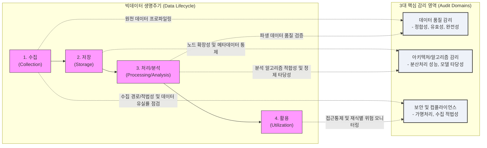

# 빅데이터 정보화 사업 감리

---

## I. 데이터 신뢰성 확보, 빅데이터 정보화 사업 감리의 개요

* **정의**: 빅데이터 생명주기(수집, 저장, 처리/분석, 활용) 전반에 걸쳐 분산 아키텍처, 데이터 품질, 분석 [[알고리즘]], 컴플라이언스를 객관적으로 점검하여 정보화 사업의 성공과 데이터 신뢰성을 확보하는 통제 활동
* **등장배경 및 필요성**:
* **컴플라이언스 강화**: [[데이터 3법]] 개정에 따른 개인정보 활용 적법성 및 [[비식별화]](가명/익명처리) 조치 검증 의무화
* **AI [[신뢰성]] 기반**: 학습 데이터의 'Garbage In, Garbage Out' 방지를 위한 원천 데이터 품질 및 정합성 보증
* **아키텍처 복잡성**: [[하둡]](Hadoop), 데이터 레이크 등 대규모 분산 환경의 [[HA(High Availability)|가용성]], 확장성, 병렬 처리 성능 검증 필요

---

## II. 빅데이터 감리의 개념도 및 핵심 점검 요소

### 가. 빅데이터 감리의 프레임워크 및 점검 개념도

* 빅데이터 생명주기 각 단계(수집-저장-처리/분석-활용)와 3대 핵심 감리 영역(품질, 아키텍처/모델, 보안)을 교차 매핑하여 [[데이터 거버넌스]] 및 플랫폼 [[무결성]] 검증

### 나. 단계별 핵심 감리 점검 요소 및 기술

| 분류 | 점검 항목(키워드) | 세부 설명 및 통제 포인트 |
| --- | --- | --- |
| **수집 단계** | **수집 적법성 (Compliance)** | - 개인정보 수집 동의 내역, 크롤링 시 저작권 및 웹 로봇 규약(robots.txt) 준수 여부 검증 |
| **수집 단계** | **수집 정합성 (Ingestion)** | - Flume, Kafka 등 배치/스트리밍 수집 환경의 데이터 누락(Loss) 및 연계 정합성 확인 |
| **저장 단계** | **분산 아키텍처 (Scale-out)** | - [[HDFS]], [[NoSQL (CAP 이론 BASE 속성)|NoSQL]] 기반 노드 증설 시 선형적 성능 향상, 복제본(Replication) 유지 및 가용성 점검 |
| **저장 단계** | **데이터 레이크 통제** | - 데이터 스웜프(Data Swamp)화 방지를 위한 데이터 카탈로그 및 메타데이터 관리 체계 검증 |
| **처리/분석** | **알고리즘 적합성 (Model)** | - 분석 목적에 맞는 AI/ML 모델 선정 타당성, 교차 검증(Cross Validation), 하이퍼파라미터 최적화 확인 |
| **처리/분석** | **데이터 정제/변환 (Cleansing)** | - [[결측치]](Missing Value), [[이상치]](Outlier) 처리 로직의 적정성 및 병렬 분산 처리(Spark 등) 성능 점검 |
| **데이터 품질** | **품질 진단 (Data Quality)** | - 데이터의 완전성, 유효성, 일관성, 정확성 측면의 프로파일링 수행 및 품질 지표(DQI) 달성 여부 점검 |
| **보안 통제** | **비식별화 조치 (De-ident.)** | - KISA 가이드라인 기반 가명/익명처리(k-익명성, l-다양성, t-근접성) 적정성 및 재식별 위험성 평가 |

---

## III. 전통적 정보시스템 감리 통제 비교 및 향후 동향

### 가. 전통적 정보시스템 감리 vs 빅데이터 감리 비교

| 비교 항목 | 전통적 [[정보시스템 감리]] | 빅데이터 정보화 사업 감리 |
| --- | --- | --- |
| **감리 목적** | 업무 요건 충족, 응용 시스템 기능/성능 보장 | 데이터 가치 창출, 분석 타당성 및 규제 준수 보장 |
| **주요 대상** | RDBMS 중심의 정형 데이터, 애플리케이션(App) | 정형/비정형 데이터, 데이터 레이크, 하둡(Hadoop) 생태계 |
| **감리 기준** | 소프트웨어 개발 생명주기([[SDLC]]) 단계별 산출물 | 데이터 생명주기(수집~활용) 기반 파이프라인 및 데이터 |
| **품질 초점** | 테이블 정규화, 참조 무결성(RI), ERD 정합성 | 빅데이터 5V 특성, [[데이터 클렌징]] 룰, 메타데이터 체계 |
| **보안 및 규제** | 접근통제, DB [[암호화]], 네트워크 보안([[방화벽]]) | 개인정보 가명/익명처리, 프라이버시 보호 모델(k-l-t) |

### 나. 빅데이터 감리의 향후 전망 및 최신 동향

* **[[인공지능 감리]](AI Audit)와의 융합**: 빅데이터가 초거대 AI([[초거대 언어 모델|LLM]] 등)의 기반 학습 데이터로 활용됨에 따라, 데이터 품질 점검을 넘어 AI 모델의 편향성(Bias), 공정성, 설명 가능성([[XAI]])을 포함하는 포괄적 [[AI 거버넌스]] 감리로 진화 중
* **데이터 패브릭(Data Fabric) 환경 감리**: 다중 클라우드(Multi-Cloud) 및 온프레미스에 분산된 데이터 자산을 논리적으로 연결하는 아키텍처에서 통합 데이터 카탈로그 및 분산 접근 제어를 점검하는 기법 고도화
* **ML 기반 지능형 품질 진단 자동화**: 데이터 규모의 폭발적 증가로 인한 전수 검사의 한계를 극복하기 위해, 기계학습 기반으로 데이터 패턴을 스스로 학습하여 이상 데이터를 탐지하는 자동화 진단(Auto DQM) 도구 도입 가속화

---

### 🔗 연관 토픽

- **소속 도메인**: [[00_데이터베이스_MOC|🗄️ 데이터베이스]]
- **세부 분류**: `4. 물리 저장 구조 & 인덱스 최적화`
- **핵심 연관 토픽**:
  - [[HDFS]]
  - [[무결성]]
  - [[데이터 클렌징|데이터 클렌징 (Data Cleansing)]]
  - [[XAI]]
  - [[데이터 거버넌스|데이터 거버넌스 (Data Governance)]]
