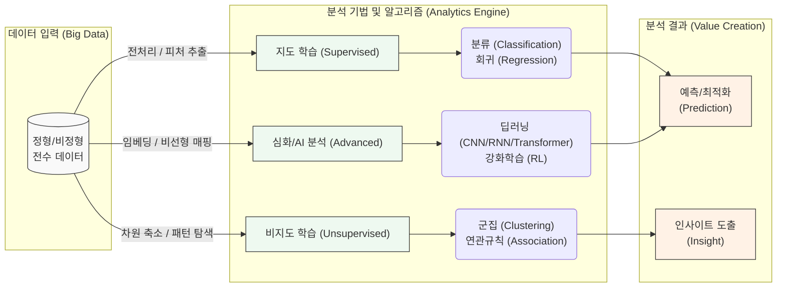

# 빅데이터 분석 기법

---

## I. 비즈니스 가치 창출의 핵심 엔진, 빅데이터 분석 기법의 개요

* **정의**: 대규모 정형·비정형 데이터 속에 묵시적으로 내재된 유용한 패턴, 규칙, 상관관계를 기계학습(ML), 통계학, AI 알고리즘을 활용해 추출하고 의사결정을 지원하는 기술
* **등장배경 및 특징**:
* **분석 패러다임 변화**: 과거 현상 파악 위주의 설명적(Descriptive) 분석에서 미래를 예측(Predictive)하고 최적 대안을 제시하는 처방적(Prescriptive) 분석으로 진화
* **컴퓨팅 파워 및 AI 융합**: [[GPU]]/[[NPU]] 등 하드웨어 발전과 [[딥러닝]] 기술의 결합으로 비정형 데이터(텍스트, 이미지, 음성)의 의미론적 분석 역량 극대화

---

## II. 빅데이터 분석 기법의 개념도 및 핵심 알고리즘

### 가. 빅데이터 분석 기법의 개념도 및 동작 프로세스

* 다양한 원천 데이터를 전처리(피처 엔지니어링)한 후, 분석 목적에 맞는 기계학습 및 AI 알고리즘을 적용하여 통찰력 도출 및 최적의 비즈니스 가치를 창출하는 구조

### 나. 빅데이터 분석 핵심 알고리즘 및 기술 요소

| 분류 | [[알고리즘]] / 요소기술 | 세부 설명 및 적용 분야 |
| --- | --- | --- |
| **[[지도학습]]** | **분류 (Classification)** | - 과거 데이터 기반 범주(Class) 예측 (스팸 분류, 이탈 예측 등)- *주요 기법*: [[의사결정나무]](Decision Tree), [[서포트 벡터 머신|SVM]], Random Forest |
| **지도학습** | **회귀 (Regression)** | - 독립변수와 종속변수 간의 인과관계 분석 및 연속형 수치 예측- *주요 기법*: 선형 회귀(Linear), 로지스틱 회귀(Logistic) |
| **비지도학습** | **군집화 (Clustering)** | - 정답(Label) 없이 데이터 간 [[유사도]] 기반으로 n개의 그룹으로 분류- *주요 기법*: K-Means, [[DBSCAN(밀도 기반 클러스터링)|DBSCAN]], 계층적 군집화 |
| **비지도학습** | **연관분석 (Association)** | - 항목 간 동시 발생 확률 기반 의미 있는 규칙 도출 (장바구니 분석)- *주요 기법*: Apriori, FP-Growth 알고리즘 |
| **[[시계열분석]]** | **Time Series Analysis** | - 시간 흐름에 따른 데이터 추세, 계절성, 주기성 파악 및 예측- *주요 기법*: ARIMA 모형, 지수평활법 |
| **텍스트분석** | **Text Mining / NLP** | - 비정형 텍스트에서 토픽 도출, 감성 분석 등 자연어 처리 수행- *주요 기법*: [[TF-IDF (Term Frequency - Inverse Document Frequency)|TF-IDF]], Word2Vec, [[LDA(Linear Discriminant Analysis)|LDA]](토픽 모델링) |
| **복잡계/AI** | **딥러닝 (Deep Learning)** | - 인공신경망 은닉층 기반 복잡한 비선형 패턴 및 특징 자동 추출- *주요 기법*: [[CNN]](비전), [[RNN (Recurrent Neural Network)|RNN]]/[[LSTM (Long Short-Term Memory)|LSTM]](순차데이터), Transformer |
| **최적화** | **[[강화학습]] (RL)** | - 환경과 상호작용하며 누적 보상(Reward)을 최대화하는 정책 학습- *주요 기법*: Q-Learning, DQN, A3C |

---

## III. 전통적 통계 분석과 빅데이터 분석의 비교 및 향후 전망

### 가. 전통적 통계 분석 vs 빅데이터(AI) 분석 비교

| 비교 항목 | 전통적 [[데이터 마이닝]] / 통계 분석 | 빅데이터 AI 기반 분석 |
| --- | --- | --- |
| **데이터 스케일** | 정형 데이터 위주, 표본(Sample) 추출 조사 | 정형 + 비정형, 대규모 전수(Population) 데이터 |
| **분석 목적** | 과거/현재 상태의 사후적 설명 및 진단 | 미래의 선제적 예측 및 능동적 맞춤형 최적화(처방) |
| **접근 방식** | [[가설 검정]] 중심(Top-Down), 연역적 접근 | 데이터 주도 패턴 발견(Bottom-Up), 귀납적 접근 |
| **주요 기법** | [[회귀분석]], 상관분석, [[t-검정 (t-test)|T-Test]], 분산분석([[ANOVA(Analysis of variance)|ANOVA]]) | 기계학습(앙상블, SVM), 딥러닝, 생성형 AI 모델 |
| **운영 인프라** | 단일 서버(Scale-up), RDBMS 중심 | 분산 컴퓨팅(Hadoop, Spark, Scale-out), 클라우드 |

### 나. 빅데이터 분석 분야 최신 동향 및 적용 방향

* **[[AutoML (Automated Machine Learning)|AutoML]] (자동화된 머신러닝) 확산**: 피처 엔지니어링부터 모델 선택, 하이퍼파라미터 튜닝까지 분석 전 과정을 자동화하여 비전문가(Citizen Data Scientist)의 분석 접근성 대폭 향상
* **[[XAI]] (설명 가능한 AI) 결합**: 딥러닝 기반 분석 알고리즘의 블랙박스(Black-Box) 한계를 극복하기 위해 [[LIME]], SHAP 등의 기법을 적용, 분석 결과에 대한 [[신뢰성]] 확보 및 규제(컴플라이언스) 대응
* **[[초거대 언어 모델|LLM]]과 RAG(검색 증강 생성) 기반 고도화**: 대규모 기업 내부 문서를 벡터 DB화하고 거대 언어 모델(LLM)과 연동하여, 자연어 질의 기반의 고차원 비정형 데이터 분석(Cognitive Analytics) 체계로 진화 중

---

### 🔗 연관 토픽

- **소속 도메인**: [[00_데이터베이스_MOC|🗄️ 데이터베이스]]
- **세부 분류**: `6. SQL 표준 문법 & 쿼리 성능 튜닝`
- **핵심 연관 토픽**:
  - [[초거대 언어 모델|초거대 언어 모델(Large Language Model)]]
  - [[딥러닝]]
  - [[GPU]]
  - [[XAI]]
  - [[강화학습]]
