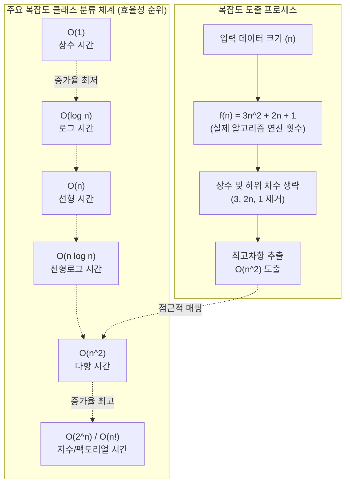

# 빅오 표기법 (O-Notation)

---

## I. 알고리즘 성능 평가의 핵심 기준, 빅오 표기법(O-Notation)의 개요

- **정의**: 알고리즘의 효율성을 평가하기 위해 입력 데이터 크기($n$)의 증가에 따른 **최악의 경우(Worst-case)** 시간 및 공간 복잡도를 점근적 상한선(Upper Bound)으로 표현하는 수학적 표기 기법
- **배경 및 필요성**: 하드웨어 성능, 운영체제 등 외부 환경에 독립적인 알고리즘 자체의 객관적 성능 평가 기준 필요성 대두
- **특징**: 최고차항 중심 표기, 점근적 분석(Asymptotic Analysis), 상수 및 낮은 차수항 생략, 최악의 실행시간 보장

---

## II. 빅오 표기법의 개념도 및 핵심 기술 요소

### 가. 빅오 표기법의 개념도 및 분석 원리

* 알고리즘의 실제 연산 횟수 함수 $f(n)$에서 증가율에 가장 큰 영향을 미치는 최고차항만을 추출하여 알고리즘이 소모하는 최대 한계치(최악의 경우)를 산정함

### 나. 빅오 표기법의 핵심 요소 및 클래스 분류

| 구분 | 요소기술(키워드) | 세부 설명 |
| --- | --- | --- |
| **분석 원리** | Upper Bound (상한선) | $f(n) \le c \cdot g(n)$을 만족하는 $g(n)$ 도출, 최악의 경우에도 이보다 오래 걸리지 않음을 보장 |
| **분석 원리** | Asymptotic (점근적) | 입력 크기 $n$이 무한대로 커질 때의 추세를 분석하여 알고리즘의 본질적 한계를 평가 |
| **복잡도 종류** | Time Complexity | 데이터 크기 증가에 따른 알고리즘 연산 횟수(비교, 대입, 덧셈 등)의 증가율 측정 |
| **복잡도 종류** | Space Complexity | 알고리즘 실행 시 추가로 필요로 하는 메모리 공간(변수, 자료구조 등)의 증가율 측정 |
| **주요 클래스** | $O(1)$ (상수 시간) | 입력 데이터 크기와 무관하게 실행 시간이 일정함 (예: 배열 인덱스 접근, [[해시 테이블]] 탐색) |
| **주요 클래스** | $O(\log n)$ (로그 시간) | 연산마다 탐색 범위가 절반씩 줄어드는 구조 (예: 이진 탐색, [[이진 탐색 트리]]) |
| **주요 클래스** | $O(n)$ (선형 시간) | 입력 데이터 크기에 정비례하여 실행 시간 증가 (예: 1중 For문 탐색, 선형 탐색) |
| **주요 클래스** | $O(n \log n)$, $O(n^2)$ | 분할 정복 알고리즘(병합/[[퀵 정렬]] 등)은 $O(n \log n)$, 다중 루프(버블/선택 정렬)는 $O(n^2)$ |

---

## III. 빅오 표기법과 타 점근적 표기법 비교 및 향후 동향

### 가. 점근적 표기법(Asymptotic Notations) 주요 방식 비교

| 비교 항목 | Big-O ($O$) | Big-Omega ($\Omega$) | Big-Theta ($\Theta$) |
| --- | --- | --- | --- |
| **초점 (의미)** | **최악의 경우 (Worst Case)** | 최선의 경우 (Best Case) | 평균/정확한 경우 (Average Case) |
| **수학적 한계선** | 점근적 상한선 (Upper Bound) | 점근적 하한선 (Lower Bound) | 상/하한선 동시 만족 (Tight Bound) |
| **수식 표현** | $f(n) \le c \cdot g(n)$ | $f(n) \ge c \cdot g(n)$ | $c_1 \cdot g(n) \le f(n) \le c_2 \cdot g(n)$ |
| **실무 활용 목적** | 시스템 다운 방지, 최대 지연 시간 예측 (가장 널리 쓰임) | 알고리즘 최적화의 한계선 파악 | 알고리즘 성능의 정확한 분석 |
| **적용 사례(정렬)** | 퀵 정렬의 최악 시간: $O(n^2)$ | 퀵 정렬의 최선 시간: $\Omega(n \log n)$ | 퀵 정렬의 평균 시간: $\Theta(n \log n)$ |

### 나. 알고리즘 복잡도 분석의 향후 전망 및 동향

* **클라우드 환경의 트레이드오프(Trade-off)**: 메모리(Space) 자원이 풍부해짐에 따라 공간 복잡도를 희생하여 시간 복잡도를 $O(1)$에 가깝게 줄이는 캐싱(Caching) 및 인메모리 DB 활용 증가
* **양자 알고리즘의 복잡도 혁신**: 쇼어 알고리즘(Shor's Algorithm) 등 양자 컴퓨팅의 등장으로 기존 지수 시간 $O(e^n)$ 소요 문제(소인수 분해 등)를 다항 시간 $O(n^3)$ 수준으로 개선하는 연구 활발
* **AI/[[초거대 언어 모델|LLM]] 최적화**: [[트랜스포머]] 아키텍처의 셀프 어텐션 연산 복잡도 $O(n^2)$를 $O(n)$ 수준으로 낮추기 위한 리니어 어텐션(Linear Attention) 등 알고리즘 최적화 기술 지속 발전 중

---

### 🔗 연관 토픽

- **소속 도메인**: [[00_컴퓨터구조_MOC|💻 컴퓨터구조]]
- **세부 분류**: `2. 캐시 & 메모리 계층 구조 · 스토리지`
- **핵심 연관 토픽**:
  - [[해시 테이블]]
  - [[퀵 정렬|퀵 정렬 (Quick Sort)]]
  - [[알고리즘]]
  - [[메모리 단편화|메모리 단편화 (Fragmentation)]]
  - [[메모리 관리 정책]]
