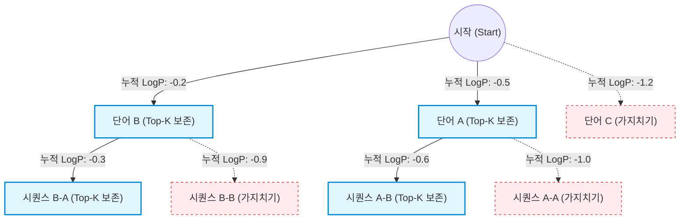

# 빔 탐색 (Beam Search)

---

## I. 시퀀스 생성 최적화 알고리즘, 빔 탐색(Beam Search)의 개요

* **정의**: 자연어 처리(NLP) 및 시퀀스 생성 모델에서 매 스텝마다 누적 확률이 가장 높은 K개(Beam Size)의 유망한 후보 시퀀스만 메모리에 유지하며 최적의 해를 탐색하는 휴리스틱 탐색 [[알고리즘]]
* **등장배경**: 모든 경우의 수를 탐색하는 완전 탐색(Exhaustive Search)의 기하급수적인 연산량 문제와 지역 최적점에 빠지기 쉬운 탐욕 탐색(Greedy Search)의 한계를 극복하기 위해 등장
* **특징**: 탐색 공간 제한을 통한 연산 효율성 확보, Beam Width 조절을 통한 품질 및 속도 트레이드오프(Trade-off) 제어, 최적해 근사(Approximation)

---

## II. 빔 탐색의 동작 원리 및 핵심 구성요소

### 가. 빔 탐색의 동작 원리

* 매 타임스텝(Time Step)마다 가능한 모든 다음 단어의 결합 확률(누적 로그 확률)을 계산
* 정해진 빔 크기(K=2)만큼의 상위 시퀀스만 다음 스텝으로 확장하고, 나머지 하위 노드는 가지치기(Pruning) 처리 수행

### 나. 빔 탐색의 핵심 구성요소

| 구분 | 핵심 기술 요소 | 세부 설명 |
| --- | --- | --- |
| **파라미터** | Beam Width (K) | 매 스텝마다 유지하는 최대 후보 시퀀스의 수 (K가 클수록 품질 상승, 연산량 증가) |
| **평가 함수** | Log Probability | 언더플로우(Underflow) 방지를 위해 시퀀스 확률 곱셈을 로그 확률의 덧셈으로 변환하여 점수 계산 |
| **보정/정규화** | Length Penalty | 긴 문장일수록 누적 확률이 낮아지는 현상을 방지하기 위해 시퀀스 길이에 대한 가중치(Alpha) 부여 |
| **탐색 제어** | Pruning (가지치기) | 정렬된 누적 확률 리스트 중 Top-K를 제외한 나머지 경로의 연산을 중단하여 메모리 최적화 |
| **탐색 제어** | Early Stopping | 탐색 중단 조건을 설정하여, 불필요한 연산을 줄이고 K개의 완성된 시퀀스가 모이면 즉시 종료 |
| **종료 조건** | EOS Token 처리 | 시퀀스 확장에서 `<EOS>`(End of Sequence) 토큰이 생성되면 해당 시퀀스는 완성된 것으로 간주 |
| **변형 기법** | Beam Search Scoring | [[딥러닝]] 기반 번역(NMT)에서 출력 문장의 품질을 최종 평가하는 추가적인 스코어링 메커니즘 |
| **변형 기법** | Diverse Beam Search | 후보들 간의 다양성(Diversity)이 부족한 단점을 해결하기 위해 그룹을 나누어 다양한 시퀀스 유도 |

---

## III. 디코딩 알고리즘 비교 및 최신 활용 동향

### 가. 텍스트 생성 디코딩 알고리즘 비교

| 비교 항목 | 탐욕 탐색 (Greedy Search) | 빔 탐색 (Beam Search) | 핵 샘플링 (Nucleus / Top-p Sampling) |
| --- | --- | --- | --- |
| **동작 방식** | 매 스텝 가장 높은 확률 단어 1개 선택 | 누적 확률 상위 K개 경로 동시 탐색 | 누적 확률 합이 p가 되는 후보군 내에서 무작위 추출 |
| **결정성** | 단결정적 (항상 동일한 결과) | 단결정적 (K가 고정될 경우 동일) | 확률적 (다양하고 창의적인 결과) |
| **연산 속도** | 매우 빠름 (연산량 최소) | 중간 (K 배수만큼 연산량 증가) | 빠름 (샘플링 과정만 추가됨) |
| **주요 단점** | 지역 최적점 빠짐, 반복 생성 오류 | 단어의 획일성, 창의성 부족 | 간헐적인 환각(Hallucination) 발생 가능 |
| **활용 분야** | 단순 분류, 매우 짧은 문장 생성 | 기계 번역(NMT), 텍스트 요약 | [[초거대 언어 모델|LLM]] 기반 챗봇(ChatGPT 등), 창작 AI |

### 나. LLM 시대의 빔 탐색 최신 동향

* **샘플링 기법과의 결합**: 거대 언어 모델(LLM)에서는 빔 탐색의 결정론적 특성으로 인한 '지루한 답변(Boring Text)'을 방지하기 위해 Temperature 조절 및 Top-K/Top-p 샘플링과 결합하여 하이브리드 디코딩 적용
* **추론 가속화(Speculative Decoding)**: 작은 초안 모델(Draft Model)이 빠르게 여러 토큰을 생성하고, 큰 모델이 이를 병렬 검증하는 과정에서 빔 탐색과 유사한 다중 경로 탐색 사상을 응용하여 연산 속도를 최적화하는 추세임

---

### 🔗 연관 토픽

- **소속 도메인**: [[00_인공지능_MOC|🤖 인공지능]]
- **세부 분류**: `1. 수학 · 통계학 & 데이터 전처리`
- **핵심 연관 토픽**:
  - [[딥러닝]]
  - [[초거대 언어 모델|초거대 언어 모델(Large Language Model)]]
  - [[TF-IDF (Term Frequency - Inverse Document Frequency)]]
  - [[시계열분석]]
  - [[자연어처리|자연어처리 (NLP)]]
