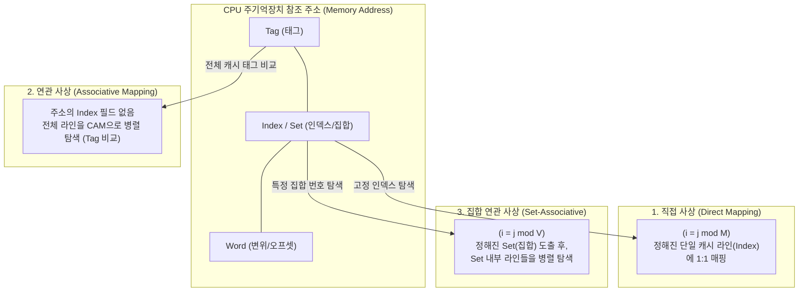

# 주기억장치와 캐시 메모리 간의 사상 기법 3가지

---

## I. 주소 변환 최적화, 캐시 메모리 사상 기법의 개요

* **정의**: 처리 속도가 느린 주기억장치의 블록들을 고속의 [[캐시 메모리]] 라인에 적재할 때, 어느 위치(라인)에 할당할지 결정하기 위한 메모리 주소 변환(Mapping) 기법
* **필요성 및 등장배경**: [[CPU]](고속)와 주기억장치(저속) 간의 병목현상(Semantic Gap) 해소, [[지역성|지역성(Locality)]] 기반 데이터를 캐시에 적재하여 데이터 접근 지연 시간(Latency) 최소화
* **특징**: 하드웨어 구현 복잡도(비용)와 캐시 적중률(Hit Ratio) 간의 트레이드오프(Trade-off)가 존재하며, 시스템 용도에 따라 3가지 주요 기법(직접, 연관, 집합 연관 사상)을 선택적으로 적용함

---

## II. 캐시 사상 기법의 동작 개념도 및 핵심 기술 요소

### 가. 3가지 사상 기법의 동작 원리 및 개념도

* 주기억장치 주소의 특정 필드(Tag, [[RDBMS 인덱스(index)|Index]]/Set)를 해석하여, 캐시 메모리 내부 라인의 위치를 정적/동적으로 할당하고 탐색함.

### 나. 캐시 사상 기법별 핵심 기술 및 구성 요소

| 분류 | 요소기술(키워드) | 세부 설명 |
| --- | --- | --- |
| **직접 사상** | $i = j \bmod m$ 연산 | 주기억장치 블록($j$)이 지정된 단 하나의 캐시 라인($i$)에만 고정 매핑됨 ($m$: 캐시 라인 수) |
| **직접 사상** | 스래싱(Thrashing) 방어 취약 | 동일 라인에 매핑되는 서로 다른 두 블록을 번갈아 참조 시, 충돌 미스(Conflict Miss)가 급증함 |
| **연관 사상** | 연관 메모리(CAM) 하드웨어 | 주소가 아닌 '데이터(Tag)' 내용 자체를 기반으로 병렬 탐색하는 고속/고비용 특수 메모리 회로 |
| **연관 사상** | 유연한 블록 적재 (1:N) | 주기억장치 블록을 캐시의 어떤 빈 라인에도 적재할 수 있어, 3가지 기법 중 적중률이 가장 높음 |
| **집합 연관 사상** | n-way 구조 | 캐시를 $v$개의 집합(Set)으로 나누고, 1개 집합 내 $n$개의 라인으로 구성하여 유연성과 비용을 절충함 |
| **집합 연관 사상** | 블록 교체 [[알고리즘]](Replacement) | Set 내 모든 라인이 사용 중일 때, [[LRU]](Least Recently Used) 등을 통해 방출할 블록을 결정함 |
| **공통 구성 요소** | Tag, Index(Set), Word 필드 | CPU의 메모리 참조 주소를 분할하여 캐시 히트(Hit) 판별 및 데이터 오프셋 추출에 사용되는 논리적 구조 |
| **성능 평가 지표** | 캐시 적중률(Hit Ratio) | 전체 메모리 접근 횟수 중 캐시에서 데이터를 찾은 비율 (연관 사상 > 집합 연관 > 직접 사상 순으로 우수함) |

---

## III. 캐시 사상 기법 3가지의 상세 비교 및 최신 동향

### 가. 직접 사상, 연관 사상, 집합 연관 사상 상세 비교

| 비교 항목 | 1. 직접 사상 (Direct Mapping) | 2. 연관 사상 (Fully Associative) | 3. 집합 연관 사상 (Set Associative) |
| --- | --- | --- | --- |
| **매핑 및 적재 방식** | 특정 인덱스 라인에 고정 (1:1 매핑) | 아무 라인에나 자유롭게 적재 (1:N 매핑) | 특정 Set(집합) 내 아무 라인에나 적재 |
| **하드웨어 비용/복잡도** | 가장 낮음 (단순 비교기 1개 사용) | 가장 높음 (전체 라인 병렬 탐색용 CAM 필요) | 보통 (집합 내 n-way 만큼의 탐색기 필요) |
| **캐시 접근 속도** | 가장 빠름 | 병렬 탐색 지연으로 다소 느림 | 보통 (Set을 찾고 병렬 탐색 수행) |
| **캐시 적중률(Hit Ratio)** | 낮음 (충돌 미스 발생 가능성 최고) | 가장 높음 (빈 공간의 100% 활용 가능) | 직접 사상과 연관 사상의 절충 (높음) |
| **주요 활용 및 적용 사례** | 초기 단순형 임베디드, 구형 L1 데이터 캐시 | TLB(변환참조버퍼) 등 소규모 특수 목적 회로 | 현대 멀티코어 CPU의 L1/L2/L3 범용 캐시 |

### 나. 최신 프로세서의 캐시 메모리 사상 트렌드

* **계층적 다차원 집합 연관 사상 적용**: 현대의 고성능 멀티코어 프로세서(예: Intel, AMD, Apple Silicon)에서는 성능 최적화를 위해 계층별로 다차원 집합 연관 사상(예: L1 캐시는 8-way, 용량이 큰 L2/L3 공유 캐시는 16-way 이상의 고차원 집합 연관 사상) 기법을 혼합 채택하여 시스템 전반의 적중률과 처리 대역폭을 극대화하는 추세임.

---

### 🔗 연관 토픽

- **소속 도메인**: [[00_컴퓨터구조_MOC|💻 컴퓨터구조]]
- **세부 분류**: `1. CPU 프로세서 & 마이크로아키텍처`
- **핵심 연관 토픽**:
  - [[캐시 메모리]]
  - [[알고리즘]]
  - [[CPU]]
  - [[LRU]]
  - [[캐시 메모리의 사상 방식|캐시(Cache) 메모리의 사상 방식(Mapping Scheme)]]
