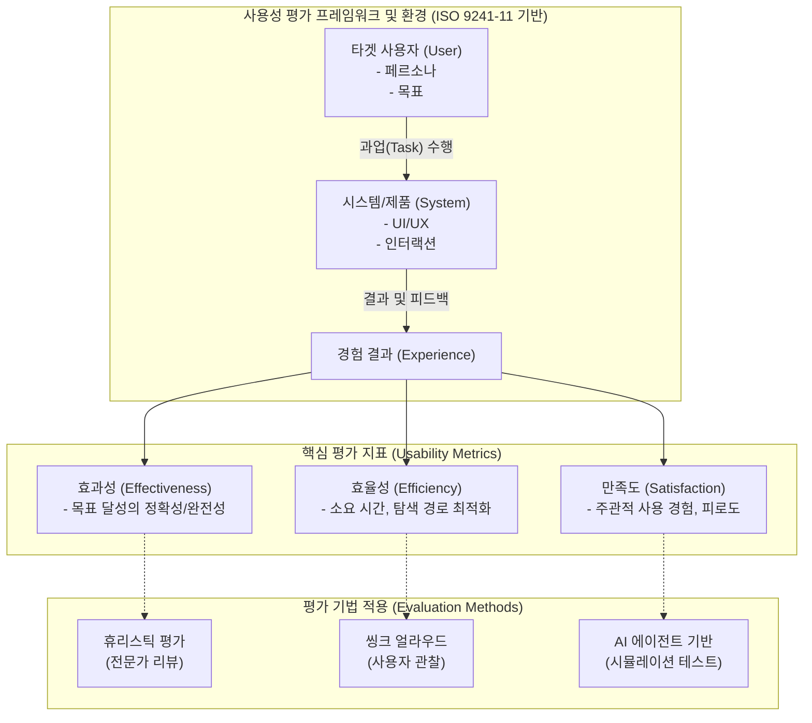

# 사용성 평가 (Usability Evaluation)

---

## I. [사용자 경험 최적화], 사용성 평가의 개요

* **정의**: 특정 환경에서 사용자가 제품이나 서비스를 통해 목표를 얼마나 정확하고 빠르며 만족스럽게 달성하는지 측정하고 개선하는 체계적 평가 과정
* **국제 표준**: ISO 9241-11(효과성, 효율성, 만족도), ISO/IEC 25010(소프트웨어 품질 특성 중 사용성)
* **필요성 및 등장배경**: 복잡한 시스템 환경에서 사용자 이탈 방지, UX/UI 결함 조기 발견을 통한 수정 비용 절감, 데이터 및 AI 기반의 객관적 사용성 검증 요구 증대

---

## II. 사용성 평가의 개념도 및 핵심 기술 요소

### 가. 사용성 평가의 프레임워크 및 프로세스 개념도

* 사용자가 시스템과 상호작용하는 과정에서 발생하는 효과성, 효율성, 만족도를 전문가, 실사용자, AI 기반 도구를 통해 다각도로 분석함

### 나. 사용성 평가의 핵심 평가 기법 및 구성 요소

| 구분 | 요소기술(키워드) | 세부 설명 |
| --- | --- | --- |
| **평가 지표** | ISO 9241-11 | 효과성(정확도), 효율성(자원/시간 소모), 만족도(주관적 감정)의 3요소 측정 |
| **전문가 평가** | 휴리스틱 평가 (Heuristic) | 제이콥 닐슨의 10가지 원칙 등을 활용하여 UX 전문가가 UI 설계 결함을 사전 점검 |
| **사용자 관찰** | 씽크 얼라우드 (Think Aloud) | 사용자가 특정 과업(Task)을 수행하며 머릿속의 생각을 소리 내어 말하게 하는 발성 사고법 |
| **정성적 연구** | 심층 인터뷰 / FGI | 타겟 그룹(6~8명)을 대상으로 사용 경험, 숨겨진 니즈, 불만족 요인을 심층 탐색 |
| **정량적 평가** | A/B 테스트 (A/B Testing) | 대조군(A)과 실험군(B)을 배포하여 체류 시간, 클릭률, 전환율 등 실제 데이터를 통계적으로 검증 |
| **측정 도구** | SUS (System Usability Scale) | 시스템 사용성에 대한 전반적인 주관적 만족도를 측정하는 표준화된 10개 문항 설문지 |
| **생체 데이터** | 시선 추적 (Eye-Tracking) | 사용자의 시선 이동 경로(Saccade), 체류 시간(Fixation)을 분석하여 시각적 인지 병목 파악 |
| **최신 기술** | AI 에이전트 시뮬레이션 | 거대 언어 모델([[초거대 언어 모델|LLM]]) 기반의 다중 페르소나를 생성하여, 휴먼 개입 없이 UI 탐색 및 오류 자동 검출 |

---

## III. 사용성 평가의 한계점 및 최신 트렌드/전망

### 가. 전통적 사용성 평가의 한계 및 최신 AI 기반 평가 동향

| 구분 | 전통적 평가 방식의 한계 | 최신 트렌드 및 해결 방안 (AI/데이터 기반) |
| --- | --- | --- |
| **참가자 모집** | 시간/비용 소모 과다, 소수 표본 한계 | **Generative AI [[페르소나]]**: LLM 에이전트 기반 대규모 가상 사용자 시뮬레이션 테스트 수행 |
| **주관성 개입** | 평가자 [[편향]], 자가 보고식 설문의 왜곡 | **멀티모달 감정 분석**: 뇌파(EEG), 안면 근육, 생체 신호를 융합 분석하여 무의식적 인지 부하 측정 |
| **시간적 제약** | 특정 기간에 랩(Lab) 환경에서만 수행 | **비동기 원격 테스트**: 클라우드 기반 툴을 활용하여 사용자가 원하는 시간에 자연스러운 환경에서 원격 평가 수행 |
| **단절된 평가** | 배포 전(Pre-launch) 일회성 평가에 그침 | **Continuous UX**: [[MLOps]] 및 CI/CD 파이프라인과 연계하여 실시간 제품 사용성 데이터를 지속적으로 모니터링 |

* **향후 전망**: 기존 정성적 휴리스틱 평가와 씽크 얼라우드의 한계를 극복하기 위해, 멀티모달 센서와 생성형 AI 기반 에이전트 시뮬레이션이 결합된 **지속적이고 자동화된 사용성 평가 체계**로 패러다임이 전환될 것으로 전망됨.

---

### 🔗 연관 토픽

- **소속 도메인**: [[00_소프트웨어공학_MOC|🏗️ 소프트웨어공학]]
- **세부 분류**: `6. 소프트웨어 테스팅 & 품질 보증 (QA/QC)`
- **핵심 연관 토픽**:
  - [[페르소나|페르소나 (Persona)]]
  - [[편향]]
  - [[초거대 언어 모델|초거대 언어 모델(Large Language Model)]]
  - [[MLOps]]
  - [[난독화]]
