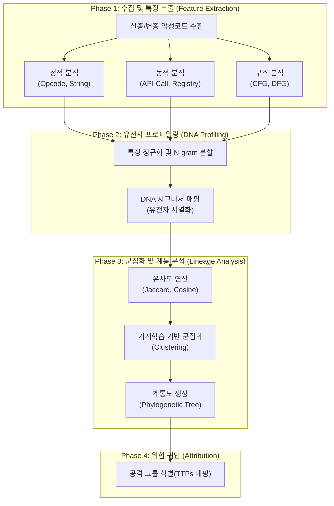

# 사이버 게놈 (Cyber Genome)

---

## I. 악성코드 근원 추적, 사이버 게놈의 개요

* **정의**: 생물학적 게놈(유전체) 분석 기법을 악성코드 분석에 적용하여, 악성코드의 고유한 특징(DNA)을 추출하고 변종 및 근원지를 추적하는 악성코드 프로파일링 기술
* **등장배경**: 백신을 우회하는 [[다형성]](Polymorphic)/변형성(Metamorphic) 악성코드의 급증, 지능형 지속 위협(APT) 공격 그룹의 식별 및 귀인(Attribution) 분석 필요성 대두
* **특징**: 고유 서열(DNA) 추출을 통한 신종/변종 탐지, 계통도(Phylogenetic tree) 기반의 진화 과정 추적, 사이버 위협 인텔리전스([[CTI]])와의 연계

---

## II. 사이버 게놈의 개념도 및 핵심 기술 요소

### 가. 사이버 게놈의 개념도 및 동작 원리

* 정적/동적 분석을 통해 악성코드의 구조적 특징을 DNA처럼 서열화하고, [[유사도]] 측정 및 계통도 분석을 수행하여 특정 공격 그룹(근원지)을 식별함

### 나. 사이버 게놈의 핵심 기술 요소

| 구분 | 요소기술(키워드) | 세부 설명 |
| --- | --- | --- |
| **특징 추출** | 제어흐름그래프(CFG) | 프로그램의 실행 흐름과 함수 간의 호출 관계를 그래프 형태로 모델링하여 구조적 특징 추출 |
| **특징 추출** | API Call Sequence | [[샌드박스]] 등 동적 환경에서 악성코드 실행 시 호출되는 [[OS(운영체제)|운영체제]] API의 순서 및 빈도 분석 |
| **데이터 처리** | N-gram 기반 분할 | 바이너리 코드나 Opcode를 N개의 연속된 윈도우 단위로 분할하여 의미 있는 패턴 생성 |
| **프로파일링** | DNA 시그니처 매핑 | 추출된 이기종 특징 데이터들을 생물학적 DNA 염기서열과 같이 고유한 서열 구조로 정규화 및 매핑 |
| **유사도 분석** | Jaccard / Cosine 유사도 | 신규 악성코드 DNA와 기존 악성코드 패밀리 간의 벡터 또는 집합 기반 유사성(Distance) 측정 |
| **기계학습** | 군집화(Clustering) | K-Means, [[DBSCAN(밀도 기반 클러스터링)|DBSCAN]] [[알고리즘]] 등을 활용하여 유전적 특징이 유사한 악성코드들을 동일 패밀리로 그룹화 |
| **시각화 분석** | 계통도(Phylogenetic Tree) | 악성코드의 변이 및 진화 과정, 파생 관계를 생물학적 진화 계통 트리 형태로 시각화 |
| **위협 식별** | 귀인(Attribution) 분석 | 추출된 DNA와 [[MITRE ATT&CK (Adversarial Tactics, Techniques & Common Knowledge)|MITRE ATT&CK]] TTPs를 매핑하여 배후의 특정 해커 그룹(APT)을 최종 식별 |

---

## III. 전통적 악성코드 분석 기법과의 비교 및 향후 전망

### 가. 전통적 시그니처 기반 탐지 vs 사이버 게놈 분석 비교

| 비교 항목 | 전통적 시그니처 기반 탐지 | 사이버 게놈 (Cyber Genome) |
| --- | --- | --- |
| **분석 대상** | 파일의 해시(Hash)값, 특정 바이트 패턴 | 악성코드의 행위, API 호출 흐름, 구조적 특징(DNA) |
| **탐지 범위** | 기지(Known)의 악성코드 탐지 | 미지(Unknown)의 신종/변종 악성코드 탐지 |
| **핵심 목적** | 엔드포인트 및 네트워크 단의 빠른 차단 | 악성코드 진화 과정 분석 및 공격 배후(근원) 추적 |
| **대응 한계** | 패킹(Packing) 및 [[난독화]] 시 탐지 우회 용이 | 난독화가 적용되어도 고유 구조(CFG 등) 기반 탐지 가능 |
| **분석 방법론** | 1:1 패턴 매칭 (Pattern Matching) | 기계학습, 패턴 클러스터링, 계통학적(Phylogenetic) 분석 |

### 나. 향후 전망 및 활용 동향

* **대형 언어 모델([[초거대 언어 모델|LLM]]) 결합**: 거대 언어 모델을 활용하여 난독화된 악성코드의 어셈블리어/Opcode를 역분석하고 유전적 특징을 자동 추출하는 에이전트 기반 분석 체계로 발전 중
* **국가 위협 인텔리전스 연계**: 국가 차원의 사이버 위협 인텔리전스(CTI) 플랫폼과 연동하여, 사이버 테러 공격 그룹을 조기 식별하고 적극적 방어(Active Defense) 체계 구축에 핵심 기술로 활용됨

---

### 🔗 연관 토픽

- **소속 도메인**: [[00_보안_MOC|🛡️ 보안]]
- **세부 분류**: `5. 사이버 공격 기법 & 침해사고 대응`
- **핵심 연관 토픽**:
  - [[CTI]]
  - [[샌드박스|샌드박스 (Sandbox)]]
  - [[유사도|유사도(Similarity)]]
  - [[난독화]]
  - [[사이버전|사이버전(Cyber Warfare)]]
