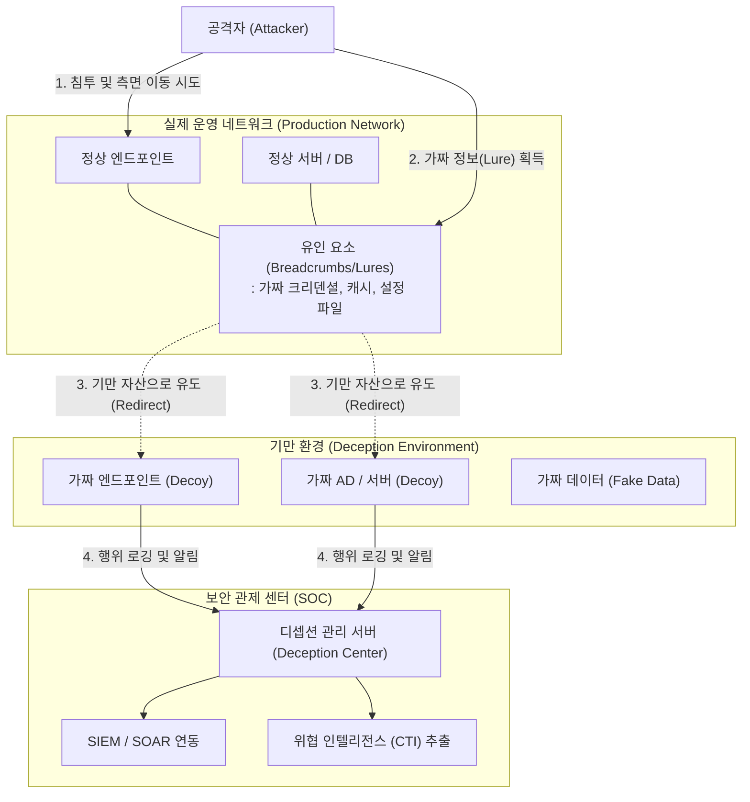

# 사이버 디셉션 (Cyber Deception)

---

## I. 능동적 방어 전략, 사이버 디셉션의 개요

* **정의**: 내부 네트워크에 가짜 자산(Decoy)과 유인 요소(Lure)를 분산 배치하여 공격자를 기만하고, 선제적으로 위협을 탐지 및 격리하는 능동적 사이버 방어 기술
* **등장배경**: 기존 경계 기반 보안 및 시그니처 기반 탐지의 한계, 지능형 지속 위협(APT)의 측면 이동(Lateral Movement) 탐지 필요성 증가, 공격자 체류 시간(Dwell Time) 최소화 요구
* **특징**: 고도화된 상호작용성(High-Interaction), 오탐률(False Positive) 제로(기만 자산 접근은 100% 위협으로 간주), MITRE Engage(능동 방어 [[프레임워크]]) 기반의 전략적 방어 수행

---

## II. 사이버 디셉션의 개념도 및 핵심 기술 요소

### 가. 사이버 디셉션의 동작 개념도

* 공격자가 운영망 침투 후 측면 이동을 위해 유인 요소(Lure)를 탈취하면, 이를 통해 가짜 자산(Decoy)으로 유도하여 공격자 TTPs(전술, 기법, 절차)를 분석하고 실시간 격리함

### 나. 사이버 디셉션의 핵심 기술 요소

| 분류 | 요소기술(키워드) | 세부 설명 |
| --- | --- | --- |
| **기만 객체** | 디코이 (Decoy) | 실제 시스템(OS, 서버, IoT기기)과 동일하게 작동하도록 정교하게 에뮬레이션된 가짜 자산 |
| **유인 수단** | 브레드크럼 (Breadcrumb) / 루어(Lure) | 디코이로 유도하기 위해 실제 엔드포인트에 뿌려두는 가짜 크리덴셜, 브라우저 히스토리, RDP [[세션]] 정보 |
| **운영 기술** | 동적 할당 (Dynamic Deployment) | 네트워크 토폴로지 변화를 지속 스캐닝하여 실환경과 이질감 없이 기만 자산을 자동 배치/변경 |
| **운영 기술** | 투명한 리다이렉션 (Redirection) | 공격자의 비정상 트래픽을 실제 자산에서 기만 네트워크로 인지하지 못하게 우회시키는 네트워크 제어 |
| **분석/대응** | 고도화 상호작용 (High-Interaction) | 공격자의 명령(CLI, 쿼리 등)에 대해 실제 시스템처럼 반응하여 더 많은 공격 기법(Payload)을 노출시킴 |
| **분석/대응** | 포렌식 및 [[CTI]] 연계 | 기만 환경 내의 모든 상호작용을 로깅하여 [[MITRE ATT&CK (Adversarial Tactics, Techniques & Common Knowledge)|MITRE ATT&CK]] 매핑 및 위협 인텔리전스 생성 |
| **확장 연동** | [[SIEM]] / [[SOAR (Security Orchestration, Automation and Response)|SOAR]] 통합 | 탐지된 위협 알람을 기반으로 [[방화벽]], NAC 등 보안 솔루션과 연동하여 침해 IP 자동 차단 및 격리 수행 |
| **보안 프레임워크** | MITRE Engage | 기만(Deception)과 적대적 교전(Adversary Engagement)을 계획하고 실행하기 위한 전략적 모델 |

---

## III. 디셉션과 기존 허니팟의 비교 및 향후 전망

### 가. 사이버 디셉션과 허니팟(Honeypot) 비교

| 비교 항목 | 기존 허니팟 (Honeypot) | 사이버 디셉션 (Cyber Deception) |
| --- | --- | --- |
| **구축 환경/위치** | 격리된 망(DMZ 등)에 단일/정적 배치 | 실제 운영 네트워크 내 분산/동적 배치 |
| **주요 목적** | 공격 샘플 수집, 연구 및 분석 | 선제적 위협 탐지, 측면 이동(Lateral Movement) 차단 |
| **확장성/관리** | 낮음 (수동 배포 및 [[유지보수]] 필요) | 높음 (자동화된 스캐닝 및 동적 [[프로비저닝]]) |
| **오탐률(FP)** | 네트워크 엣지 배치로 노이즈(스캔 등) 많음 | 내부망 유도 기반으로 오탐률 제로(Zero FP) 근접 |
| **대응 수준** | 방어적, 수동적 (Passive) | 능동적 방어(Active Defense) 및 실시간 자동 격리 |

### 나. 최신 동향 및 향후 전망

* **제로 트러스트([[제로 트러스트 보안모델|Zero Trust]]) 및 [[XDR]]과의 융합**: 신뢰하지 않는다는 제로 트러스트 원칙을 보완하여, 인증을 우회한 내부자 위협이나 APT 공격을 XDR 아키텍처와 연계하여 입체적으로 탐지하는 핵심 요소로 부상 중임.
* **생성형 AI(Generative AI) 기반 기만 환경 자동화**: [[초거대 언어 모델|LLM]] 등을 활용하여 기업의 실제 데이터(이메일, 소스코드, 문서)와 구별할 수 없는 수준의 가짜 데이터(Fake Data)를 실시간으로 대량 생성하여 공격자의 데이터 유출 실효성을 무력화하는 방향으로 발전하고 있음.

---

### 🔗 연관 토픽

- **소속 도메인**: [[00_보안_MOC|🛡️ 보안]]
- **세부 분류**: `5. 사이버 공격 기법 & 침해사고 대응`
- **핵심 연관 토픽**:
  - [[제로 트러스트 보안모델|제로 트러스트 (Zero Trust) 보안모델]]
  - [[XDR|XDR(eXtended Detection Response)]]
  - [[CTI]]
  - [[SIEM]]
  - [[MITRE ATT&CK (Adversarial Tactics, Techniques & Common Knowledge)]]
