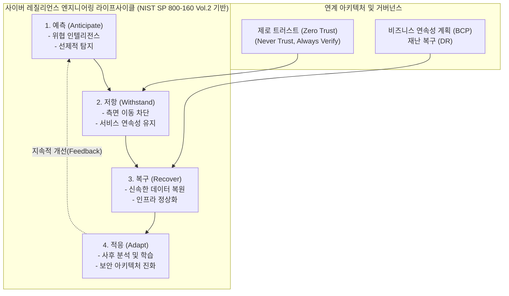

# 사이버 레질리언스 (Cyber Resilience)

---
## I. 디지털 생존 전략, 사이버 레질리언스의 개요

* **정의**: 사이버 공격, 내부 위협, 시스템 오류 등 불가피한 침해 상황을 전제로, 위협을 예측하고 견디며 신속하게 복구 및 적응하여 비즈니스 연속성을 유지하는 전사적 위협 대응 및 회복 전략
* **등장배경**: 기존 경계 방어(Perimeter Defense) 기반 보안망의 한계 노출, 지능형 지속 위협(APT) 및 [[랜섬웨어]] 공격의 고도화, 비즈니스 중단에 따른 막대한 경제적 손실 증가
* **특징**: 침해 수용(Compromise is Inevitable) 마인드셋, NIST SP 800-160 Vol.2 기반의 4대 목표(Anticipate, Withstand, Recover, Adapt) 지향, IT 인프라 보안과 [[BCP]]/DR 거버넌스의 융합

---

## II. 사이버 레질리언스의 개념도 및 핵심 기술 요소

### 가. 사이버 레질리언스의 프레임워크 및 동작 원리

* 완벽한 방어가 불가능함을 인정하고 예측(Anticipate) → 저항(Withstand) → 복구(Recover) → 적응(Adapt)의 선순환 체계를 통해 공격자의 체류 시간과 피해 규모를 최소화함

### 나. 사이버 레질리언스의 핵심 기술 및 구성 요소

| 구분 | 요소기술(키워드) | 세부 설명 |
| --- | --- | --- |
| **목표/전략** | 예측 (Anticipate) | 위협 인텔리전스([[CTI]]) 및 위협 헌팅을 통해 잠재적 공격 TTPs를 사전에 인지하고 대비 상태 유지 |
| **목표/전략** | 저항 (Withstand) | 제로 트러스트 기반 인증과 마이크로 세그멘테이션을 적용하여 침해 발생 시 피해 범위(Blast Radius) 격리 |
| **목표/전략** | 복구 (Recover) | 불변(Immutable) 백업 및 자동화된 DR 오케스트레이션을 통해 핵심 비즈니스 기능을 최단 시간에 복원 |
| **목표/전략** | 적응 (Adapt) | 침해 사고 후 포렌식 분석 결과를 바탕으로 보안 정책 및 인프라 구조를 지속적으로 재평가하고 강화 |
| **[[프레임워크]]** | NIST SP 800-160 Vol. 2 | 시스템 엔지니어링 관점에서 사이버 레질리언스 시스템 구축을 위한 목표, 객체, 설계 원칙을 제시하는 표준 |
| **프레임워크** | MITRE CREF | 사이버 레질리언스 엔지니어링 프레임워크로, ATT&CK과 맵핑하여 방어 전술 및 기만(Deception) 기술 적용 |
| **복구 기술** | 에어 갭 (Air-Gap) 백업 | 물리적/논리적으로 운영망과 분리된 백업 환경을 구축하여 랜섬웨어 감염 시에도 백업본의 [[무결성]] 보장 |
| **거버넌스** | IT/보안-BCP 융합 | 단일 IT 부서의 책임을 넘어 이사회 중심의 전사적 리스크 관리(ERM) 및 비즈니스 연속성(BCP) 체계와 통합 |

---

## III. 전통적 사이버 보안과의 비교 및 최신 컴플라이언스 동향

### 가. 전통적 사이버 보안 vs 사이버 레질리언스 비교

| 비교 항목 | 사이버 보안 (Cyber Security) | 사이버 레질리언스 (Cyber Resilience) |
| --- | --- | --- |
| **기본 가정** | 시스템 침입은 차단할 수 있음 (방어 가능) | 시스템 침입은 불가피함 (Compromise is Inevitable)# 사이버 레질리언스(Cyber Resilience) |

---

### 🔗 연관 토픽

- **소속 도메인**: [[00_보안_MOC|🛡️ 보안]]
- **세부 분류**: `5. 사이버 공격 기법 & 침해사고 대응`
- **핵심 연관 토픽**:
  - [[BCP|BCP (Business Continuity Planning)]]
  - [[CTI]]
  - [[사이버전|사이버전(Cyber Warfare)]]
  - [[랜섬웨어]]
  - [[비즈니스 연속성 계획]]
